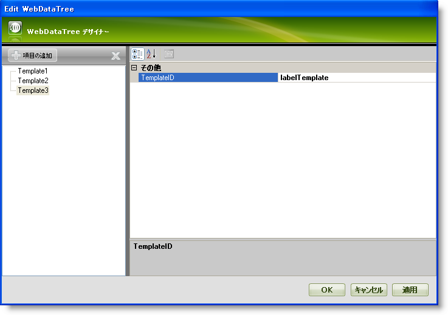
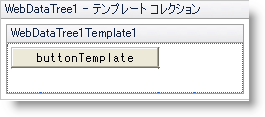
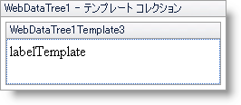
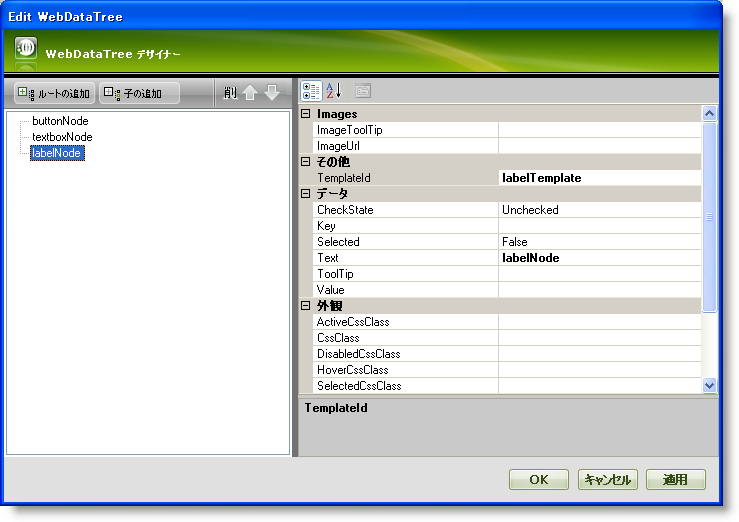

////

|metadata|
{
    "name": "webdatatree-node-templating",
    "controlName": ["WebDataTree"],
    "tags": ["Templating"],
    "guid": "{BEF107E2-B9C2-4B4E-9ED3-57826B9D2B0A}",  
    "buildFlags": [],
    "createdOn": "0001-01-01T00:00:00Z"
}
|metadata|
////

= ノード テンプレート化

WebDataTree™ はノード テンプレート化をサポートします。これにより任意の ASP.NET および HTML コンテンツをノードに挿入することによってノード描画をカスタマイズすることが可能となります。以下のテンプレート メソッドがサポートされます:

* 個々のノードは関連付けられた特定のテンプレートを持つことができます。
* テンプレートのコレクションを作成でき、このコレクションから個々のノードにテンプレートを指定することができます。
* WebDataTree で各ノードに適用される基本のテンプレートを作成できます。

WebDataTree™ によって WebDataTree コントロールにノードが存在しない時に事前に定義したメッセージを表示することができます。たとえば、WebDataTree コントロールのノード コレクションが空でデータ ソースがバインドされない時にエンドユーザーにメッセージを表示したいとします。NoNodesTemplate タグ内に表示したいメッセージを含むことによってこれを達成できます。

[start=1]
. Visual Studio™ ツールボックスから、ScriptManager コンポーネントと WebDataTree コントロールをフォームにドラッグ アンド ドロップします。
[start=2]
. ソース コードで、 pick:[asp-net="link:{ApiPlatform}web{ApiVersion}~infragistics.web.ui.navigationcontrols.webdatatree~nonodestemplate.html[NoNodesTemplate]"]  タグを使用して事前に定義したメッセージを示すために WebDataTree タグ間に以下のコードを含めます。

*HTML の場合:*

----
     <NoNodesTemplate>
        

            There are currently no nodes to display.
        
  
      </NoNodesTemplate>
----

[start=3]
. アプリケーションを保存して実行します。WebDataTree は以下の画像のようにメッセージを表示します。

image::images/WebDataTree_Using_no_nodes_template_in_WebDataTree_01.png[]

WebDataTree でサポートされるノードをカスタマイズするためのすべてのメソッドの一覧はこのトピックの最初をご覧ください。WebDataTree は 高度な UI デザイナーを介してテンプレートを個々のノードに簡単に指定することができます。テンプレートを使用すると、要件に応じて個々のノード オブジェクトのルック アンド フィールをカスタマイズできます。次にテンプレート コレクションを使用してテンプレートを個々のノードに指定する方法を学習します。

[start=1]
. Visual Studio™ ツールボックスから、ScriptManager コンポーネントと WebDataTree コントロールをフォームにドラッグ アンド ドロップします。
[start=2]
. WebDataTree コントロールのスマート タグをクリックして、[テンプレート コレクションの編集] を選択します。これによって WebDataTree デザイナーが開かれ、ここで新しいテンプレートを追加できます。
[start=3]
. [項目の追加] をクリックして新しいテンプレートをテンプレート コレクションに追加します。3 つのテンプレート、Template1、Template2 および Template3 を追加します。 pick:[asp-net="link:{ApiPlatform}web{ApiVersion}~infragistics.web.ui.itemtemplate~templateid.html[TemplateID]"]  プロパティを buttonTemplate、textboxTemplate および labelTemplate にそれぞれ設定します。WebDataTree デザイナーは以下の画像のようになります。

[start=4]
. [適用] そして [OK] ボタンをクリックしてデザイナーを閉じます。
[start=5]
. この手順で、テンプレートは以下に示すように編集されます:

** WebDataTree コントロールのスマート タグをクリックして、[テンプレートの編集] を選択します。これによりテンプレート編集モードで WebDataTree を表示します。
** WebDataTree コントロールのスマート タグをクリックして Template1 を編集するためにドロップダウン リストから WebDataTree1Template1 を選択します。
** 標準のボタンをツールボックスから WebDataTree1Template1 領域にドラッグ アンド ドロップしてボタンの Text プロパティを buttonTemplate に設定します。
** WebDataTree はデザイン モードで以下の画像のようになるはずです。

同様に、それぞれ Text プロパティが textboxTemplate に設定された標準的な TextBox と Text プロパティが labelTemplate に設定された標準的な Label を持つようにテンプレート Template2 と Template3 を編集します。デザイン モードでは、Template2 と Template3 は以下の画像のようになります:

*Template2 :*

image::images/WebDataTree_Assigning_templates_to_individual_nodes_using_the_templates_collection_03.png[]

*Template3 :*

[start=6]
. 今度はスマート タグをクリックし、[テンプレート編集の終了] を選択して WebDataTree のテンプレート編集モードを閉じます。
[start=7]
. 3 つのノード buttonNode、textboxNode、labelNode を WebDataTree に追加し、 pick:[asp-net="link:{ApiPlatform}web{ApiVersion}~infragistics.web.ui.navigationcontrols.navitem~templateid.html[TemplateId]"]  プロパティを buttonTemplate、textboxTemplate および lalbelTemplate にそれぞれ設定します。ノードの追加方法の詳細は、 link:webdatatree-getting-started-with-webdatatree.html[デザイナーを使用してノードを WebDataTree に追加」] を参照してください。
[start=8]
. WebDataTree デザイナーは以下の画像のようになります。

[start=9]
. [OK] をクリックしてデザイナーを終了します。
[start=10]
. アプリケーションを保存して実行します。WebDataTree は以下の画像のようになるはずです。

image::images/WebDataTree_Assigning_templates_to_individual_nodes_using_the_templates_collection_06.png[]