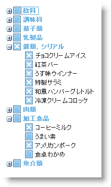
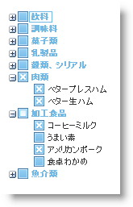

////

|metadata|
{
    "name": "webdatatree-using-checkboxes-in-webdatatree",
    "controlName": ["WebDataTree"],
    "tags": [],
    "guid": "{B0DAFB26-2DB8-4193-A6CA-1C0BDB3EBD30}",  
    "buildFlags": [],
    "createdOn": "0001-01-01T00:00:00Z"
}
|metadata|
////

= WebDataTree でチェックボックスを使用

WebDataTree™ によって、ルートノードの下の子ノードすべてにチェックが付けられるのか、それともノードを展開せずにいくつかにチェックが付けられるのかを決定するためにチェックボックスを使用することが可能となります。たとえば、作業構成明細を提示したいとします。これで階層に深く入らなくても、タスクのどの下位の階層が完了し、どれが部分的に完了したかをプロジェクトマネージャが簡単に視覚化することを可能にしたいです。WebDataTree でチェックボックス機能は以下の 2 つの異なる状態で主に動作します:

* *Bi-State* -- この状態では、チェックボックスはチェックされた状態とチェックされない状態の 2 つの異なる状態を提供します。チェックされた状態では、すべての子ノードもチェックされる場合ルート ノードはチェックされます。ただしチェックされない状態では、以下の画像のように子ノードの一部がチェックされないまたは全部がチェックされるわけではない場合、ルート ノードはチェックされません。

WebDataTree コントロールの  pick:[asp-net="link:{ApiPlatform}web{ApiVersion}~infragistics.web.ui.navigationcontrols.webdatatree~checkboxmode.html[CheckBoxMode]"]  プロパティを BiState に設定することによって 2 つの状態のチェックボックスを使用できます。デフォルトで、このプロパティは Off に設定されます。Microsoft® Visual Studio® [プロパティ] ウィンドウを使用する、または以下のコードを使用することによって、CheckBoxMode プロパティを設定できます:

*Visual Basic の場合：*

----
WebDataTree1.CheckBoxMode = Infragistics.Web.UI.CheckBoxMode.BiState
----

*C# の場合：*

----
WebDataTree1.CheckBoxMode = Infragistics.Web.UI.CheckBoxMode.BiState;
----

*In HTML:*

----
    <ig:WebDataTree ID="WebDataTree1" runat="server" Height="500px" Width="300px" 
        CheckBoxMode="BiState">    
    </ig:WebDataTree>
----

* *Tri-State* -- この状態では、チェックボックスはチェックされた状態、チェックされない状態、部分的の 3 つの異なる状態を提供します。チェックされた状態では、すべての子ノードがチェックされる場合、ルート ノードはチェックされます。チェックされない状態では、すべての子ノードがチェックされるわけではない場合、ルート ノードはチェックされません。部分的な状態では、以下の画像のようにルート ノードにはチェックされない一部の子ノードをいくつかあります:

WebDataTree コントロールの CheckBoxMode プロパティを TriState に設定することによって 3 つの状態でチェックボックスを使用できます。

*Visual Basic の場合：*

----
WebDataTree1.CheckBoxMode = Infragistics.Web.UI.CheckBoxMode.TriState
----

*C# の場合：*

----
WebDataTree1.CheckBoxMode = Infragistics.Web.UI.CheckBoxMode.TriState;
----

*In HTML:*

----
    <ig:WebDataTree ID="WebDataTree1" runat="server" Height="500px" Width="300px" 
        CheckBoxMode="TriState">    
    </ig:WebDataTree>
----