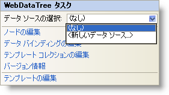

////

|metadata|
{
    "name": "webdatatree-webdatatree-smart-tag",
    "controlName": ["WebDataTree"],
    "tags": ["Design Environment"],
    "guid": "{050EFDD1-A541-445C-91CD-3C537FFE2164}",  
    "buildFlags": [],
    "createdOn": "0001-01-01T00:00:00Z"
}
|metadata|
////

= WebDataTree スマート タグ

Visual Studio 2005/2008（.NET Framework 2.0/3.5）では、{ProductName} の個々のコントロール/コンポーネントにはスマート タグがあります。コントロールやコンポーネントを選択することで、スマート タグのアンカーが表示されます。このアンカーをクリックするとポップアップ パネルが表示され、そこからコントロール/コンポーネントの最もよく使うプロパティや設定にすばやく簡単にアクセスできます。

WebDataTree™ のスマート タグには次の項目が含まれています。

* [データ ソースの選択] -- 既存のデータ ソースを選択する、または WebDataTree にバインドするようにデータ ソースを構成できます。

WebDataTree のスマート タグには次のリンクが含まれています。

* ノードの編集 - ノードの追加、削除およびプロパティの設定のために [WebDataTree の編集] ダイアログを表示します。
* DataBindings の編集 -- コントロールのデータ バインディングを管理するために [WebDataTree の編集] ダイアログを表示します。
* テンプレート コレクションの編集 - WebDataTree で使用できるテンプレートを追加/削除できるテンプレート コレクション エディターにリンクします。
* バージョン情報 -- これをクリックすると WebDataTree 製品の情報を開きます。状態、バージョン、有効期限、製品キーなどの情報を含みます。
* テンプレートの編集 -- これをクリックして、編集できるすべての使用可能なテンプレートを表示します。必要に応じてテンプレートにコントロールをドラッグ アンド ドロップして、コントロールを編集できます。

項目の説明と、プロパティ グリッドの各項目が対応するプロパティについては、以下の表を参照してください。

[options="header", cols="a,a,a"]
|====
|項目|説明|対応するプロパティ

|データ ソースの選択
|ドロップダウン リストによって、既存のデータ ソースを選択したり、新しいデータ ソースを構成できます。
|*DataSourceID*

|====