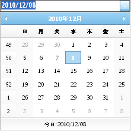

////

|metadata|
{
    "name": "webdatepicker-about-webdatepicker",
    "controlName": ["WebDatePicker"],
    "tags": ["Getting Started","Selection"],
    "guid": "{EDB230B7-D133-4FAA-BE76-AB42BFF4986B}",  
    "buildFlags": [],
    "createdOn": "2009-04-06T11:26:34Z"
}
|metadata|
////

= WebDatePicker について

WebDatePicker™ はドロップダウン カレンダーとともに日付エディタを提供し、さまざまな外観および動作ベースのプロパティを提供するコントロールです。WebDatePicker は優れたパフォーマンスと応答性の高いエンドユーザー エクスペリエンスを促進する証明済みのコード ベースを利用するために {ProductName} AJAX フレームワークを使用して構築されます。 pick:[asp-net="link:{ApiPlatform}web{ApiVersion}~infragistics.web.ui.editorcontrols_namespace.html[Infragistics.Web.UI.EditorControls]"]  名前空間で WebDataTree を見つけることができます。

すべての {ProductName} AJAX コントロールのように、WebDatePicker は Infragistics® Application Styling Framework にシームレスに統合します。CSS ベースのプロパティを使用すると、既存のスタイル シートを利用することによって、WebDatePicker を手動でカスタマイズできます。

WebDatePicker は、クライアント側の JavaScript プログラミング環境に強固なオブジェクト モデルも提供します。クライアント サイド オブジェクトモデル（CSOM）は、十分な機能を備えたプロパティとメソッドで構成され、開発者はサーバー側でポストバックしなくても、重要な機能単位をプログラムできます。

WebDatePicker コントロールの機能の一部には以下が含まれます:

* *高パフォーマンス* -- 軽量のマークアップと最適化されたコードがパフォーマンスを向上します。
* *スピン ボタン* -- エンドユーザーは値のリストを簡単にスピンできます。
* *標準的なバリデーターのサポート* -- ASP.NET バリデーター コントロールをサポートします。
* *最大値と最小値* -- エディタに入力できる日時の許容可能な範囲を簡単に指定できます。
* *ReduceDayOnInvalidDate* -- エンドユーザーが月の最大日よりも大きい値を入力すると、値は自動的に小さくできます。
* *ShowPatternOnFocus* -- 編集モードで、表示される文字列（入力パターン）はカレットの右側のカットオフ プロンプトとリテラル文字で動的に構築できます。
* *SelectionOnFocus* -- 編集モードに入ると必ず異なる選択タイプを設定できます。
* *カルチャー* -- ローカライズされたフォーマットのためにコントロールによって使用される CultureInfo オブジェクトを設定できます。
* *カスタムのドロップダウン カレンダー* -- カスタムのドロップダウン カレンダーはコントロールを使用するように設定できます。
* *UseLastGoodDate* -- コントロールがフォーカスを失って日付フィールドに無効値があるとき、自動的に最後の有効な日付値を使用できます。
* *CenturyThreshold* -- エンドユーザーが 1 桁または 2 桁のみを入力する場合に、20 世紀または 21 世紀を年フィールドでオートフィルします。
* *EnsureSharedCalendar* -- 共有のデフォルトカレンダーが作成されてフォームに追加されていることを確認します。
* *FindSharedCalendar* -- 共有のドロップダウン カレンダーへの参照を検索できます。