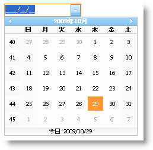

////

|metadata|
{
    "name": "webdatepicker-using-webmonthcalendar-as-webdatepickers-dropdown-calendar",
    "controlName": ["WebDatePicker"],
    "tags": ["Patterns and Practices","Styling","Tips and Tricks"],
    "guid": "{79518DF7-8E85-47E3-B83A-C236AE8AA8B3}",  
    "buildFlags": [],
    "createdOn": "0001-01-01T00:00:00Z"
}
|metadata|
////

= WebDatePicker のドロップダウン カレンダーとして WebMonthCalendar を使用

WebDatePicker™ は、標準のドロップダウン カレンダー コントロールが含まれており、データを入力する時にエンドユーザーは日付を取得できます。ただし、より機能豊かなドロップダウン カレンダーをエンドユーザーに提供したい場合、WebDatePicker によって WebMonthCalendar™ をドロップダウン カレンダーとして使用できます。以下の 2 通りのいずれかの方法で WebMonthCalendar を WebDatePicker に関連付けることができます:

* *コントロールが同じコンテナに存在する* -- 両方のコントロールが同じコンテナに存在する時に、WebDatePicker コントロールの  pick:[asp-net="link:{ApiPlatform}web{ApiVersion}~infragistics.web.ui.editorcontrols.webdatepicker~dropdowncalendarid.html[DropDownCalendarID]"]  プロパティを WebMonthCalendar コントロールの link:http://msdn.microsoft.com/query/dev10.query?appId=Dev10IDEF1&l=EN-US&k=k(System.Web.UI.Control.ID)&rd=true[ID] プロパティに設定できます。
* *コントロールが異なるコンテナに存在する* -- 一方のコントロールがもう一方のコントロールと異なるコンテナに存在する場合、WebDatePicker が WebMonthCalendar の正しいインスタンスを使用できるように、代わりに WebDatePicker コントロールの DropDownCalendarID プロパティを WebMonthCalendar コントロールの link:http://msdn.microsoft.com/query/dev10.query?appId=Dev10IDEF1&l=EN-US&k=k(System.Web.UI.Control.ClientID)&rd=true[ClientID] プロパティに設定できます。この場合、WebMonthCalendar の以下のスタイル属性も確認する必要があります。

display:none;

visibility:hidden;

注：Page_Load イベントの後で DropDownCalendarID プロパティを設定しないでください。

== WebMonthCalendar を WebDatePicker コントロールのドロップダウン カレンダーとして設定するには

[start=1]
. Microsoft® Visual Studio® ツールボックスから、ScriptManager コンポーネント、WebDatePicker コントロールならびに WebMonthCalendar コントロールをフォームにドラッグ アンド ドロップします。
[start=2]
. 要求に応じて WebMonthCalendar をカスタマイズします。この例では、WebMonthCalendar の週番号を有効にします。

*Visual Basic の場合：*

----
WebMonthCalendar1.EnableWeekNumbers = true
----

*C# の場合：*

----
WebMonthCalendar1.EnableWeekNumbers = true;
----

[start=3]
. Microsoft® Visual Studio® [プロパティ] ウィンドウを介して、または以下のコードを使用して WebDatePicker コントロールの DropDownCalendarID プロパティを WebMonthCalendar コントロールの Id プロパティに設定します。

*Visual Basic の場合：*

----
WebDatePicker1.DropDownCalendarID = WebMonthCalendar1.ID
----

*C# の場合：*

----
WebDatePicker1.DropDownCalendarID = WebMonthCalendar1.ID;
----

[start=4]
. アプリケーションを実行し、WebMonthCalendar を WebDatePicker コントロールのドロップダウン カレンダーとして確認します。

