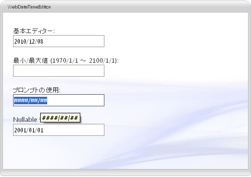

////

|metadata|
{
    "name": "webdatetimeeditor-about-webdatetimeeditor",
    "controlName": ["WebDateTimeEditor"],
    "tags": ["Editing","Getting Started"],
    "guid": "{6E9E8424-1880-4C6B-9DF2-B048120E048F}",  
    "buildFlags": [],
    "createdOn": "2009-04-06T17:04:59Z"
}
|metadata|
////

= WebDateTimeEditor について

WebDateTimeEditor™ は日時編集機能を可能にするエディター コントロールで、さまざまな外観および動作ベースのプロパティを提供します。WebDateTimeEditor は優れたパフォーマンスと応答性の高いエンドユーザー エクスペリエンスを促進する証明済みのコード ベースを利用するために {ProductName} AJAX フレームワークを使用して構築されます。 pick:[asp-net="link:{ApiPlatform}web{ApiVersion}~infragistics.web.ui.editorcontrols_namespace.html[Infragistics.Web.UI.EditorControls]"]  名前空間で WebDateTimeEditor を見つけることができます。

すべての {ProductName} AJAX コントロールのように、WebDateTimeEditor は Infragistics® Application Styling Framework にシームレスに統合します。CSS ベースのプロパティを使用すると、既存のスタイルシートを利用することによって、WebDateTimeEditor を手動でカスタマイズできます。

WebDateTimeEditor は、クライアント側の JavaScript プログラミング環境に強固なオブジェクト モデルも提供します。クライアント サイド オブジェクトモデル（CSOM）は、十分な機能を備えたプロパティとメソッドで構成され、開発者はサーバー側でポストバックしなくても、重要な機能単位をプログラムできます。

WebDateTimeEditor コントロールの機能の一部には以下が含まれます:

* *ハイパフォーマンス* -- 軽量のマークアップと最適化されたコードがパフォーマンスを向上します。
* *スピン ボタン* -- エンドユーザーは値のリストを簡単にスピンできます。
* *標準的なバリデーターのサポート* -- ASP.NET バリデーター コントロールをサポートします。
* *最大値と最小値* -- エディターに入力できる日時の許容可能な範囲を簡単に指定できます。
* *ReduceDayOnInvalidDate* -- エンドユーザーが月の最大日よりも大きい値を入力すると、値は自動的に小さくできます。
* *ShowPatternOnFocus* -- 編集モードで、表示される文字列（入力パターン）はカレットの右側のカットオフ プロンプトとリテラル文字で動的に構築できます。
* *SelectionOnFocus* -- 編集モードに入ると必ず異なる選択タイプを設定できます。
* *カルチャー* -- ローカライズされたフォーマットのためにコントロールによって使用される CultureInfo オブジェクトを設定できます。