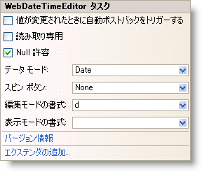

////

|metadata|
{
    "name": "webdatetimeeditor-webdatetimeeditor-smart-tag",
    "controlName": ["WebDateTimeEditor"],
    "tags": ["Design Environment"],
    "guid": "{1A74421D-5A5F-4E0D-9C2D-3C40AE540BA5}",  
    "buildFlags": [],
    "createdOn": "2009-04-06T17:06:10Z"
}
|metadata|
////

= WebDateTimeEditor スマート タグ

Visual Studio 2005/2008（.NET Framework 2.0/3.5）では、{ProductName} の個々のコントロール/コンポーネントにはスマート タグがあります。コントロールやコンポーネントを選択することで、スマート タグのアンカーが表示されます。このアンカーをクリックするとポップアップ パネルが表示され、そこからコントロール/コンポーネントの最もよく使うプロパティや設定にすばやく簡単にアクセスできます。

WebDateTimeEditor™ のスマート タグには次の項目が含まれています。

* 値の変更時に自動ポストバック -- ValueChanged イベントに適用される自動ポストバック オプションを設定できます。
* 読み取り専用 -- エンドユーザーがコントロールのテキストを編集できるかどうかを構成することができます。
* Nullable -- null 値のサポートおよび Value プロパティに System.Nullable を使用する機能を提供します。
* データ モード -- エディターで値をラップするためにオブジェクトのタイプを設定することができます。
* スピン ボタン -- スピン ボタンの表示状態および位置を設定できます。
* 編集モード書式 -- コントロールがフォーカスを取得している時に編集モードに使用される日付の書式を設定できます。
* 表示モード書式 -- コントロールがフォーカスを失った時に表示するために使用される日付の書式を設定できます。

WebDateTimeEditor のスマート タグには次のリンクが含まれています。

* バージョン情報 -- これをクリックすると WebDateTimeEditor 製品の情報を開きます。状態、バージョン、有効期限、製品キーなどの情報を含みます。
* エクステンダーの追加 -- これをクリックすると、WebDateTimeEditor と使用可能なすべてのコントロール エクステンダーを表示するダイアログを表示します。

項目の説明と、プロパティ グリッドの各項目が対応するプロパティについては、以下の表を参照してください。

[options="header", cols="a,a,a"]
|====
|項目|説明|対応するプロパティ

|値の変更時に自動ポストバック
|ValueChanged イベントに適用される自動ポストバック オプションを取得/設定します。
|*ValueChanged (AutoPostBackFlags)*

|読み取り専用
|エンドユーザーがコントロールのテキストを編集する機能を取得または設定します。
|*ReadOnly*

|Nullable
|null 値のサポートおよび Value プロパティに System.Nullable を使用する機能を取得または設定します。
|*Nullable*

|データ モード
|Value プロパティをラップするために使用されるオブジェクト型を取得または設定します。
|*DataMode*

|スピン ボタン
|スピン ボタンの表示状態および位置を取得または設定します。
|*SpinButtonsDisplay (Buttons)*

|編集モードの書式
|コントロールが入力フォーカスを持っているときに編集モードで使用される日付書式を取得または設定します。
|*EditModeFormat*

|表示モードの書式
|コントロールが入力フォーカスを持たないときに、表示モードに使用する日付の書式を取得または設定します。
|*DisplayModeFormat*

|====