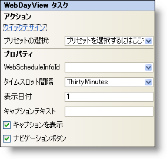

////

|metadata|
{
    "name": "webdayview-smart-tag",
    "controlName": ["WebSchedule"],
    "tags": ["Design Environment","Scheduling"],
    "guid": "{97A0794C-E9CF-4A1C-BF16-2F4E40F01758}",  
    "buildFlags": [],
    "createdOn": "2005-04-11T00:00:00Z"
}
|metadata|
////

= WebDayView スマート タグ

Visual Studio 2005（.NET Framework 2.0）では、{ProductName}の個々のコントロール／コンポーネントにはスマートタグがあります。コントロールやコンポーネントを選択するだけで、スマート タグのアンカーが表示されます。このアンカーをクリックするとポップアップ パネルが表示され、そこからコントロール/コンポーネントの最もよく使うプロパティや設定にすばやく簡単にアクセスできます。

WebDayView™ のスマートタグには次のセクションが含まれています。

* アクション -- よく使うタスク（クイック デザイナーへのアクセス、プリセットのロードなど）を実行できます。
* ［プロパティ］ -- よく使うプロパティ（Visible Daysなど）への容易なアクセスを提供します。

各セクションの項目（フィールド、ドロップダウン リスト、チェックボックスなど）の説明と、各項目が対応するプロパティ グリッドのプロパティについては、以下の表を参照してください。

[options="header", cols="a,a,a"]
|====
|アクション|説明|対応するプロパティ

|クイック デザイン
|［クイック デザイン］をクリックすると、クイック デザイナーが表示されます。これは、コントロールを右クリックしてコンテキスト メニューから ［クイック デザイン］ を選択するのと同じです。
|なし

|プリセットの選択
|「ここをクリック」リンクをクリックして、UltraWebTab のプリセットを素早く選択します。これは、クイック デザイナーを開いて ［プリセット］ を展開してから ［プリセットの管理］ をクリックするのと同じです。
|なし

|====

[options="header", cols="a,a,a"]
|====
|プロパティ|説明|対応するプロパティ

|WebScheduleInfoID
|WebScheduleの各ビューは、WebScheduleInfoが適切に機能する必要があります。WebフォームにすでにWebScheduleInfoがある場合、WebScheduleInfoIDドロップダウンに表示されます。
| pick:[asp-net="link:{ApiPlatform}webui.webschedule{ApiVersion}~infragistics.webui.webschedule.webscheduleviewbase~webscheduleinfo.html[WebScheduleInfoID]"] 

|TimeSlot 間隔
|WebDayView は時間間隔に分割されています。 デフォルトの間隔が 30 分であるため、時間スロットごとに 2 つのセクションが表示されています。
| pick:[asp-net="link:{ApiPlatform}webui.webschedule{ApiVersion}~infragistics.webui.webschedule.webdayview~timeslotinterval.html[TimeSlotInterval]"] 

|VisibleDays
|このプロパティは、WebDayView に表示される日数を決定します。最小値は 1 日、最大値は 14 日です。
| pick:[asp-net="link:{ApiPlatform}webui.webschedule{ApiVersion}~infragistics.webui.webschedule.webdayview~visibledays.html[VisibleDays]"]

|====

= WebDayView スマート タグ

Visual Studio 2005 (.NET Framework 2.0) ですべての {ProductName} コントロール/コンポーネントにスタートタグを追加しています。 コントロール/コンポーネントを選択すると、スマートタグ アンカーが表示されます。 アンカーをクリックすると、コントロール/コンポーネントの一般的な機能に簡単にアクセスするためのポップアップ パネルが表示されます。

WebDayView™ スタート タグは以下のセクションで構成されています:

* アクション -- よく使用するタスク (クイック デザイナーへのアクセス、プリセットのロードなど) を実行できます。
* プロパティ -- よく使用するプロパティ (Visible Days など) への簡単なアクセスを提供します。

各セクションの項目 (フィールド、ドロップダウン リスト、チェックボックスなど) の説明と、各項目が対応するプロパティ グリッドのプロパティについては、以下の表を参照してください。

[options="header", cols="a,a,a"]
|====
|Actions|Description|CorrespondingProperty

|クイック デザイン
|［クイック デザイン］をクリックすると、クイック デザイナーが表示されます。 コントロールを右クリックしてコンテキスト メニューから［クイック デザイン］を選択するのと同じです。
|なし

|プリセットの選択
|[ここをクリック] リンクをクリックして、UltraWebTab のプリセットをすばやく選択します。 クイック デザイナーを開いて ［プリセット］ を展開してから ［プリセットの管理］ をクリックするのと同じです。
|なし

|====

[options="header", cols="a,a,a"]
|====
|Properties|Description|CorrespondingProperty

|WebScheduleInfoID
|WebSchedule ビューが正しく機能するために WebScheduleInfo が必要です。 Web フォームにすでに WebScheduleInfo を追加している場合、WebScheduleInfoID ドロップダウンに表示されます。
| link:{ApiPlatform}webui.webschedule{ApiVersion}~infragistics.webui.webschedule.webscheduleviewbase~webscheduleinfo.html[WebScheduleInfoID]

|タイムスロットインターバル
|WebDayViewは時間の間隔に分割されます。デフォルトの間隔は30分です。したがって、1時間が2つの時間のセクションに分割されます。
link:{ApiPlatform}webui.webschedule{ApiVersion}~infragistics.webui.webschedule.webdayview~timeslotinterval.html[TimeSlotInterval]

|表示期間
|このプロパティはWebDayViewに表示したい日数を決定します。最低1日から最高14日までに表示できます。
link:{ApiPlatform}webui.webschedule{ApiVersion}~infragistics.webui.webschedule.webdayview~visibledays.html[VisibleDays]

|キャプションテキスト
|キャプションを表示している場合、ここでキャプションのテキストを設定できます。
|link:{ApiPlatform}webui.webschedule{ApiVersion}~infragistics.webui.webschedule.webdayview~captionheadertext.html[CaptionHeaderText]

|キャプションを表示
|チェックボックスをオンにすると、キャプションが表示されます。
|link:{ApiPlatform}webui.webschedule{ApiVersion}~infragistics.webui.webschedule.webscheduleviewbase~captionheadervisible.html[CaptionHeaderVisible]

|ナビゲーションボタン
|カレンダー上部にある月のナビゲーションボタンの表示/非表示を切り替えます。
|link:{ApiPlatform}webui.webschedule{ApiVersion}~infragistics.webui.webschedule.webscheduleviewbase~navigationbuttonsvisible.html[NavigationButtonsVisible]

|====