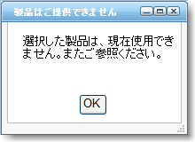
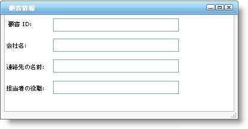

////

|metadata|
{
    "name": "webdialogwindow-about-webdialogwindow",
    "controlName": ["WebDialogWindow"],
    "tags": ["How Do I"],
    "guid": "{C3B2E1AE-55FE-4172-96C1-2EEFD29C669E}",  
    "buildFlags": [],
    "createdOn": "0001-01-01T00:00:00Z"
}
|metadata|
////

= WebDialogWindow について

WebDialogWindow™ コントロールは、Web ページではシンプルな 
 セクションとして表示するがポップアップ ウィンドウとして表示することにより、現在のブラウザでいくつかのポップアップ ブロッカーを無視することができます。WebDialogWindow によって、任意の Web アプリケーションにダイアログ ボックス機能を簡単に追加できます。WebDialogWindow のコンテンツ領域はそれ自体 
 ですが、任意の HTML または ASP.NET オブジェクトを含むことができます。モーダルまたは非モーダル ダイアログ ボックスのいずれかとして WebDialogWindow を表示できます。

WebDialogWindow は Infragistics Application Styling フレームワークにシームレスに統合します。CSS ベースのプロパティを使用すると、既存のスタイル シートを利用することによって、WebDialogWindow コントロールを手動でカスタマイズできます。

== WebDialogWindow は以下の機能をサポートします。

* *モーダル/非モーダル モード* - WebDialogWindow によって、モーダルまたは非モーダルのいずれでコントロールを表示するのかを設定できます。適切なモードを選択することで、アプリケーションのフローを制御し、必要な時にエンド ユーザーからのアクションを保証できます。
* *ヘッダー* - WebDialogWindow はヘッダー領域を表示します。この領域には、ダイアログ ウィンドウを制御するための閉じる、最小化、最大化をはじめとするいくつかのボタンだけでなくテキストを含むことができます。
* *リサイズ* - 必要なときに、エンド ユーザーはランタイムに WebDialogWindow をリサイズできます。
* *位置* - WebDialogWindow の開始位置を手動で設定する、またはアプリケーションの中央に自動的に表示するのいずれかを実行できます。
* *ウィンドウの状態* - エンド ユーザーは WebDialogWindows を最小化または最大化する、またはエンド ユーザーから非表示にすることができます。