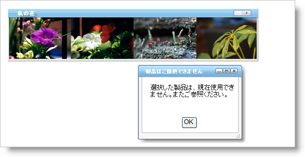

////
|metadata|
{
    "name": "webdialogwindow-displaying-the-webdialogwindow-client-side",
    "controlName": ["WebDialogWindow"],
    "tags": ["Events"],
    "guid": "{F289D506-9953-43F8-8C18-A1D743137151}",
    "buildFlags": [],
    "createdOn": "0001-01-01T00:00:00Z"
}
|metadata|
////

= WebDialogWindow クライアント側を表示

== 始める前に

WebDialogWindow™ コントロールは、ユーザーのアクションに対応して通知を表示できます。WebDialogWindow クライアントサイド オブジェクト モデルを使用し、プロンプトのフィードバックを提供すると同時にユーザーのアクションに応答することができます。たとえば、ユーザーが製品コレクションから売り切れの製品を選択した場合、選択した製品が売り切れであることを顧客に通知するための通知を表示する必要があります。

== 達成すること

クライアント側オブジェクト モデルを使用して、WebDialogWindow コントロールを表示する方法を学習します。情報を提供するテキストと閉じるボタンを表示するダイアログ ボックスを作成します。エンド ユーザーが WebImageViewer から特定の画像を選択すると、ダイアログ ボックスが表示します。

== 次の手順を実行します。

[start=1]
. 新しい ASP.NET AJAX 対応の Web サイトを作成します。Visual Studio が新しい Web サイトを作成すると、WebForm に ScriptManager のインスタンス（デフォルトで追加された）を配置することを確認します。
[start=2]
. アプリケーションで Infragistics Application Styling が有効になっていることを確認します。これの実行方法の詳細は、 link:web-enabling-application-styling-using-the-web-config-file.html[web.config ファイルを使用してアプリケーション スタイリングを有効にする]を参照してください。
[start=3]
. WebImageViewer コントロールを WebForm に追加します。WebImageViewer でいくつかの画像を必要とします。詳細は、 link:webimageviewer-getting-started-with-the-webimageviewer.html[WebImageViewer で開始]を参照してください。
[start=4]
. フォーム上に WebDialogWindow を配置します。
[start=5]
. WebDialogWindow のコンテンツ領域内に HTML テーブルを配置します。
[start=6]
. 2 行 1 列しか含まないように HTML テーブルを変更します。
[start=7]
. HTML テーブルの一番上の行に ASP.NET Label を配置します。
[start=8]
. Label の Text プロパティを "選択した製品は無効です" に設定します。後ほど確認してください。
[start=9]
. HTML テーブルの 2 番目の行に HTML Button を配置します。
[start=10]
. Value プロパティを "OK" に設定し、ID プロパティを "btnDialogWindow" に設定します。
[start=11]
. ソース ビューで、WebDialogWindow コントロール内の HTML テーブルを指定します。
[start=12]
. Button の入力を囲む <TD> タグを修正すると、以下のコードの事例と一致します。

*HTML の場合:*

----
<td style="vertical-align:middle">
        ...
</td>
----

[start=13]
. HTML ボタンの入力で、onclick プロパティを作成し、"javascript:btnDialogWindow_onClick()" に設定します。詳細なガイドでこの JavaScript 関数を後で定義します。
[start=14]
. デザイン ビューで、WebDialogWindow コントロールを選択します。
[start=15]
. WebDialogWindow コントロールの  pick:[asp-net="link:{ApiPlatform}web{ApiVersion}~infragistics.web.ui.layoutcontrols.webdialogwindow~header.html[Header]"]  プロパティを指定して展開します。Header プロパティの  pick:[asp-net="link:{ApiPlatform}web{ApiVersion}~infragistics.web.ui.layoutcontrols.layoutheader~captiontext.html[CaptionText]"]  プロパティを見つけて "Product Not Available Dialog" に設定します。
[start=16]
. WebDialogWindow の  pick:[asp-net="link:{ApiPlatform}web{ApiVersion}~infragistics.web.ui.layoutcontrols.webdialogwindow~initiallocation.html[InitialLocation]"]  プロパティを Centered に設定します。希望する場合、コンテンツと同じ大きさになるようにダイアログをリサイズできます。
[start=17]
. アプリケーションが初めて実行する時、WebDialogWindow コントロールを非表示にしたい場合には、 pick:[asp-net="link:{ApiPlatform}web{ApiVersion}~infragistics.web.ui.layoutcontrols.webdialogwindow~windowstate.html[WindowState]"]  プロパティを Hidden に設定してください。
[start=18]
. WebImageViewer の ImageClick クライアント側イベントを作成します。クライアント側イベントの作成についての詳細は、 link:setting-up-a-client-side-event.html[「クライアント側イベントの設定」]を参照してください。
[start=19]
. WebImageViewer の ImageClick イベント内で、選択した画像の URL をテストして WebDialogWindow が表示すべきかどうかを決定することができます。以下のコードの例は、ImageClick イベントを例示します。

注：このコードを修正して、画像の URL で動作するようにする必要があります。

*JavaScript の場合:*

----
function WebImageViewer1_ImageClick(sender, imageArgs){
        var imgSelected = imageArgs.getImageItem();
        if(imgSelected.get_imageUrl() == "./images/spikes.jpg")
        {
                var dialog = $find("WebDialogWindow1");
                dialog.show();
        }           
}
----

[start=20]
. btnDialogWindow_onClick と呼ばれる関数を作成します。この関数は、ユーザーがダイアログ ボックスで [OK] ボタンを選択するときに呼び出されます。この関数はダイアログ ボックスを非表示にします。以下のコードを使用してダイアログ ボックスを閉じます。

*JavaScript の場合:*

----
function btnDialogWindow_onClick(){
        var dialog = $find("WebDialogWindow1");
        dialog.hide();
}
----

[start=21]
. アプリケーションをビルドして実行します。売り切れの製品の画像をクリックすると、ダイアログ ボックスが表示します。[OK] ボタンをクリックして、ダイアログ ボックスを閉じます。

.注:
[NOTE]
====
ウェブ プロジェクトではなくウェブ サイトでこのガイドを使用する場合、JavaScript の関数を正しく動作させるために WebDialogWindow の ClientIDMode オプションを Static に設定する必要があります。
====