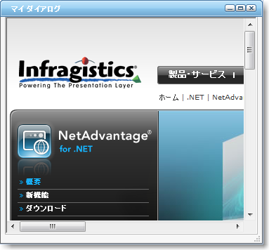

////

|metadata|
{
    "name": "webdialogwindow-getting-started-with-the-webdialogwindow",
    "controlName": ["WebDialogWindow"],
    "tags": ["Getting Started"],
    "guid": "{D9EAB48E-71EE-44EB-83F5-7C61FB6BB967}",  
    "buildFlags": [],
    "createdOn": "2008-12-01T21:00:19Z"
}
|metadata|
////

= WebDialogWindow で開始

== 始める前に

以下の手順は、WebDialogWindow™ を開始する方法を示します。コントロールのオブジェクト モデルをよく知るために一連の手順を完了します。

*以下の手順の前提は以下のとおりです。*

* Getting_Started_with_the_WebDialogWindow という名前を指定した新しい ASP.NET AJAX 対応の Web サイトをすでに作成している。
* WebForm 上に ASP.NET AJAX ScriptManager インスタンスがある。
* このアプリケーションで Infragistics Application Styling を有効にしており、Default Style を使用している。これの実行方法の詳細は、 link:web-enabling-application-styling-using-the-web-config-file.html[「web.config ファイルを使用してアプリケーション スタイリングを有効にする」]を参照してください。

== 達成すること

読み終わると、WebDialogWindow コントロールを利用する最初のアプリケーションを無事に作成したことになります。

== 次の手順を実行します。

[start=1]
. Visual Studio Toolbox で、WebDialogWindow コントロールを指定してダブルクリックし、WebForm でインスタンスを取得します。
[start=2]
. WebDialogWindow コントロールをクリックして、[プロパティ] ウィンドウで  pick:[asp-net="link:{ApiPlatform}web{ApiVersion}~infragistics.web.ui.layoutcontrols.webdialogwindow~header.html[Header]"]  プロパティを指定して展開します。
[start=3]
. Header プロパティ内で、 pick:[asp-net="link:{ApiPlatform}web{ApiVersion}~infragistics.web.ui.layoutcontrols.layoutheader~captiontext.html[CaptionText]"]  プロパティを指定し、My Dialog に設定します。
[start=4]
. スクロール ダウンして、 pick:[asp-net="link:{ApiPlatform}web{ApiVersion}~infragistics.web.ui.layoutcontrols.layoutheader~maximizebox.html[MaximizeBox]"]  プロパティを指定し展開します。Visible プロパティを True に設定します。
[start=5]
. スクロール ダウンして、 pick:[asp-net="link:{ApiPlatform}web{ApiVersion}~infragistics.web.ui.layoutcontrols.layoutheader~minimizebox.html[MinimizeBox]"]  プロパティを指定し展開します。Visible プロパティを True に設定します。
[start=6]
. これで WebDialogWindow プロパティの最上位レベルに戻ることができます。スクロール ダウンして、 pick:[asp-net="link:{ApiPlatform}web{ApiVersion}~infragistics.web.ui.layoutcontrols.webdialogwindow~modal.html[Modal]"]  プロパティを指定して True に設定します。
[start=7]
. pick:[asp-net="link:{ApiPlatform}web{ApiVersion}~infragistics.web.ui.layoutcontrols.webdialogwindow~resizer.html[Resizer]"]  プロパティを指定して展開します。 pick:[asp-net="link:{ApiPlatform}web{ApiVersion}~infragistics.web.ui.layoutcontrols.resizer~enabled.html[Enabled]"]  プロパティを指定して True に設定します。
[start=8]
. この時点で、ContentPane の Template 内にコンテンツを配置できます。これはこの領域に任意のコントロールをドラッグ アンド ドロップすることができることを意味します（通常は WebDialogWindow コントロールの一番上に向けて配置）。あるいは、WebDialogWindow コントロールの ContentPane 内に任意のリソースを表示することを可能にする URL を指定することも可能です。
[start=9]
. これで WebDialogWindow プロパティの最上位レベルに戻り、 pick:[asp-net="link:{ApiPlatform}web{ApiVersion}~infragistics.web.ui.layoutcontrols.webdialogwindow~windowstate.html[WindowState]"]  プロパティを指定してその値を Hidden に設定することができます。
[start=10]
. この特定の例では、URL を使用してダイアログ内にメインの Infragistics の Web サイトを表示します。WebDialogWindow コントロールをクリックして、[プロパティ] ウィンドウで  pick:[asp-net="link:{ApiPlatform}web{ApiVersion}~infragistics.web.ui.layoutcontrols.webdialogwindow~contentpane.html[ContentPane]"]  プロパティを指定および展開します。 pick:[asp-net="link:{ApiPlatform}web{ApiVersion}~infragistics.web.ui.layoutcontrols.contentpane~contenturl.html[ContentUrl]"]  プロパティを指定して、その値を http://jp.infragistics.com に設定します。

*注：* WebDialogWindow がコンテンツで IFrames を描画するためには、ContentURL プロパティを有効な値に設定する必要があります。そうでなければ、IFrames はコンテンツで描画しません。代わりにコンテンツ パネルとして描画します。

[start=11]
. 標準の Button を WebForm に配置します。

*注：* フォーム上に HTML ボタンを配置することによって、ポストバックを避けることも可能です。WebDialogWindow のクライアント サイド オブジェクト モデルを使用してダイアログ ウィンドウを表示することの詳細は、 link:webdialogwindow-displaying-the-webdialogwindow-client-side.html[「WebDialogWindow クライアント側を表示」]を参照してください。

[start=12]
. Button コントロールをクリックして、[プロパティ] ウィンドウで、ID プロパティを btnShow に変更し、次に Text プロパティを Show に変更します。
[start=13]
. 次に Click イベントのイベント ハンドラを追加するために Button をダブルクリックします。イベント ハンドラで、次のコードを追加します。

*Visual Basic の場合：*

----
Protected Sub btnShow_Click(ByVal sender As Object, _
  ByVal e As System.EventArgs) Handles btnShow.Click
	Select Case Me.WebDialogWindow1.WindowState
		Case Infragistics.Web.UI.LayoutControls.DialogWindowState.Hidden
			Me.WebDialogWindow1.WindowState = _
			  Infragistics.Web.UI.LayoutControls.DialogWindowState.Normal
	End Select
End Sub
----

*C# の場合：*

----
protected void btnShow_Click(object sender, EventArgs e)
{
	switch (this.WebDialogWindow1.WindowState)
	{
		case Infragistics.Web.UI.LayoutControls.DialogWindowState.Hidden:
			this.WebDialogWindow1.WindowState = 
			  Infragistics.Web.UI.LayoutControls.DialogWindowState.Normal;
			break;
	}
}
----

[start=14]
. アプリケーションを保存して実行します。WebForm がロードした時に、Show ボタンをクリックして WebDialogWindow コントロールを表示します。以下の画像は、構成したばかりの WebDialogWindow とともに WebForm を表示します。

WebDialogWindow の一番上に配置されているさまざまなボタン要素をクリックすることで試すことができます。

* 最大化ボタンによって、WebDialogWindow はページ全体のサイズになります。
* 最小化ボタンによって WebDialogWindow は小さいサイズに縮小され、ブラウザ ウィンドウの一番上の左側に移動します。
* ヘッダーでマウスのボタンをクリックしたまま必要な場所にドラッグすることにより、WebDialogWindow コントロールを移動することができます。
* Resizer 要素をクリックしてコントロールの右手下にドラッグすることにより、WebDialogWindow をリサイズすることも可能です。
* 通常一番上に配置されている [閉じる] ボタンはダイアログを非表示にします。