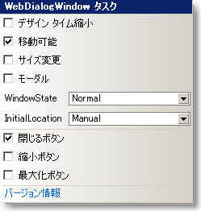

////

|metadata|
{
    "name": "webdialogwindow-smart-tag",
    "controlName": ["WebDialogWindow"],
    "tags": ["How Do I"],
    "guid": "{7246B970-EFF0-4803-A84F-2AB9B7B9C686}",  
    "buildFlags": [],
    "createdOn": "0001-01-01T00:00:00Z"
}
|metadata|
////

= WebDialogWindow スマート タグ

Visual Studio 2005/2008（.NET Framework 2.0/3.5）では、{ProductName} の個々のコントロール/コンポーネントにはスマート タグがあります。コントロールやコンポーネントを選択するだけで、スマート タグのアンカーが表示されます。このアンカーをクリックするとポップアップ パネルが表示され、そこからコントロール/コンポーネントの最もよく使うプロパティや設定にすばやく簡単にアクセスできます。

スマート タグ内の各項目（フィールド、ドロップダウン リスト、チェックボックスなど）の説明と、プロパティ ウィンドウの各項目が対応するプロパティについては、以下の表を参照してください。

[options="header", cols="a,a,a"]
|====
|項目|説明|対応するプロパティ

|DesignTimeMinimize
|このチェック ボックスを選択するとデザインタイム エディタでダイアログ ウィンドウを最小化します。このプロパティが使用できるのはデザインタイムのみです。
|DesignTimeMinimize

|Moveable
|このチェックボックスの選択を解除して、エンド ユーザーがダイアログ ウィンドウを移動できなくします。
| pick:[asp-net="link:{ApiPlatform}web{ApiVersion}~infragistics.web.ui.layoutcontrols.webdialogwindow~moveable.html[Movable]"] 

|Resizable
|このチェックボックスを選択すると、エンド ユーザーはダイアログ ウィンドウをリサイズできます。
| pick:[asp-net="link:{ApiPlatform}web{ApiVersion}~infragistics.web.ui.layoutcontrols.resizer~enabled.html[Resizer.Enabled]"] 

|Modal
|このチェックボックスを選択すると、ダイアログ ウィンドウをモーダル ダイアログ ボックスにします。
| pick:[asp-net="link:{ApiPlatform}web{ApiVersion}~infragistics.web.ui.layoutcontrols.webdialogwindow~modal.html[Modal]"] 

|WindowState
|ページが初めてロードした時にダイアログ ウィンドウを表示、最小化、最大化または非表示のいずれにしたいかをドロップダウン リストから選択します。
| pick:[asp-net="link:{ApiPlatform}web{ApiVersion}~infragistics.web.ui.layoutcontrols.webdialogwindow~windowstate.html[WindowState]"] 

|InitialLocation
|Web ページの中央にダイアログ ウィンドウを常に表示したい場合にはドロップダウン リストから [Centered] を選択します。
| pick:[asp-net="link:{ApiPlatform}web{ApiVersion}~infragistics.web.ui.layoutcontrols.webdialogwindow~initiallocation.html[InitialLocation]"] 

|Close Button
|このチェックボックスを選択すると、ヘッダ領域の右側に [閉じる] ボタンを表示します。
| pick:[asp-net="link:{ApiPlatform}web{ApiVersion}~infragistics.web.ui.layoutcontrols.restoredialogbutton~visible.html[Header.CloseBox.Visible]"] 

|Minimize Button
|このチェックボックスを選択すると、ヘッダ領域の右側に [最小化] ボタンを表示します。
| pick:[asp-net="link:{ApiPlatform}web{ApiVersion}~infragistics.web.ui.layoutcontrols.restoredialogbutton~visible.html[Header.MinimizeBox.Visible]"] 

|Maximize Button
|このチェックボックスを選択すると、ヘッダ領域の右側に [最大化] ボタンを表示します。
| pick:[asp-net="link:{ApiPlatform}web{ApiVersion}~infragistics.web.ui.layoutcontrols.restoredialogbutton~visible.html[Header.MaximizeBox.Visible]"] 

|====