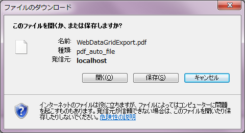

////

|metadata|
{
    "name": "webdocumentexporter-getting-started-with-webdocumentexporter",
    "controlName": ["WebDocumentExporter"],
    "tags": ["Exporting","Getting Started","Grids"],
    "guid": "0c0bd092-2e5f-4365-a495-67c325cbcda7",  
    "buildFlags": [],
    "createdOn": "2010-09-29T07:58:05.3227056Z"
}
|metadata|
////

= WebDocumentExporter で開始

== 達成すること

WebDataGrid/WebHierarchicalDataGrid データを PDF または XPS ドキュメント ファイル形式にエクスポートするように WebDocumentExporter を設定および使用する方法を学習します。

== 次の手順を実行します

[start=1]
. Northwind の Customers テーブルからデータを取得する WebDataGrid をバインドします。
[start=2]
. WebDocumentExporter コントロールを Visual Studio Toolbox からページにドラッグします。

.. WebDocumentExporter の link:{ApiPlatform}web{ApiVersion}~infragistics.web.ui.gridcontrols.baseexporter~exportmode.html[ExportMode] プロパティを Download に設定します。
.. コントロールの ID プロパティを WebDocumentExporter に設定します。
.. コントロールの link:{ApiPlatform}web{ApiVersion}~infragistics.web.ui.gridcontrols.baseexporter~downloadname.html[DownloadName] プロパティを "ExportedData" に設定します。

*HTML の場合:*

[source]
----
<ig:WebDocumentExporter  runat="server" ID="WebDocumentExporter"
----

[source]
----
ExportMode ="Download" DownloadName="ExportedData" />
----

*注：* デフォルトで、WebDocumentExporter は PDF ドキュメント形式でデータをエクスポートします。XPS ドキュメントでエクスポートしたい場合には、 link:{ApiPlatform}web{ApiVersion}~infragistics.web.ui.gridcontrols.webdocumentexporter~format.html[Format] プロパティを XPS に設定する必要があります。

[start=3]
. Button コントロールを Visual Studio Toolbox からページにドラッグします。

.. ボタンの ID プロパティを btnExport に設定します。
.. コントロールの Text プロパティを "Export Data" に設定します。
.. コントロールの OnClick を "btnExport_Click" に設定します。
.. コード ビハインドで "btnExport_Click" ハンドラーを定義し、WebDocumentExporter の link:{ApiPlatform}web{ApiVersion}~infragistics.web.ui.gridcontrols.webdocumentexporter~export.html[Export] メソッドを呼び出します。

*HTML の場合:*

----
<asp:Button runat="server" ID="btnExport" Text="Export Data" OnClick="btnExport_Click" />
----

[cols="a"]
|====
|コード ビハインド（C#）の場合:

|protected void btnExport_Click(object sender, EventArgs e) 

{ 

this.WebDocumentExporter.Export(this.whdgCustomers); 

}

|====

[start=4]
. アプリケーションを実行します。
[start=5]
. [データのエクスポート] ボタンをクリックします。

[データのエクスポート] ボタンをクリックした後、ブラウザーで "ExportedData.pdf" という名前のファイルを開くのかそれとも保存するのかを尋ねられます。

*注：* ExportedData.pdf ファイルは Grid の表示可能なデータしか含みません。データ ソース内の全データをエクスポートしたい場合には、「データ ソース内の全データをエクスポート」を参照してください。

== 関連トピック

link:webdocumentexporter-about-webdocumentexporter.html[WebDocumentExporter について]

link:webexcelexporter-saving-all-data-in-the-data-source.html[すべてのデータをデータ ソースに保存]

link:webexcelexporter-saving-exported-data-on-the-server.html[エクスポートしたデータをサーバーに保存]