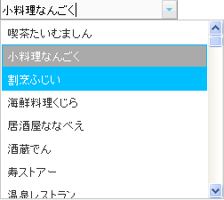

////

|metadata|
{
    "name": "webdropdown-about-webdropdown",
    "controlName": ["WebDropDown"],
    "tags": [],
    "guid": "{BFC0E9C7-7A92-4C2D-A09B-0AD9010168AC}",  
    "buildFlags": [],
    "createdOn": "0001-01-01T00:00:00Z"
}
|metadata|
////

= WebDropDown について

WebDropDown™ はエンドユーザーがドロップダウン リストから単一の項目または複数の項目を選択することを可能にするコントロールです。WebDropDown は優れたパフォーマンスと応答性の高いエンドユーザー エクスペリエンスを促進する証明済みのコード ベースを利用するために {ProductName} AJAX フレームワークの上に構築されます。 pick:[asp-net="link:{ApiPlatform}web{ApiVersion}~infragistics.web.ui.listcontrols_namespace.html[Infragistics.Web.UI.ListControls]"]  名前空間で WebDropDown を見つけることができます。

一般的に、WebDropDown はユーザー入力のための Value Display と項目を保持するドロップダウン コンテナの 2 つの主要なエンティティで構成されます。WebDropDown には、デザインタイム ツールが高度なデザイナー UI として含まれます。このデザインタイムユーティリティは要件に従ってコントロールを素早く簡単に設定する支援をし、徹底的なコーディングを必要とすることなく広範な機能へのアクセスを提供します。

すべての {ProductName} AJAX コントロールのように、WebDropDown は Infragistics® Application Styling Framework にシームレスに統合します。CSS ベースのプロパティを使用すると、既存のスタイル シートを利用することによって、WebDropDown を手動でカスタマイズできます。

WebDropDown は、クライアント側の JavaScript プログラミング環境に強固なオブジェクト モデルも提供します。クライアント サイドオブジェクトモデル（CSOM）は、十分な機能を備えたプロパティとメソッドで構成され、開発者はサーバー側でポストバックしなくても、重要な機能単位をプログラムできます。

WebDropDown コントロールの機能の一部には以下が含まれます:

* *ハイパフォーマンス* -- 軽量のマークアップと最適化されたコードがパフォーマンスを向上します。
* *強力なデータ バインディング* -- 開発者はデータ ソースに接続してドロップダウン リストを自動生成することができます。
* *オート コンプリート* -- Value Display に入力した接頭辞で開始する項目をドロップダウン リストに提案することにより、ユーザー エクスペリエンスを高めます。
* *マルチモードのサポート* -- WebDropDown を表示する方法に関するさまざまなモード。
* *項目の選択* -- ドロップダウン コンテナから項目を単一または複数選択。
* *ロード オン デマンド* -- WebDropDown がパフォーマンスを一切落とすことなく非常に大量のデータを処理することを可能にします。
* *テンプレート* -- 値項目の外観をカスタマイズするために使用可能な項目テンプレートを開発者は定義することができます。