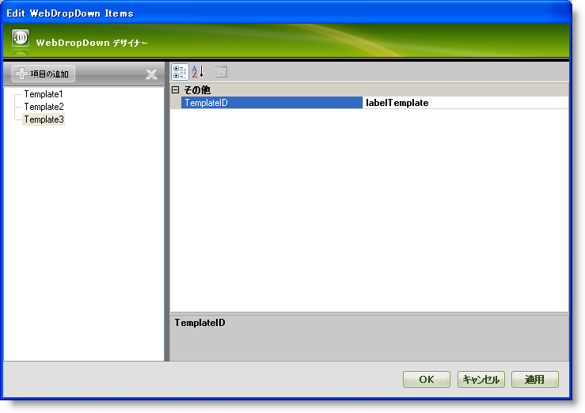
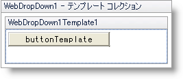
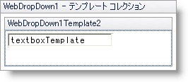
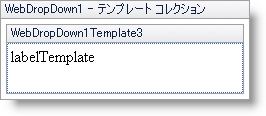
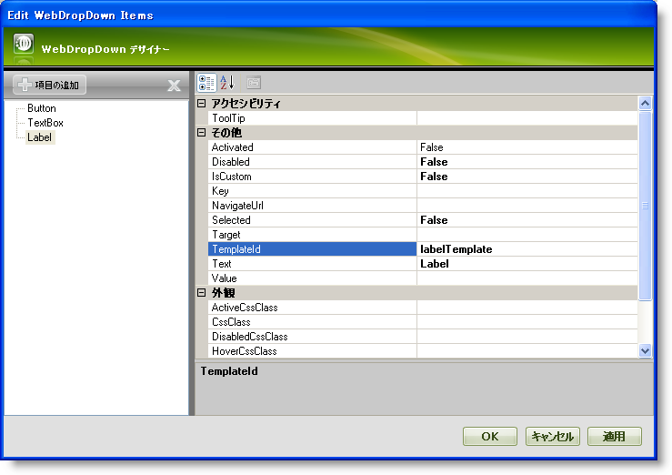
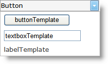

////

|metadata|
{
    "name": "webdropdown-assigning-templates-to-individual-items-using-the-templates-collection",
    "controlName": ["WebDropDown"],
    "tags": ["Templating"],
    "guid": "{D933D043-70EC-4FFB-9B4E-37C8A811BACF}",  
    "buildFlags": [],
    "createdOn": "0001-01-01T00:00:00Z"
}
|metadata|
////

= テンプレート コレクションを使用してテンプレートを個別の項目に指定

== 始める前に

WebDropDown™ によって高度な UI デザイナーを介してテンプレートを個々の項目に簡単に指定することができます。テンプレートを使用すると、要件に応じて個々の項目のルック アンド フィールをカスタマイズできます。

== 達成すること

テンプレート コレクションを使用してテンプレートを個々の項目に指定する方法を学習します。

== 次の手順を実行します

[start=1]
. Visual Studio™ ツールボックスから、ScriptManager コンポーネントと WebDropDown コントロールをフォームにドラッグ アンド ドロップします。
[start=2]
. WebDropDown コントロールのスマート タグをクリックして、[テンプレート コレクションの編集] を選択します。これによって WebDropDown デザイナーが開かれ、ここで新しいテンプレートを追加できます。
[start=3]
. [項目の追加] をクリックして新しいテンプレートをテンプレート コレクションに追加します。3 つのテンプレート、Template1、Template2 および Template3 を追加します。 pick:[asp-net="link:{ApiPlatform}web{ApiVersion}~infragistics.web.ui.itemtemplate~templateid.html[TemplateID]"]  プロパティを buttonTemplate、textboxTemplate および labelTemplate にそれぞれ設定します。WebDropDown デザイナーは以下の画像のようになります。

[start=4]
. [適用] そして [OK] ボタンをクリックしてデザイナーを閉じます。
[start=5]
. この手順で、テンプレートは以下に示すように編集されます:

** WebDropDown コントロールのスマート タグをクリックして、[テンプレートの編集] を選択します。これによりテンプレート編集モードで WebDropDown を表示します。
** WebDropDown コントロールのスマート タグをクリックして Template1 を編集するためにドロップダウン リストから WebDropDown1Template1 を選択します。
** 標準のボタンをツールボックスから WebDropDown1Template1 領域にドラッグ アンド ドロップしてボタンの Text プロパティを buttonTemplate に設定します。
** WebDropDown はデザイン モードで以下の画像のようになるはずです。

同様に、それぞれ Text プロパティが textboxTemplate に設定された標準的な TextBox と Text プロパティが labelTemplate に設定された標準的な Label を持つようにテンプレート Template2 と Template3 を編集します。デザイン モードでは、Template2 と Template3 は以下の画像のようになります:

*Template2 :*

*Template3 :*

[start=6]
. 今度はスマート タグをクリックし、［テンプレート編集の終了］を選択して WebDropDown のテンプレート編集モードを閉じます。
[start=7]
. 3 つの項目 Button、TextBox、Label をドロップダウン リストに追加し、TemplateId プロパティを buttonTemplate、textboxTemplate および labelTemplate にそれぞれ設定します。項目の追加方法の詳細は、 link:webdropdown-getting-started-with-webdropdown.html[デザイナーを使用して項目を WebDropDown に追加]を参照してください。
[start=8]
. WebDropDown デザイナーは以下の画像のようになります。

[start=9]
. [適用] と [OK] をクリックしてデザイナーを閉じます。
[start=10]
. アプリケーションを保存して実行します。WebDropDown は以下の画像のようになるはずです。

