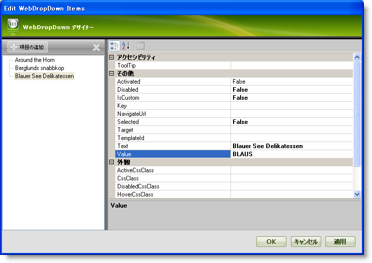
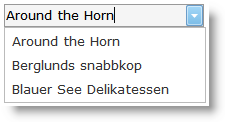

////

|metadata|
{
    "name": "webdropdown-getting-started-with-webdropdown",
    "controlName": ["WebDropDown"],
    "tags": ["Getting Started"],
    "guid": "{5AA76B6C-08D2-4CF0-84D5-444BBB478382}",  
    "buildFlags": [],
    "createdOn": "0001-01-01T00:00:00Z"
}
|metadata|
////

= WebDropDown で開始

WebDropDown™ によってリッチなユーザー インタフェース デザイナーを使用して項目をドロップダウン コンテナに手動で追加できます。外観、動作およびさまざまなその他のプロパティを設定する WebDropDown デザイナーを使用して各ドロップダウン項目をカスタマイズできます。

*デザイナーを使用して項目を WebDropDown に追加するには次の手順に従ってください:*

[start=1]
. Visual Studio™ ツールボックスから、WebDropDown コントロールを指定して WebForm にドラッグ アンド ドロップします。
[start=2]
. [プロパティ] ウィンドウで、Items プロパティを指定して、省略記号 (...) ボタンをクリックし、WebDropDown デザイナーを起動します。WebDropDown スマート タグで [項目の編集] をクリックすることによってもデザイナーを起動できます。
[start=3]
. [WebDropDown 項目の編集] ダイアログで、[項目の追加] ボタンをクリックします。これによって新しいリスト項目が項目コレクションに追加されます。以下のプロパティを設定します。

[options="header", cols="a,a"]
|====
|テキスト|値

|Around the Horn
|AROUT

|====

[start=4]
. 前述の手順を繰り返して、以下のデータを使用して項目をさらに 2 つ追加します:

[options="header", cols="a,a"]
|====
|テキスト|値

|Berglunds snabbkop
|BERGS

|Blauer See Delikatessen
|BLAUS

|====

[start=5]
. この時点で、[WebDropDown 項目の編集] ダイアログは次のように表示されます。

[start=6]
. アプリケーションを保存して実行します。この時点で、WebDropDown は次のようになります。

