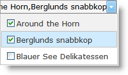

////

|metadata|
{
    "name": "webdropdown-multiple-selection",
    "controlName": ["WebDropDown"],
    "tags": ["Selection"],
    "guid": "{31AD416E-2CAF-4C93-9D11-59F1DC7DEC64}",  
    "buildFlags": [],
    "createdOn": "0001-01-01T00:00:00Z"
}
|metadata|
////

= 複数選択

WebDropDown™ によってエンドユーザーがドロップダウン コンテナから単一および複数項目選択を実行することを可能にします。デフォルトで、単一選択が有効です。複数選択を有効にするには、  pick:[asp-net="link:{ApiPlatform}web{ApiVersion}~infragistics.web.ui.listcontrols.webdropdown~displaymode.html[DisplayMode]"]  プロパティを *DropDown* または *DropDownList* のいずれかに設定し、  pick:[asp-net="link:{ApiPlatform}web{ApiVersion}~infragistics.web.ui.listcontrols.webdropdown~enablemultipleselection.html[EnableMultipleSelection]"]  プロパティを True に設定する必要があります。

項目が選択されると、事前に定義された区切り記号を使用することですべての選択された項目の表示値を連結して形成されて Value Display コンポーネントでエンドユーザーに表示されます。デフォルトで区切り記号はコンマに設定されます。ただし、WebDropDown コントロールの  pick:[asp-net="link:{ApiPlatform}web{ApiVersion}~infragistics.web.ui.listcontrols.webdropdown~multiselectvaluedelimiter.html[MultiSelectValueDelimiter]"]  プロパティを設定することによって区切り記号を変更できます。

WebDropDown コントロールの  pick:[asp-net="link:{ApiPlatform}web{ApiVersion}~infragistics.web.ui.listcontrols.webdropdown~multipleselectiontype.html[MultipleSelectionType]"]  プロパティを設定することによってチェックボックスまたはキーボードを使用することによって複数選択が実行できます。

== チェックボックスを使用して複数選択

WebDropDown™ はチェックボックスを使用して複数選択を可能にします。WebDropDown コントロールの  pick:[asp-net="link:{ApiPlatform}web{ApiVersion}~infragistics.web.ui.listcontrols.webdropdown~multipleselectiontype.html[MultipleSelectionType]"]  プロパティを Checkbox に設定することによってチェックボックスを使用して複数選択を有効にできます。これはあらゆるリスト項目の前にチェックボックスを描画します。

== チェックボックスを使用して複数項目をドロップダウン リストから選択するには:

[start=1]
. Visual Studio Toolbox から、WebDropDown のインスタンスをフォームにドラッグ アンド ドロップして項目を項目コレクションに追加します。項目の追加の詳細は、 link:webdropdown-getting-started-with-webdropdown.html[WebDropDown で開始] を参照してください。
[start=2]
. WebDropDown で複数選択を有効にするには、Microsoft® Visual Studio® [プロパティ] ウィンドウを使用する、または以下のコードを使用して EnableMultipleSelection プロパティを True に設定する必要があります。 

*Visual Basic の場合：*

[source]
----
WebDropDown1.EnableMultipleSelection = true
----

*C# の場合：*

[source]
----
WebDropDown1.EnableMultipleSelection = true;
----

[start=3]
. チェックボックスを使用して複数項目を選択するには、[プロパティ] ウィンドウを使用する、または以下のコードを使用して MultipleSelectionType プロパティを Checkbox に設定する必要があります。

*Visual Basic の場合：*

[source]
----
WebDropDown1.MultipleSelectionType = DropDownMultipleSelectionType.Checkbox
----

*C# の場合：*

[source]
----
WebDropDown1.MultipleSelectionType = DropDownMultipleSelectionType.Checkbox;
----

[start=4]
. アプリケーションを保存して実行します。ドロップダウンからチェックボックスを選択すると、値表示にデフォルトの区切り記号で分離された項目が表示されるのが分かります。

== キーボードを使用して複数選択

WebDropDown™ はキーボードを使用して複数選択を可能にします。Ctrl/Shift キーを押すと、Windows Explorer に存在するのと同じ方法で複数選択することができます。Ctrl/Shift キーを押して項目をクリックする、または上矢印/下矢印キーでナビゲートすることによって複数選択が実行されます。項目が選択されると、Value Display コンポーネントに値の区切られたセットがエンドユーザーに表示されます。この表示は、事前に定義された区切り記号（デフォルトでコンマ）を使用することですべての選択された項目の表示値を連結することで形成されます。

WebDropDown コントロールの  pick:[asp-net="link:{ApiPlatform}web{ApiVersion}~infragistics.web.ui.listcontrols.webdropdown~multipleselectiontype.html[MultipleSelectionType]"]  プロパティを Keyboard に設定することによってキーボードを使用して複数選択を有効にできます。

== キーボードを使用して複数項目をドロップダウン リストから選択するには:

[start=1]
. Visual Studio ツールボックスから、WebDropDown のインスタンスをフォームにドラッグ アンド ドロップして項目を項目コレクションに追加します。項目の追加の詳細は、 link:webdropdown-getting-started-with-webdropdown.html[WebDropDown で開始] を参照してください。
[start=2]
. WebDropDown で複数選択を有効にするには、Microsoft® Visual Studio® [プロパティ] ウィンドウを使用する、または以下のコードを使用して EnableMultipleSelection プロパティを True に設定する必要があります。

*Visual Basic の場合：*

[source]
----
WebDropDown1.EnableMultipleSelection = true
----

*C# の場合：*

[source]
----
WebDropDown1.EnableMultipleSelection = true; 
----

[start=3]
. キーボードを使用して複数項目を選択するには、[プロパティ] ウィンドウを使用する、または以下のコードを使用して MultipleSelectionType プロパティを Keyboard に設定する必要があります。

*Visual Basic の場合：*

----
WebDropDown1.MultipleSelectionType = DropDownMultipleSelectionType.Keyboard
----

*C# の場合：*

----
WebDropDown1.MultipleSelectionType = DropDownMultipleSelectionType.Keyboard;
----

[start=4]
. アプリケーションを保存して実行します。Ctrl/Shift キーを押してドロップダウンから上矢印/下矢印キーでナビゲートすると、値表示にコンマで区切られた選択された項目が表示されることが分かります。