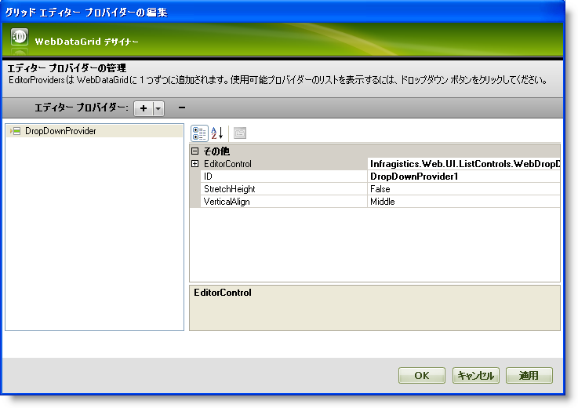
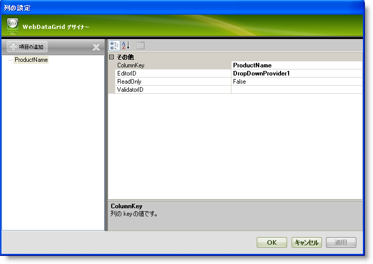
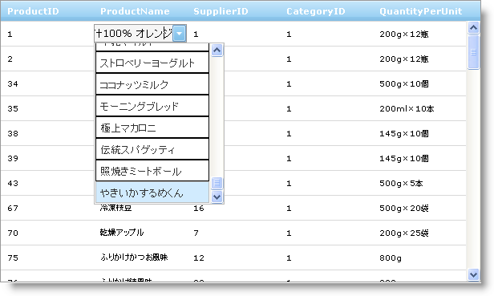

////

|metadata|
{
    "name": "webdropdown-using-webdropdown-as-an-editor-provider-for-webdatagrid",
    "controlName": ["WebDropDown"],
    "tags": [],
    "guid": "{AD8C6A53-D966-445B-80AA-A0ABC1DA41C7}",  
    "buildFlags": [],
    "createdOn": "0001-01-01T00:00:00Z"
}
|metadata|
////

= WebDataGrid のエディター プロバイダーとして WebDropDown を使用

== 始める前に

WebDropDown™ は、すべての他の WebDropDown 機能と共にセル値の項目のドロップダウン リストを表示するために WebDataGrid™ 用のエディター プロバイダーとして使用できます。

== 達成すること

WebDataGrid で  pick:[asp-net="link:{ApiPlatform}web{ApiVersion}~infragistics.web.ui.gridcontrols.dropdownprovider.html[DropDownProvider]"]  として WebDropDown を使用する方法を学びます。

== 次の手順を実行します

[start=1]
. Visual Studio™ ツールボックスから、ScriptManager コンポーネント、SqlDataSource コンポーネントおよび WebDataGrid コントロールをフォームにドラッグ アンド ドロップします。
[start=2]
. SqlDataSource1 を使用して Northwind データベースの Products テーブルの ProductID、ProductName、SupplierID、CategoryID および QuantityPerUnit に WebDataGrid を バインドします。実行についての詳細は、 link:webdatagrid-getting-started-with-webdatagrid.html[「WebDataGrid を SQL データ ソースにバインド」]を参照してください。
[start=3]
. Visual Studio プロパティ ウィンドウで、 pick:[asp-net="link:{ApiPlatform}web{ApiVersion}~infragistics.web.ui.gridcontrols.webdatagrid~editorproviders.html[EditorProviders]"]  プロパティを指定して、省略記号 (...) ボタンをクリックし、[グリッド エディター プロバイダー デザイナーの編集] を起動します。
[start=4]
. + ボタンをクリックし、使用できるエディター プロバイダーのドロップダウン リストから DropDownProvider を選択します。
[start=5]
. DropDownProvider1 としてエディターの ID をそのままにしておきます。この ID は列のエディターを設定するときに後で必要になります。

[start=6]
. EditorControl プロパティを展開して、以下のプロパティを設定します。

[options="header", cols="a,a"]
|====
|プロパティ|値

|DataSourceID
|SqlDataSource1

|DropDownOrientation
|BottomLeft

|TextField
|ProductName

|ValueField
|ProductID

|====

[start=7]
. [適用] と [OK] をクリックしてデザイナーを閉じます。
[start=8]
. pick:[asp-net="link:{ApiPlatform}web{ApiVersion}~infragistics.web.ui.gridcontrols.webdatagrid~behaviors.html[Behaviors]"]  プロパティを指定して、省略記号 (...) ボタンをクリックし、[グリッド動作の編集] ダイアログを起動します。
[start=9]
. 編集を有効にするには左のリストで Cell Editing 動作チェックボックスをチェックします。
[start=10]
. 右のプロパティ グリッドで  pick:[asp-net="link:{ApiPlatform}web{ApiVersion}~infragistics.web.ui.gridcontrols.cellediting~columnsettings.html[ColumnSettings]"]  プロパティを指定して、省略記号 (...) ボタンをクリックして、[列設定] ダイアログを起動します。
[start=11]
. WebDataGrid を構成して ProductName 列の編集のために DropDownProvider を使用します。

** [項目の追加] ボタンをクリックして列設定を追加します。
** ProductName として  pick:[asp-net="link:{ApiPlatform}web{ApiVersion}~infragistics.web.ui.gridcontrols.columnsetting~columnkey.html[ColumnKey]"]  プロパティを設定します。
**  pick:[asp-net="link:{ApiPlatform}web{ApiVersion}~infragistics.web.ui.gridcontrols.columneditsetting~editorid.html[EditorID]"]  プロパティを使用できるプロバイダーのドロップダウン リストから DropDownProvider1 に設定します。
** [適用] と [OK] ボタンをクリックして [列設定] ダイアログを閉じます。
** [適用] と [OK] をクリックして [グリッド動作の編集] ダイアログを閉じます。

[start=12]
. アプリケーションを保存して実行します。ProductName 列のセルが編集モードになると、以下の画像のように項目のドロップダウン リストが表示されることがわかります。

