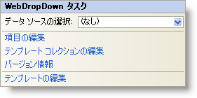

////

|metadata|
{
    "name": "webdropdown-webdropdown-smart-tag",
    "controlName": ["WebDropDown"],
    "tags": ["Design Environment"],
    "guid": "{34941237-8F8E-4F75-A76F-3ED5573E1DCC}",  
    "buildFlags": [],
    "createdOn": "0001-01-01T00:00:00Z"
}
|metadata|
////

= WebDropDown スマート タグ

Visual Studio 2005/2008（.NET Framework 2.0/3.5）では、{ProductName} の個々のコントロール/コンポーネントにはスマート タグがあります。コントロールやコンポーネントを選択することで、スマート タグのアンカーが表示されます。このアンカーをクリックするとポップアップ パネルが表示され、そこからコントロール/コンポーネントの最もよく使うプロパティや設定にすばやく簡単にアクセスできます。

WebDropDown™ のスマート タグには次の項目が含まれています。

* [データ ソースの選択] -- 既存のデータ ソースを選択する、または WebDropDown にバインドするようににデータ ソースを構成できます。

項目の説明と、プロパティ グリッドの各項目が対応するプロパティについては、以下の表を参照してください。

WebDropDown のスマート タグには次のリンクが含まれています。

* 項目の編集 – 項目の追加、削除、そしてプロパティの設定のために [WebDropDown の編集] ダイアログを表示します。
* テンプレート コレクションの編集 - WebDropDown で使用できるテンプレートを追加/削除できるテンプレート コレクション エディターにリンクします。
* バージョン情報 -- これをクリックすると WebDropDown 製品情報が開きます。状態、バージョン、有効期限、製品キーなどの情報を含みます。
* テンプレートの編集 -- これをクリックして、編集できるすべての使用可能なテンプレートを表示します。必要に応じてテンプレートにコントロールをドラッグ アンド ドロップして、コントロールを編集できます。

[options="header", cols="a,a,a"]
|====
|項目|説明|対応するプロパティ

|データ ソースの選択
|ドロップダウン リストによって、既存のデータ ソースを選択したり、新しいデータ ソースを構成できます。
|*DataSourceID*

|====