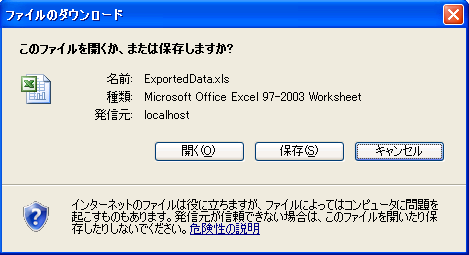

////

|metadata|
{
    "name": "webexcelexporter-exporting-multiple-grids-with-webexcelexporter",
    "controlName": ["WebExcelExporter"],
    "tags": ["Exporting","Grids","Grouping"],
    "guid": "8a983da0-c879-45ac-a427-bc666808fc85",  
    "buildFlags": [],
    "createdOn": "2010-06-06T07:56:24.2216939Z"
}
|metadata|
////

= WebExcelExporter で複数グリッドをエクスポート

== 達成すること

データを複数の WebDataGrid/WebHierarchicalDataGrid データから Excel™ ファイル形式にエクスポートするように WebExcelExporter を設定および使用する方法を学習します。

== 始める前に

ここに示すサンプルをコンパイルおよび実行するためには、NetAdvatage for ASP.NET v. 10.2 をインストールする必要があります。SQL サーバー（Express またはその他任意のエディション）の実行中のインスタンスも必要となりますが、SQL サーバーのインスタンスに NorthWind データベースを添付することも必要となります。 link:http://msdn.microsoft.com/ja-JP/library/8b6y4c7s.aspx[http://msdn.microsoft.com/ja-JP/library/8b6y4c7s.aspx] にある指示に従い NorthWind データベースをインストールするか、 link:http://www.microsoft.com/downloads/details.aspx?familyid=06616212-0356-46a0-8da2-eebc53a68034&displaylang=en[http://www.microsoft.com/downloads/details.aspx?familyid=06616212-0356-46a0-8da2-eebc53a68034&displaylang=en] (英語) から直接データベースをダウンロードすることができます。

== 複数のグリッドをひとつのワークシートにエクスポート

以下の手順に従って、別個のワークシート内の各グリッドを使用し、2 つのグリッドをひとつのファイルにエクスポートします。

[start=1]
. 2 つの WebDataGrid コントロールをあるデータ ソースにバインドして Web ページ（ASP.NET Web フォーム）を作成します。

*HTML の場合:*

----
<ig:WebDataGrid runat="server" ID="wdgCustomers" 
        DataSourceID="SqlDsCustomers" 
        DataKeyFields="CustomerID" 
        AutoGenerateColumns="
        >
            <Columns>
                <ig:BoundDataField Key="Country" DataFieldName="Country" Header-Text="Country" />
                <ig:BoundDataField Key="City" DataFieldName="City" Header-Text="City" />
                <ig:BoundDataField Key="CompanyName" DataFieldName="CompanyName" Header-Text="Company" />
                <ig:BoundDataField Key="ContactName" DataFieldName="ContactName" Header-Text="Contact" />
                <ig:BoundDataField Key="Phone" DataFieldName="Phone" Header-Text="Phone" />
            </Columns>
        </ig:WebDataGrid>
<ig:WebDataGrid runat="server" ID="wdgEmpoyees" 
            DataSourceID="SqlDsEmployees" 
            DataKeyFields="EmployeeID" 
            AutoGenerateColumns="true"
            >
            </ig:WebDataGrid>
        <asp:SqlDataSource runat="server"ID="SqlDsCustomers"ConnectionString="<%$ ConnectionStrings:NorthwindConnectionString %>" SelectCommand="SELECT * FROM [Customers] ORDER BY [Country]">
        </asp:SqlDataSource>
<asp:SqlDataSource ID="SqlDsEmployees" runat="server" 
            ConnectionString="<%$ ConnectionStrings:NorthwindConnectionString %>" 
            SelectCommand="SELECT [EmployeeID], [TitleOfCourtesy], [LastName], [FirstName], [Title], [Country] FROM [Employees] ORDER BY [Country], [LastName]">
        </asp:SqlDataSource>
----

[start=2]
. WebExcelExporter コントロールを Visual Studio Toolbox からページにドラッグします。

.. WebExcelExporter の ExportMode プロパティを Download に設定します。
.. コントロールの ID プロパティを WebExcelExporter に設定します。
.. コントロールの DownloadName プロパティを "ExportedData" に設定します。

*HTML の場合:*

----
<ig:WebExcelExporter runat="server" ID="WebExcelExporter" ExportMode ="Download" DownloadName="ExportedData" />
----

[start=3]
. Button コントロールを Visual Studio Toolbox からページにドラッグします。

.. ボタンの ID プロパティを btnExport に設定します。
.. コントロールの Text プロパティを「データのエクスポート」に設定します。
.. コントロールの OnClick プロパティを "btnExport_Click" に設定します。
.. コード ビハインドで "btnExport_Click" ハンドラーを定義し、WebExcelExporter の Export() メソッド オーバーロードのひとつを呼び出します。

[cols="a"]
|====
|コード ビハインド（C#）の場合:

|protected void btnExport_Click(object sender, EventArgs e) 

{ 

this.WebExcelExporter.Export(this.wdgCustomers, this.wdgEmpoyees); 

}

|====

*HTML の場合:*

----
<asp:Button runat="server" ID="btnExport" Text="データのエクスポート" OnClick="btnExport_Click" />
----

[start=4]
. アプリケーションを実行します。
[start=5]
. [データのエクスポート] ボタンをクリックします。

[データのエクスポート] ボタンをクリックした後、ブラウザーで "ExportedData.xls" という名前のファイルを開くのかそれとも保存するのかを尋ねられます。

== 複数のグリッドを別個のワークシートにエクスポート

複数のグリッドを別個のワークシートにエクスポートために以前の例から唯一変更しなければならないのは、使用している WebExcelExporter の Export() メソッド オーバーロードを変更することです。Boolean パラメーター（exportSingleGridPerSheet）を最初に受け入れる特定のオーバーロードがあります。したがって、手順（3.d）で作成したイベント ハンドラーを以下の方法で変更する必要があります。

[cols="a"]
|====
|コード ビハインド（C#）の場合:

|protected void btnExport_Click(object sender, EventArgs e) 

{ 

this.WebExcelExporter.Export(true, this.wdgCustomers, this.wdgEmpoyees); 

}

|====

再度アプリケーションを実行して、[データのエクスポート] ボタンをクリックします。ファイルには 2 つのワークシートができます。

*注：* ExportedData.xlsx ファイルは Grid の表示可能なデータしか含みません。