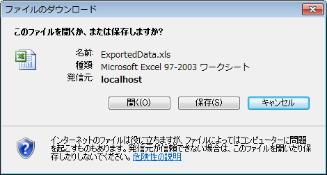

////

|metadata|
{
    "name": "webexcelexporter-saving-all-data-in-the-data-source",
    "controlName": ["WebExcelExporter"],
    "tags": ["Data Binding","Exporting","Grids","Persistence"],
    "guid": "338c111b-d40b-44b7-8572-658f68b77058",  
    "buildFlags": [],
    "createdOn": "2010-06-06T07:51:53.0296939Z"
}
|metadata|
////

= すべてのデータをデータ ソースに保存

== 達成すること

フル データ ソースを使用して、WebDataGrid/WebHierarchicalDataGrid データを Excel™ ファイル形式にエクスポートするように WebExcelExporter を設定および使用する方法を学習します。これはページングまたは仮想スクロールを有効にしたが、現在のページのみだけでなく（デフォルト モード）、データソース内のデータ全体をエクスポートしたい場合に適しています。

== 始める前に

ここに示すサンプルをコンパイルおよび実行するためには、NetAdvatage for ASP.NET v. 10.2 をインストールする必要があります。SQL サーバー（Express またはその他任意のエディション）の実行中のインスタンスも必要となりますが、SQL サーバーのインスタンスに NorthWind データベースを添付することも必要となります。 link:http://msdn.microsoft.com/ja-JP/library/8b6y4c7s.aspx[http://msdn.microsoft.com/ja-JP/library/8b6y4c7s.aspx] にある指示に従い NorthWind データベースをインストールするか、 link:http://www.microsoft.com/downloads/details.aspx?familyid=06616212-0356-46a0-8da2-eebc53a68034&displaylang=en[http://www.microsoft.com/downloads/details.aspx?familyid=06616212-0356-46a0-8da2-eebc53a68034&displaylang=en] (英語) から直接データベースをダウンロードすることができます。

== Microsoft Office Excel 2003 形式でフル データ ソースのデータをエクスポート

以下の手順に従って、すべてのデータをデータ ソースから Microsoft Office Excel™ 2003 ファイル形式にエクスポートします。

[start=1]
. WebDataGrid を SqlDataSource コントロールにバインドして Web ページ（ASP.NET Web フォーム）を作成します。そのグリッドに対するページング動作を有効にします。

*HTML の場合:*

----
<ig:WebDataGrid runat="server" ID="wdgCustomers" 
        DataSourceID="SqlDsCustomers" 
        DataKeyFields="CustomerID" 
        AutoGenerateColumns="
        >
            <Columns>
                <ig:BoundDataField Key="Country" DataFieldName="Country" Header-Text="Country" />
                <ig:BoundDataField Key="City" DataFieldName="City" Header-Text="City" />
                <ig:BoundDataField Key="CompanyName" DataFieldName="CompanyName" Header-Text="Company" />
                <ig:BoundDataField Key="ContactName" DataFieldName="ContactName"Header-Text="Contact" />
                <ig:BoundDataField Key="Phone" DataFieldName="Phone" Header-Text="Phone" />
            </Columns>
            <Behaviors>
                <ig:Paging PageSize="5" QuickPages="3"                  Enabled="true" PagerMode="NumericFirstLast" />
            </Behaviors>
        </ig:WebDataGrid>
----

[start=2]
. WebExcelExporter コントロールを Visual Studio Toolbox からページにドラッグします。

.. WebExcelExporter の ExportMode プロパティを Download に設定します。
.. コントロールの ID プロパティを WebExcelExporter に設定します。
.. コントロールの DownloadName プロパティを ExportedData に設定します。
.. コントロールの DataExportMode プロパティを AllDataInDataSource に設定します。

*HTML の場合:*

----
<ig:WebExcelExporter runat="server" ID="WebExcelExporter" ExportMode ="Download" DownloadName="ExportedData" DataExportMode="AllDataInDataSource"
 />
----

[start=3]
. Button コントロールを Visual Studio Toolbox からページにドラッグします。

.. ボタンの ID プロパティを btnExport に設定します。
.. コントロールの Text プロパティを「データのエクスポート」に設定します。
.. コントロールの OnClick を btnExport_Click に設定します。
.. コード ビハインドで btnExport_Click ハンドラーを定義し、WebExcelExporter の Export() メソッド オーバーロードのひとつを呼び出します。

[cols="a"]
|====
|コード ビハインド（C#）の場合:

|protected void btnExport_Click(object sender, EventArgs e) 

{ 

this.WebExcelExporter.Export(this.wdgCustomers); 

}

|====

*HTML の場合:*

----
<asp:Button runat="server" ID="btnExport" Text="データのエクスポート" OnClick="btnExport_Click" />
----

[start=4]
. アプリケーションを実行します。
[start=5]
. [データのエクスポート] ボタンをクリックします。

[データのエクスポート] ボタンをクリックした後、ブラウザーで "ExportedData.xls" という名前のファイルを開くのかそれとも保存するのかを尋ねられます。

ファイルを開いた時に、グリッド内の現在表示されているデータではなく（現在のページ）、データ全体がエクスポートされたのが確認できます。