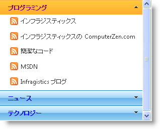

////

|metadata|
{
    "name": "webexplorerbar-about-webexplorerbar",
    "controlName": ["WebExplorerBar"],
    "tags": ["Getting Started","How Do I","Layouts"],
    "guid": "{323A9523-C5EB-4E4D-9695-3D24E9D3E782}",  
    "buildFlags": [],
    "createdOn": "2010-01-03T22:49:02Z"
}
|metadata|
////

= WebExplorerBar について

WebExplorerBar™ コントロールは Windows Explorer バーにある機能と非常に似た機能を提供します。項目はグループに含まれ、各グループを展開または縮小できます。各項目またはグループを使用して選択する URL にナビゲートすることができます。これによりシンプルでありながら効果的なナビゲーション レイアウトが可能となります。

以下のリストに WebExplorerBar のさまざまな機能をリストします。

* *データ バインディング --* 階層データへの効率的なデータ バインディングのサポート。
* *ロードオンデマンド* -- エンドユーザーによって必要とされるものだけをロードします。
* *カスタマイズ可能なモード* -- さまざまな展開可能モードをサポート。

以下のスクリーンショットは WebExplorerBar コントロールを表示し、その主要部分にラベルを付けます。

== 関連トピック

link:webexplorerbar-smart-tag.html[WebExplorerBar スマートタグ]

link:webexplorerbar-getting-started-with-webexplorerbar.html[WebExplorerBar で開始]

link:webexplorerbar-using-webexplorerbar.html[WebExplorerBar の使用]