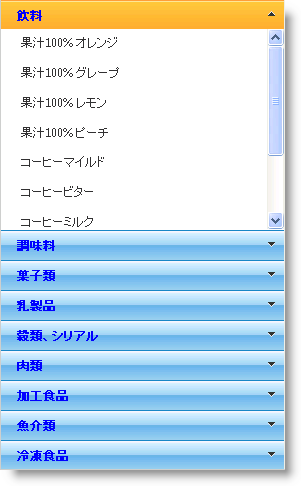

////

|metadata|
{
    "name": "webexplorerbar-binding-to-webhierarchcialdatasource",
    "controlName": ["WebExplorerBar"],
    "tags": ["Data Binding","How Do I"],
    "guid": "{A6861AD3-B594-41FC-88EB-251F7E129C6E}",  
    "buildFlags": [],
    "createdOn": "2010-01-03T22:39:20Z"
}
|metadata|
////

= WebHierarchcialDataSource にバインド

== 始める前に

WebExplorerBar™ は階層データ ソースにバインドでき、データ階層の各レベルを表示します。最上位のレベルはさまざまなグループを表し、各子レベルは項目を表します。

== 達成すること

AccessDataSource コンポーネントを使用して WebExplorerBar を WebHierarchicalDataSource コンポーネントにバインドする方法を学習します。

== 以下の手順を実行します

[start=1]
. Visual Studio™ ツールボックスから Web ページに ScriptManager コンポーネントをドラッグします。
[start=2]
. WebExplorerBar コントロールをページにドラッグします。
[start=3]
. WebHierarchicalDataSource コンポーネントをページにドラッグします。
[start=4]
. Nortwind データベースから Categories および Products データを取得するために、2 つの AccessDataSource コンポーネントを使用するように WebHierarchicalDataSource を設定します。WebHierarchicalDataSource を使用するために詳細なガイドが必要な場合には、 link:webhierarchicaldatasource-getting-started-with-webhierarchicaldatasource.html[WebHierarchicalDataSource で開始]を参照してください。WebHierarchicalDataSource コンポーネントを設定した後は、以下のマークアップができます。

*HTML の場合:*

----
    <asp:AccessDataSource ID="CategoriesDS" runat="server" DataFile="~/App_Data/Nwind.mdb"
        SelectCommand="SELECT Categories.CategoryID, Categories.CategoryName FROM Categories ">
    </asp:AccessDataSource>
    <asp:AccessDataSource ID="ProductsDS" runat="server" DataFile="~/App_Data/Nwind.mdb"
        SelectCommand="SELECT Products.ProductID, Products.ProductName, Products.CategoryID FROM Products ">
    </asp:AccessDataSource>
    <ig:WebHierarchicalDataSource ID="whds" runat="server">
        <DataViews>
            <ig:DataView DataSourceID="CategoriesDS" ID="Categories" />
            <ig:DataView DataSourceID="ProductsDS" ID="Products" />
        </DataViews>
        <DataRelations>
            <ig:DataRelation ParentDataViewID="Categories" ParentColumns="CategoryID" ChildDataViewID="Products"
                ChildColumns="CategoryID" />
        </DataRelations>
    </ig:WebHierarchicalDataSource>
----

*注：* 明確にするために、データ ビューの ID プロパティは、WebHierarchicalDataSource によって設定されるデフォルト値から変更されました。

[start=5]
. WebExplorerBar の DataSourceID プロパティを、WebHierarchicalDataSource コンポーネントの ID である WebHierarchicalDataSource1 に設定します。
[start=6]
. WebExplorerBar の項目にデータ バインドを設定して、Categories データ ビューと Products データ ビューの CategoryName プロパティと ProductName プロパティをそれぞれ表示します。

.. ExplorerBarItemBinding オブジェクトを DataBindings コレクションに追加します。
.. DataMember プロパティを CategoriesDataview に設定します。
.. TextField プロパティを CategoryName に設定します。
.. もうひとつの ExplorerBarItemBinding オブジェクトをコレクションに追加します。
.. DataMember を ProductsDataview に、TextField を ProductName に設定します。

*HTML の場合:*

----
   <ig:WebExplorerBar GroupExpandBehavior="SingleExpanded" MaxGroupHeight="200px" DataSourceID="whds"  
         InitialDataBindDepth="0" ID="WebExplorerBar1" runat="server" Width="300px">
        <DataBindings>
            <ig:ExplorerBarItemBinding DataMember="Categories" TextField="CategoryName" />
            <ig:ExplorerBarItemBinding DataMember="Products" TextField="ProductName" />
        </DataBindings>
    </ig:WebExplorerBar>
----

[start=7]
. アプリケーションを実行します。WebExplorerBar コントロールはバインドされる階層データ ソースに基づいてグループと項目を表示します。

== 関連トピック

link:webexplorerbar-smart-tag.html[WebExplorerBar スマートタグ]

link:webexplorerbar-keyboard-navigation.html[キーボード ナビゲーション]

link:webexplorerbar-height-properties.html[WebExplorerBar の高さのプロパティ]

link:webexplorerbar-setting-navigateurl-and-target-properties.html[NavigateURL と Target プロパティの設定]

link:webexplorerbar-binding-to-an-xml-data-source.html[XML データ ソースにバインドする]

link:webexplorerbar-binding-to-webhierarchcialdatasource.html[WebHierarchcialDataSource にバインド]

link:webexplorerbar-serverevents.html[サーバー側イベント]

link:webexplorerbar-selection-behavior.html[選択動作]

link:webexplorerbar-clientside-api.html[ClientSide API]

link:webexplorerbar-clientevents.html[クライアント側イベント]

link:webexplorerbar-styling.html[CSS クラス プロパティ]