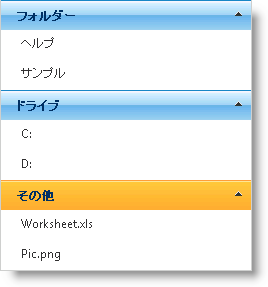

////

|metadata|
{
    "name": "webexplorerbar-getting-started-with-webexplorerbar",
    "controlName": ["WebExplorerBar"],
    "tags": ["Getting Started","Grouping"],
    "guid": "{DA54D236-F191-4CB7-8872-87F2A8AC3C10}",  
    "buildFlags": [],
    "createdOn": "2010-01-03T22:44:37Z"
}
|metadata|
////

= WebExplorerBar で開始

== 始める前に

WebExplorerBar™ コントロールによって、データ ソースにバインドすることなく、グループと項目を表示することができます。デザイン タイムに、またはコード ビハインドでグループと項目を追加することによってこれを実行できます。

== 達成すること

グループと項目を WebExplorerBar に追加する方法を学習します。

== 次の手順を実行します

[start=1]
. Visual Studio™ ツールボックスから Web ページに ScriptManager コンポーネントをドラッグします。
[start=2]
. WebExplorerBar コントロールをページにドラッグします。
[start=3]
. WebExplorerBar の link:{ApiPlatform}web{ApiVersion}~infragistics.web.ui.navigationcontrols.webexplorerbar~groups.html[Groups] プロパティを使用して、 link:{ApiPlatform}web{ApiVersion}~infragistics.web.ui.navigationcontrols.explorerbargroup.html[ExplorerBarGroup] オブジェクトをグループ コレクションに追加します。

*HTML の場合:*

----
<ig:WebExplorerBar ID="WebExplorerBar1" runat="server" GroupExpandBehavior="AnyExpandable">
        <Groups>
            <ig:ExplorerBarGroup Text="フォルダー">
            <%--TODO: 項目を追加します--%>
            </ig:ExplorerBarGroup>
        </Groups>
</ig:WebExplorerBar>
----

*Visual Basic の場合：*

----
' グループ 1 
Dim group As New ExplorerBarGroup() 
group.Text = "フォルダー" 
Me.WebExplorerBar1.Groups.Add(group)
----

*C# の場合：*

----
// グループ 1
ExplorerBarGroup group = new ExplorerBarGroup();
group.Text = "フォルダー";
this.WebExplorerBar1.Groups.Add(group);
----

[start=4]
. link:{ApiPlatform}web{ApiVersion}~infragistics.web.ui.navigationcontrols.explorerbaritemcollection.html[Items] プロパティを使用して、2 つの ExplorerBarItem オブジェクトを項目コレクションに追加します。
[start=5]
. 一方の link:{ApiPlatform}web{ApiVersion}~infragistics.web.ui.navigationcontrols.explorerbaritem.html[ExplorerBarItem] オブジェクトで link:{ApiPlatform}web{ApiVersion}~infragistics.web.ui.navigationcontrols.explorerbaritembase~text.html[Text] プロパティを "Documents" に設定し、もう一方の ExplorerBarItem オブジェクトで "Samples" に設定します。

*HTML の場合:*

----
<Items>
   <ig:ExplorerBarItem Text="ヘルプ" />
   <ig:ExplorerBarItem Text="サンプル" />
</Items>
----

*Visual Basic の場合：*

----
Dim item As New ExplorerBarItem() 
item.Text = "ヘルプ" 
group.Items.Add(item) 
item = New ExplorerBarItem() 
item.Text = "サンプル" 
group.Items.Add(item)
----

*C# の場合：*

----
ExplorerBarItem item = new ExplorerBarItem();
item.Text = "ヘルプ";
group.Items.Add(item);
item = new ExplorerBarItem();
item.Text = "サンプル";
group.Items.Add(item);
----

[start=6]
. 手順 3 と 4 をさらに 2 回繰り返し、さらに 2 グループ取得して以下のサンプル コードに従ってテキストを設定します。

*HTML の場合:*

----
<ig:ExplorerBarGroup Text="ドライブ">
    <Items>
       <ig:ExplorerBarItem Text="C:" />
       <ig:ExplorerBarItem Text="D:" />
    </Items>
 </ig:ExplorerBarGroup>
 <ig:ExplorerBarGroup  Text="その他">
     <Items>
        <ig:ExplorerBarItem Text="Worksheet.xls" />
        <ig:ExplorerBarItem Text="Pic.png" />
     </Items>
</ig:ExplorerBarGroup>
----

*Visual Basic の場合：*

----
' グループ 2 
group = New ExplorerBarGroup() 
group.Text = "ドライブ" 
Me.WebExplorerBar1.Groups.Add(group) 
item = New ExplorerBarItem() 
item.Text = "C:" 
group.Items.Add(item) 
item = New ExplorerBarItem() 
item.Text = "D:" 
group.Items.Add(item) 
' グループ 3 
group = New ExplorerBarGroup() 
group.Text = "その他" 
Me.WebExplorerBar1.Groups.Add(group) 
item = New ExplorerBarItem() 
item.Text = "Worksheet.xls" 
group.Items.Add(item) 
item = New ExplorerBarItem() 
item.Text = "Pic.png" 
group.Items.Add(item)
----

*C# の場合：*

----
// グループ 2
group = new ExplorerBarGroup();
group.Text = "ドライブ";
this.WebExplorerBar1.Groups.Add(group);
item = new ExplorerBarItem();
item.Text = "C:";
group.Items.Add(item);
item = new ExplorerBarItem();
item.Text = "D:";
group.Items.Add(item);
// グループ 3
group = new ExplorerBarGroup();
group.Text = "その他";
this.WebExplorerBar1.Groups.Add(group);
item = new ExplorerBarItem();
item.Text = "Worksheet.xls";
group.Items.Add(item);
item = new ExplorerBarItem();
item.Text = "Pic.png";
group.Items.Add(item);
----

[start=7]
. アプリケーションを実行します。WebExplorerBar コントロールはサブ項目を持つ 3 つのグループを表示します。

== 関連トピック

link:webexplorerbar-about-webexplorerbar.html[WebExplorerBar の理解]

link:webexplorerbar-using-webexplorerbar.html[WebExplorerBar の使用]