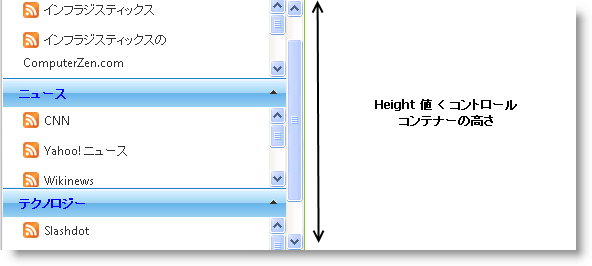
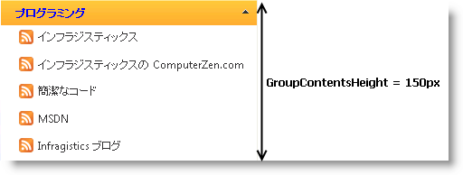
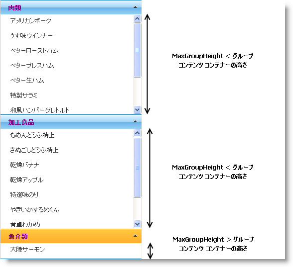

////

|metadata|
{
    "name": "webexplorerbar-height-properties",
    "controlName": ["WebExplorerBar"],
    "tags": ["API","How Do I","Styling"],
    "guid": "{0DB3838A-E7A2-4609-B5B3-079F5621468E}",  
    "buildFlags": [],
    "createdOn": "2010-01-03T22:54:46Z"
}
|metadata|
////

= WebExplorerBar の高さのプロパティ

WebExplorerBar™ の高さは、コントロールの  pick:[asp-net="link:{ApiPlatform}web{ApiVersion}~infragistics.web.ui.navigationcontrols.webexplorerbar~height.html[Height]"] 、 pick:[asp-net="link:{ApiPlatform}web{ApiVersion}~infragistics.web.ui.navigationcontrols.webexplorerbar~groupcontentsheight.html[GroupContentsHeight]"]  および  pick:[asp-net="link:{ApiPlatform}web{ApiVersion}~infragistics.web.ui.navigationcontrols.webexplorerbar~maxgroupheight.html[MaxGroupHeight]"]  プロパティを使用することで構成できます。

* Height – コントロール コンテナーの高さを指定します。WebExplorerBar Groups および Items コンテンツの Height が Height プロパティ値を超えると、スクロールバーが発生します。

Height 値 < 合計のコントロール コンテナーの高さ

* GroupContentsHeight – WebExplorerBar グループのコンテンツ コンテナーの高さを固定値として設定します。グループ コンテンツの高さが GroupContentsHeight プロパティ値を超える場合、スクロールバーが発生します。グループに項目がいくつあろうとも、高さは常に指定された値に固定されます。GroupContentsHeight の値を設定する方法は以下の 2 通りです。

** コントロール レベルから - すべてのグループのコンテンツの高さを指定します。
** グループ レベルから - 宣言するグループに限り高さの値を指定します。

*注：* グループ レベルから GroupContentsHeight プロパティを設定する方が優先されます。

* MaxGroupHeight – WebExplorerBar グループのコンテンツの最大の高さを設定します。グループ コンテンツの高さが MaxGroupHeight 値を超える場合、スクロールバーが発生します。コンテンツの高さは、グループ内にある項目数に応じて変わります。したがって、合計の高さが MaxGroupHeight よりも小さい場合、その項目の下に未使用のスペースがあるということは起こりません。

*注：* MaxGroupHeight プロパティ値はポストバック後は保持されません。グループ コンテンツの高さを動的に取得し、ポストバックが発生すると、MaxGroupHeight プロパティ値は展開されたグループに適用されなくなります。

*推奨:* ページがロードされた時にグループを展開せずに MaxGroupHeight プロパティを使用してください。ページがロード中に AnyExpandable に設定された GroupExpandBehavior プロパティを使用するか、すべてのグループを縮小することもできます。

== 関連トピック

link:webexplorerbar-smart-tag.html[WebExplorerBar スマートタグ]

link:webexplorerbar-keyboard-navigation.html[キーボード ナビゲーション]

link:webexplorerbar-height-properties.html[WebExplorerBar の高さのプロパティ]

link:webexplorerbar-setting-navigateurl-and-target-properties.html[NavigateURL と Target プロパティの設定]

link:webexplorerbar-binding-to-an-xml-data-source.html[XML データ ソースにバインドする]

link:webexplorerbar-binding-to-webhierarchcialdatasource.html[WebHierarchcialDataSource にバインド]

link:webexplorerbar-serverevents.html[サーバー側イベント]

link:webexplorerbar-selection-behavior.html[選択動作]

link:webexplorerbar-clientside-api.html[ClientSide API]

link:webexplorerbar-clientevents.html[クライアント側イベント]

link:webexplorerbar-styling.html[CSS クラス プロパティ]