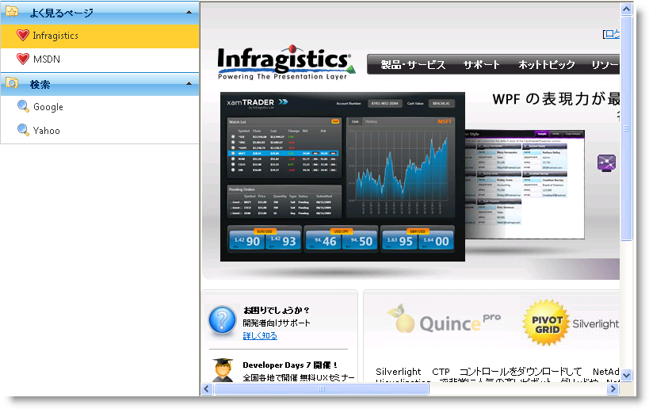

////

|metadata|
{
    "name": "webexplorerbar-setting-navigateurl-and-target-properties",
    "controlName": ["WebExplorerBar"],
    "tags": ["How Do I","Layouts","Navigation"],
    "guid": "{84E214A6-634B-4635-9BB0-EAFE3EB0A6E9}",  
    "buildFlags": [],
    "createdOn": "2010-01-03T22:58:30Z"
}
|metadata|
////

= NavigateURL と Target プロパティの設定

WebExplorerBar™ をページのナビゲーション レイアウトとして使用できます。コントロールの  pick:[asp-net="link:{ApiPlatform}web{ApiVersion}~infragistics.web.ui.navigationcontrols.explorerbargroup.html[ExplorerBarGroup]"]  および  pick:[asp-net="link:{ApiPlatform}web{ApiVersion}~infragistics.web.ui.navigationcontrols.explorerbaritem.html[ExplorerBarItem]"]  オブジェクトには  pick:[asp-net="link:{ApiPlatform}web{ApiVersion}~infragistics.web.ui.navigationcontrols.explorerbaritembase~navigateurl.html[NavigateUrl]"]  プロパティと  pick:[asp-net="link:{ApiPlatform}web{ApiVersion}~infragistics.web.ui.navigationcontrols.explorerbaritembase~target.html[Target]"]  プロパティがあり、ユーザーのページの URL とページをロードするターゲットをそれぞれ設定するために使用できます。

以下のコードは WebExplorerBar の項目を Web ページへのナビゲーション リンクとして使用し、iframe にページをロードする方法を示します。

*HTML の場合:*

----
<ig:WebExplorerBar ID="WebExplorerBar1" runat="server" Width="300px" BehaveMode="AnyExpandable">
    <Groups>
        <ig:ExplorerBarGroup Text="よく見るページ" ImageUrl="~/Icons/FolderFavorite.png">
            <Items>
                <ig:ExplorerBarItem Text="Infragistics" NavigateUrl="http://jp.infragistics.com" Target="iframe1" ImageUrl="~/Icons/Favorites.png" />
                <ig:ExplorerBarItem Text="MSDN" NavigateUrl="http://msdn.microsoft.com/ja-jp/default.aspx" Target="iframe1" ImageUrl="~/Icons/Favorites.png" />
            </Items>
        </ig:ExplorerBarGroup>
        <ig:ExplorerBarGroup Text="検索" ImageUrl="~/Icons/FolderExplore.png">
            <Items>
                <ig:ExplorerBarItem Text="Google" NavigateUrl="http://www.google.com" Target="iframe1" ImageUrl="~/Icons/Search.png" />
                <ig:ExplorerBarItem Text="Yahoo" NavigateUrl="http://www.yahoo.co.jp" Target="iframe1" ImageUrl="~/Icons/Search.png" />
            </Items>
        </ig:ExplorerBarGroup>
    </Groups>
</ig:WebExplorerBar>
<iframe id="frame1" name="iframe1" class="MainContent" width="550" height="500">
</iframe>
----

*Visual Basic の場合：*

----
' グループ 1
Dim weg = New ExplorerBarGroup With {.Text = "よく見るページ", .ImageUrl = "~/Icons/FolderFavorite.png"}
Dim item = New ExplorerBarItem With {.Text = "Infragistics", .NavigateUrl = "http://jp.infragistics.com", .Target = "iframe1", .ImageUrl = "~/Icons/Favorites.png" }
weg.Items.Add(item)
item = New ExplorerBarItem With {.Text = "MSDN", .NavigateUrl = "http://msdn.microsoft.com/ja-jp/default.aspx", .Target = "iframe1", .ImageUrl = "~/Icons/Favorites.png"}
weg.Items.Add(item)
Me.WebExplorerBar1.Groups.Add(weg)
' グループ 2
weg = New ExplorerBarGroup With {.Text = "検索", .ImageUrl = "~/Icons/FolderExplore.png"}
item = New ExplorerBarItem With {.Text = "Google", .NavigateUrl = "http://www.google.com", .Target = "iframe1", .ImageUrl = "~/Icons/Search.png"}
weg.Items.Add(item)
item = New ExplorerBarItem With {.Text = "Yahoo", .NavigateUrl = "http://www.yahoo.co.jp", .Target = "iframe1", .ImageUrl = "~/Icons/Search.png"}
weg.Items.Add(item)
Me.WebExplorerBar1.Groups.Add(weg)
----

*C# の場合：*

----
// グループ 1
ExplorerBarGroup weg = new ExplorerBarGroup() { Text = "よく見るページ", ImageUrl = "~/Icons/FolderFavorite.png" };
ExplorerBarItem item = new ExplorerBarItem()
{
    Text = "Infragistics",
    NavigateUrl = "http://jp.infragistics.com",
    Target = "iframe1",
    ImageUrl = "~/Icons/Favorites.png"
};
weg.Items.Add(item);
item = new ExplorerBarItem()
{
    Text = "MSDN",
    NavigateUrl = "http://msdn.microsoft.com/ja-jp/default.aspx",
    Target = "iframe1",
    ImageUrl = "~/Icons/Favorites.png"
};
weg.Items.Add(item);
this.WebExplorerBar1.Groups.Add(weg);
// グループ 2
weg = new ExplorerBarGroup() { Text = "検索", ImageUrl = "~/Icons/FolderExplore.png" };
item = new ExplorerBarItem()
{
    Text = "Google",
    NavigateUrl = "http://www.google.com",
    Target = "iframe1",
    ImageUrl = "~/Icons/Search.png"
};
weg.Items.Add(item);
item = new ExplorerBarItem()
{
    Text = "Yahoo",
    NavigateUrl = "http://www.yahoo.co.jp",
    Target = "iframe1",
    ImageUrl = "~/Icons/Search.png"
};
weg.Items.Add(item);
this.WebExplorerBar1.Groups.Add(weg);
----

== 関連トピック

link:webexplorerbar-smart-tag.html[WebExplorerBar スマートタグ]

link:webexplorerbar-keyboard-navigation.html[キーボード ナビゲーション]

link:webexplorerbar-height-properties.html[WebExplorerBar の高さのプロパティ]

link:webexplorerbar-setting-navigateurl-and-target-properties.html[NavigateURL と Target プロパティの設定]

link:webexplorerbar-binding-to-an-xml-data-source.html[XML データ ソースにバインドする]

link:webexplorerbar-binding-to-webhierarchcialdatasource.html[WebHierarchcialDataSource にバインド]

link:webexplorerbar-serverevents.html[サーバー側イベント]

link:webexplorerbar-selection-behavior.html[選択動作]

link:webexplorerbar-clientside-api.html[ClientSide API]

link:webexplorerbar-clientevents.html[クライアント側イベント]

link:webexplorerbar-styling.html[CSS クラス プロパティ]