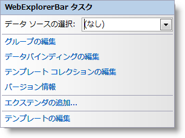

////

|metadata|
{
    "name": "webexplorerbar-smart-tag",
    "controlName": ["WebExplorerBar"],
    "tags": ["Design Environment","How Do I"],
    "guid": "{6142D276-0FDA-4134-A059-B6A53EA042ED}",  
    "buildFlags": [],
    "createdOn": "2010-01-03T22:47:22Z"
}
|metadata|
////

= WebExplorerBar スマートタグ

Visual Studio 2005/2008（.NET Framework 2.0/3.5）では、{ProductName} の個々のコントロール/コンポーネントにはスマートタグがあります。コントロールやコンポーネントを選択することで、スマートタグのアンカーが表示されます。このアンカーをクリックするとポップアップ パネルが表示され、そこからコントロール/コンポーネントの最もよく使うプロパティや設定にすばやく簡単にアクセスできます。

WebExplorerBar™ のスマートタグには次の項目が含まれています。

* [データ ソースの選択] -- 既存のデータ ソースを選択する、または WebExplorerBar にバインドするようにデータ ソースを構成できます。

WebExplorerBar のスマートタグには次のリンクが含まれています。

* グループと項目の編集 -- グループと項目を追加および削除するだけでなくプロパティを設定するための [WebExplorerBar の編集] ダイアログが表示します。
* DataBindings の編集 -- コントロールのデータ バインディングを管理するために [WebExplorerBar の編集] ダイアログを表示します。
* テンプレート コレクションの編集 - WebExplorerBar で使用できるテンプレートを追加/削除するためのテンプレート コレクション エディターにリンクします。
* バージョン情報 -- これをクリックすると WebExplorerBar 製品情報が開きます。状態、バージョン、有効期限、製品キーなどの情報を含みます。
* テンプレートの編集 -- これをクリックして、編集できるすべての使用可能なテンプレートを表示します。必要に応じてテンプレートにコントロールをドラッグ アンド ドロップして、コントロールを編集できます。

項目の説明と、プロパティ グリッドの各項目が対応するプロパティについては、以下の表を参照してください。

[options="header", cols="a,a,a"]
|====
|項目|説明|対応するプロパティ

|データ ソースの選択
|ドロップダウン リストによって、既存のデータ ソースを選択したり、新しいデータ ソースを構成できます。
|*DataSourceID*

|====

== 関連トピック

link:webexplorerbar-smart-tag.html[WebExplorerBar スマートタグ]

link:webexplorerbar-keyboard-navigation.html[キーボード ナビゲーション]

link:webexplorerbar-height-properties.html[WebExplorerBar の高さのプロパティ]

link:webexplorerbar-setting-navigateurl-and-target-properties.html[NavigateURL と Target プロパティの設定]

link:webexplorerbar-binding-to-an-xml-data-source.html[XML データ ソースにバインドする]

link:webexplorerbar-binding-to-webhierarchcialdatasource.html[WebHierarchcialDataSource にバインド]

link:webexplorerbar-serverevents.html[サーバー側イベント]

link:webexplorerbar-selection-behavior.html[選択動作]

link:webexplorerbar-clientside-api.html[ClientSide API]

link:webexplorerbar-clientevents.html[クライアント側イベント]

link:webexplorerbar-styling.html[CSS クラス プロパティ]