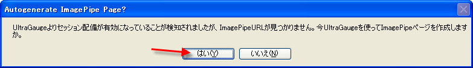

////

|metadata|
{
    "name": "webgauge-session-deployment",
    "controlName": ["WebGauge"],
    "tags": ["Deployment","How Do I"],
    "guid": "{CF7ADCBE-F904-4C8B-87D7-8B0F7140A71A}",  
    "buildFlags": [],
    "createdOn": "0001-01-01T00:00:00Z"
}
|metadata|
////

= セッション配備

WebGauge コントロールを持っているアプリケーションを実行する前に、配備のシナリオを設定および構成する必要があります。

*セッション状態の画像配備を有効にするには、次の手順に従ってください。*

[start=1]
. Web フォームで WebGauge コントロールを選択します。
[start=2]
. pick:[asp-net="link:{ApiPlatform}webui.ultrawebgauge{ApiVersion}~infragistics.webui.ultrawebgauge.ultragauge~deploymentscenario.html[DeploymentScenario]"]  プロパティを展開します。
[start=3]
. pick:[asp-net="link:{ApiPlatform}webui.ultrawebgauge{ApiVersion}~infragistics.webui.ultrawebgauge.webgaugedeploymentscenario~mode.html[Mode]"]  プロパティを指定して、ドロップダウン リストから、セッションの列挙体のメンバを選択します。
[start=4]
. この時点で、ImagePipe コンポーネントを含む Web フォームを自動作成するようにプロンプトが表示されます。これによって、セッションを通して安全な画像転送を可能にします。

[start=5]
. [はい] をクリックして、Web フォームと ImagePipe コンポーネントを自動的に生成します。
[start=6]
. この時点で、GaugeImage という名前の Web フォームが作成されプロジェクトに追加されます。

image::images/Getting_Started_WebGauge_03.png[]

この新しい WebForm には、GaugeImagePipe サーバー側コンポーネントへの参照が含まれます。メインの Web フォーム上の Gauge コンポーネントは、このサーバー側コンポーネントを指し示します。

GaugeImagePipe Web フォーム（GaugeImage.aspx）は、GaugeImagePipe コントロールを持つ任意の Web フォームにすることができます。以下のコードは、最小限の形式の GaugeImage.aspx の完全なテキストの例です。この Web フォームを使用する前に、Register ディレクティブのアセンブリ名とバージョン番号を現在のアセンブリ バージョンに更新する必要があります。

*XML の場合:*

----
<%@ Page %>
<%@ Register TagPrefix="igGauge"
  Assembly="Infragistics2.WebUI.UltraWebGauge.v7.1,
  version=7.1.20071.1, Culture=neutral, 
  PublicKeyToken=7dd5c3163f2cd0cb"
  Namespace="Infragistics.WebUI.UltraWebGauge" %>
<igGauge:GaugeImagePipe id="GaugeImagePipe1" runat="server" />
----