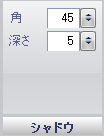

////

|metadata|
{
    "name": "webgauge-shadow-pane",
    "controlName": ["WebGauge"],
    "tags": ["How Do I"],
    "guid": "{964673E4-359A-4362-8840-F2CB9C27F802}",  
    "buildFlags": [],
    "createdOn": "0001-01-01T00:00:00Z"
}
|metadata|
////

= シャドー ペイン

[シャドー] ペインによって、プロパティ（例、アンカー）でドロップ シャドーの角度と深さを修正できます。

pick:[asp-net="link:{ApiPlatform}webui.ultrawebgauge{ApiVersion}~infragistics.ultragauge.resources.shadow~angle.html[角度]"]  -- この値を 0 から 100 の整数に設定します。この値はプロパティ上のドロップ シャドーの角度を決定します。

pick:[asp-net="link:{ApiPlatform}webui.ultrawebgauge{ApiVersion}~infragistics.ultragauge.resources.shadow~depth.html[深さ]"]  -- この値を 0 から 100 の整数に設定します。この値は、ドロップ シャドーとプロパティ（例、アンカー）間の距離を決定します。

== 関連トピック

link:webgauge-effects-tab.html[効果タブ]