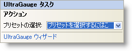

////

|metadata|
{
    "name": "webgauge-webgauge-smart-tag",
    "controlName": ["WebGauge"],
    "tags": ["How Do I"],
    "guid": "{7C9C839B-C56D-4AFB-892F-1264AC6432A1}",  
    "buildFlags": [],
    "createdOn": "0001-01-01T00:00:00Z"
}
|metadata|
////

= WebGauge スマート タグ

Visual Studio 2005（.NET Framework 2.0）では、{ProductName} の個々のコントロール/コンポーネントにはスマート タグがあります。コントロールやコンポーネントを選択するだけで、スマート タグのアンカーが表示されます。このアンカーをクリックするとポップアップ パネルが表示され、そこからコントロール/コンポーネントの最もよく使用するプロパティや設定にすばやく簡単にアクセスできます。

WeGauge スマート タグには次のセクションが含まれています。

* アクション -- link:webgauge-creating-a-webgauge-using-a-preset.html[プリセットを使用して WebGauge を作成]を選択できます。
* UltraGauge デザイナ -- link:webgauge-webgauge-designer.html[WebGauge デザイナ]を起動します。これによって素早くかつ簡単にゲージのルック アンド フィールを変更できます。

各セクションの項目（ドロップダウン リストなど）の説明と、プロパティ グリッド内のその項目が対応するプロパティについては、以下を参照してください。

[options="header", cols="a,a,a"]
|====
|アクション|説明|対応するプロパティ

|プリセットの選択
|「ここをクリック」リンクをクリックして、WebGauge のプリセットを素早く選択します。
|なし

|====