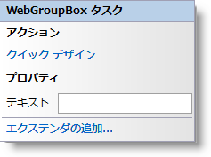

////

|metadata|
{
    "name": "webgroupbox-smart-tag",
    "controlName": ["WebGroupBox"],
    "tags": ["Design Environment","Layouts"],
    "guid": "{8956D7C2-C29C-4CD6-9162-A21F5500E0FC}",  
    "buildFlags": [],
    "createdOn": "2007-05-02T08:05:40Z"
}
|metadata|
////

= WebGroupBox スマート タグ

Visual Studio 2005（.NET Framework 2.0）では、{ProductName}の個々のコントロール/コンポーネントにはスマートタグがあります。コントロールやコンポーネントを選択するだけで、スマートタグのアンカーが表示されます。このアンカーをクリックするとポップアップ パネルが表示され、そこからコントロール/コンポーネントの最もよく使うプロパティや設定にすばやく簡単にアクセスできます。

WebGroupBox™ のスマートタグには次のセクションが含まれています。

* アクション -- よく使うタスク（クイック デザイナーへのアクセス、プリセットのロードなど）を実行できます。
* プロパティ -- よく使うプロパティ（Text など）への容易なアクセスを提供します。
* エクステンダーの追加 -- これをクリックすると、WebGroupBox と使用可能なすべてのコントロール エクステンダーを表示するダイアログを表示します。

各セクションの項目（フィールド、ドロップダウン リスト、チェックボックスなど）の説明と、各項目が対応するプロパティ グリッドのプロパティについては、以下の表を参照してください。

[options="header", cols="a,a,a"]
|====
|操作|説明|対応するプロパティ

|クイック デザイン
|［クイック デザイン］をクリックすると、クイック デザイナーが表示されます。これは、コントロールを右クリックしてコンテキスト メニューから ［クイック デザイン］ を選択するのと同じです。
|なし

|====

[options="header", cols="a,a,a"]
|====
|プロパティ|説明|対応するプロパティ

|テキスト
|このコントロールに表示されるテキスト。テキストは、上境界線を基準にして垂直方向に中央配置して表示します。
| pick:[asp-net="link:{ApiPlatform}webui.misc{ApiVersion}~infragistics.webui.misc.webgroupbox~text.html[Text]"] 

|====