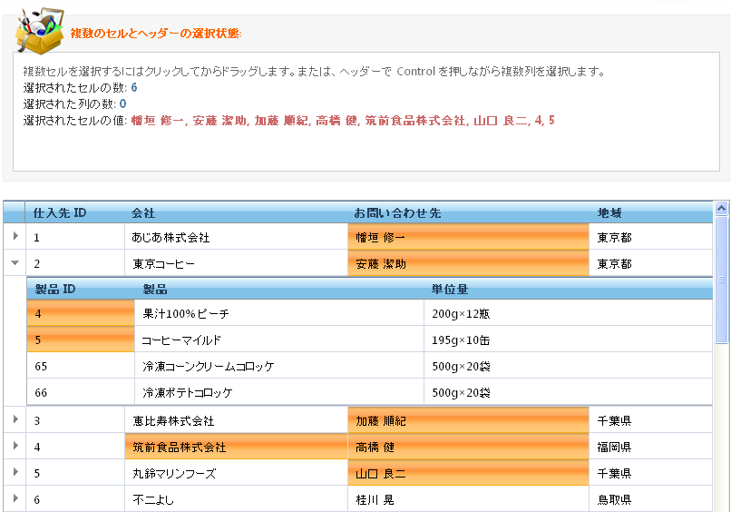

////

|metadata|
{
    "name": "webhierachicaldatagrid-selection",
    "controlName": ["WebHierarchicalDataGrid"],
    "tags": ["Grids","Selection"],
    "guid": "{3E060D4B-EEDF-403D-B6D9-6106FC6C6127}",  
    "buildFlags": [],
    "createdOn": "0001-01-01T00:00:00Z"
}
|metadata|
////

= 選択

選択動作によって、WebHierarchicalDataGrid™ の行、セル、列の選択が有効になります。選択動作が追加されたら、ユーザーが選択できるオブジェクトを指定するために選択タイプを設定する必要があります。

選択タイプは、None、Single および Multiple の選択肢で構成され、オブジェクトの単一選択または複数設定を可能にする、またはオプションすべてを無効にすることができます。

選択動作を追加する時に個々のオブジェクトのクライアント側のイベントと CSS スタイルを設定することもできます。

選択動作を有効にするために、次の手順を実行します。

[start=1]
. Microsoft® Visual Studio™ [プロパティ] ウィンドウで、 pick:[asp-net="link:{ApiPlatform}web{ApiVersion}~infragistics.web.ui.gridcontrols.webhierarchicaldatagrid~behaviors.html[Behaviors]"]  プロパティを指定して、省略記号 (...) ボタンをクリックし、[動作エディター] ダイアログを起動します。
[start=2]
. この動作を追加して有効にするには、左側で選択の隣りのチェックボックスをチェックします。
[start=3]
. pick:[asp-net="link:{ApiPlatform}web{ApiVersion}~infragistics.web.ui.gridcontrols.selection~cellclickaction.html[CellClickAction]"]  プロパティはデフォルトで Cell に設定されています。この例では、デフォルト値のままにしておきます。

*注：*  pick:[asp-net="link:{ApiPlatform}web{ApiVersion}~infragistics.web.ui.gridcontrols.rowdeleting.html[RowDeleting]"]  を有効にすると、Selection 動作を追加することもプロンプトされます。それを行うことを選択すると、Selection は Single および Row にそれぞれ設定された CellClickAction プロパティで有効になります。

[start=4]
. [OK] をクリックしてこのダイアログを閉じます。クリックされた時にセルを選択するように WebHierarchicalDataGrid が設定されます。

== セル選択を有効にする

デフォルトで、Selection 動作の  pick:[asp-net="link:{ApiPlatform}web{ApiVersion}~infragistics.web.ui.gridcontrols.selection~cellclickaction.html[CellClickAction]"]  プロパティは Cell に設定されており、これによってセルの選択が有効になります。  pick:[asp-net="link:{ApiPlatform}web{ApiVersion}~infragistics.web.ui.gridcontrols.selection~cellselecttype.html[CellSelectType]"]  プロパティを Single または Multiple に設定できます。

=== セルを選択する

エンドユーザーはマウスまたはキーボードを使用することでセルを選択できます。

コードでセルを選択するには、セルを選択されたセル コレクションに追加します。セルの選択を解除するには、コレクションから削除して、クリア メソッドを呼び出してすべての選択されたセルを削除します。サーバー側とクライアント側の両方でこれを実行できます。

この事例では、列選択を実行するためにサーバー側のコードについて、 pick:[asp-net="link:{ApiPlatform}web{ApiVersion}~infragistics.web.ui.gridcontrols.webhierarchicaldatagrid~rowislanddatabound_ev.html[RowIslandDataBound]"]  イベントが処理されます。クライアント側のコードにも同様に、子バンドで列を選択するために、生成済みのクライアント側のイベントが処理されます。

*Visual Basic の場合：*

----
' RowIslandDataBound イベントを接続します 
AddHandler Me.WebHierarchicalDataGrid1.RowIslandDataBound, AddressOf WebHierarchicalDataGrid1_RowIslandDataBound
Protected Sub WebHierarchicalDataGrid1_RowIslandDataBound(ByVal sender As Object, ByVal e As RowIslandEventArgs)HandlesWebHierarchicalDataGrid1.RowIslandDataBound
' 親バンドでセルを選択します 
   If e.RowIsland.DataMember = "SqlDataSource1_DefaultView" Then
       Dim s As Selection = e.RowIsland.Behaviors.Selection
       s.SelectedColumns.Add(e.RowIsland.Columns(2))
   End If
' 子バンドでセルを選択します 
   If e.RowIsland.DataMember = "SqlDataSource2_DefaultView" AndAlso e.RowIsland.ParentRow = Me.WebHierarchicalDataGrid1.GridView.Rows(0) Then
       Dim s As Selection = e.RowIsland.Behaviors.Selection
       s.SelectedColumns.Add(e.RowIsland.Columns(2))
   End If
End Sub
----

*C# の場合：*

----
// RowIslandDataBound イベントを接続します
this.WebHierarchicalDataGrid1.RowIslandDataBound += new RowIslandEventHandler(WebHierarchicalDataGrid1_RowIslandDataBound);
protected void WebHierarchicalDataGrid1_RowIslandDataBound(object sender, RowIslandEventArgs e)
{       
   // 親バンドでセルを選択します
   if (e.RowIsland.DataMember == "SqlDataSource1_DefaultView")
   {
      Selection s = e.RowIsland.Behaviors.Selection;
      s.SelectedColumns.Add(e.RowIsland.Columns[2]);
   }
// 子バンドでセルを選択します
   if (e.RowIsland.DataMember == "SqlDataSource2_DefaultView"
       && e.RowIsland.ParentRow == this.WebHierarchicalDataGrid1.GridView.Rows[0])
   {
      Selection s = e.RowIsland.Behaviors.Selection;
      s.SelectedColumns.Add(e.RowIsland.Columns[2]);
   }
}
----

*JavaScript の場合：*

----
var grid = $find("WebHierarchicalDataGrid1");
var parentGrid = grid.get_gridView();
var childGrid = grid.get_gridView().get_rows().get_row(3).get_rowIslands(0)[0];
// 親列選択
if (parentGrid!= null)
parentGrid.get_behaviors().get_selection().get_selectedColumns().add(parentGrid.get_columns().get_column(0));
// 子列選択
if (childGrid != null) childGrid.get_behaviors().get_selection().get_selectedColumns().add(childGrid.get_columns().get_column(0));
----

== 列選択を有効にする

列選択を有効にした後で、エンドユーザーは列のヘッダーをクリックして列を選択できます。 選択された列コレクションに追加することでコードで列を選択することも可能です。

*注：* コードで列を選択する時に ColumnSelectType を設定する必要はありません。必要なのは Selection 動作を有効にすることだけです。

この事例では、列選択を実行するためにサーバー側のコードについて、  pick:[asp-net="link:{ApiPlatform}web{ApiVersion}~infragistics.web.ui.gridcontrols.webhierarchicaldatagrid~rowislanddatabound_ev.html[RowIslandDataBound]"]  イベントが処理されます。クライアント側のコードにも同様に、子バンドで列を選択するために、生成済みのクライアント側のイベントが処理されます。

*Visual Basic の場合:*

----
' RowIslandDataBound イベントを接続します 
AddHandler Me.WebHierarchicalDataGrid1.RowIslandDataBound, AddressOf WebHierarchicalDataGrid1_RowIslandDataBound
Protected Sub WebHierarchicalDataGrid1_RowIslandDataBound(ByVal sender As Object, ByVal e As RowIslandEventArgs)HandlesWebHierarchicalDataGrid1.RowIslandDataBound
   ' 親バンドでセルを選択します 
   If e.RowIsland.DataMember = "SqlDataSource1_DefaultView" Then
       Dim s As Selection = e.RowIsland.Behaviors.Selection
       s.SelectedColumns.Add(e.RowIsland.Columns(2))
   End If
   ' 子バンドでセルを選択します 
   If e.RowIsland.DataMember = "SqlDataSource2_DefaultView" AndAlso e.RowIsland.ParentRow = Me.WebHierarchicalDataGrid1.GridView.Rows(0) Then
       Dim s As Selection = e.RowIsland.Behaviors.Selection
       s.SelectedColumns.Add(e.RowIsland.Columns(2))
   End If
End Sub
----

*C# の場合:*

----
// RowIslandDataBound イベントを接続します
this.WebHierarchicalDataGrid1.RowIslandDataBound += new RowIslandEventHandler(WebHierarchicalDataGrid1_RowIslandDataBound);
protected void WebHierarchicalDataGrid1_RowIslandDataBound(object sender, RowIslandEventArgs e)
{       
   // 親バンドでセルを選択します
   if (e.RowIsland.DataMember == "SqlDataSource1_DefaultView")
   {
      Selection s = e.RowIsland.Behaviors.Selection;
      s.SelectedColumns.Add(e.RowIsland.Columns[2]);
   }
   // 子バンドでセルを選択します
   if (e.RowIsland.DataMember == "SqlDataSource2_DefaultView"
       && e.RowIsland.ParentRow == this.WebHierarchicalDataGrid1.GridView.Rows[0])
   {
      Selection s = e.RowIsland.Behaviors.Selection;
      s.SelectedColumns.Add(e.RowIsland.Columns[2]);
   }
}
----

*Javascript の場合:*

----
var grid = $find("WebHierarchicalDataGrid1");
var parentGrid = grid.get_gridView();
var childGrid = grid.get_gridView().get_rows().get_row(3).get_rowIslands(0)[0];
// 親列選択
if (parentGrid!= null)
parentGrid.get_behaviors().get_selection().get_selectedColumns().add(parentGrid.get_columns().get_column(0));
// 子列選択
if (childGrid != null) childGrid.get_behaviors().get_selection().get_selectedColumns().add(childGrid.get_columns().get_column(0));
----

== 行選択を有効にする

行選択を有効にした後で行を選択する方法はいくつかあります。その行でセルをクリックして行を選択するか、それらを選択した行コレクションに追加してコードで行を選択することもできます。行の選択を解除するには、コレクションから削除します。

*注：* コードで行を選択する時に CellClickAction または RowSelectType を設定する必要はありません。必要なのは Selection 動作を有効にすることだけです。

このトピックでは、サーバー側のコードについて、行選択を実行するために  pick:[asp-net="link:{ApiPlatform}web{ApiVersion}~infragistics.web.ui.gridcontrols.webhierarchicaldatagrid~rowislanddatabound_ev.html[RowIslandDataBound]"]  イベントが処理されます。クライアント側のコードにも同様に、子バンドで行を選択するために、生成済みのクライアント側のイベントが処理されます。

*Visual Basic の場合：*

----
' RowIslandDataBound イベントを接続します 
AddHandler Me.WebHierarchicalDataGrid1.RowIslandDataBound, AddressOf WebHierarchicalDataGrid1_RowIslandDataBound
Protected Sub WebHierarchicalDataGrid1_RowIslandDataBound(ByVal sender As Object, ByVal e As RowIslandEventArgs) Handles WebHierarchicalDataGrid1.RowIslandDataBound
' 親バンドでセルを選択します 
   If e.RowIsland.DataMember = "SqlDataSource1_DefaultView" Then
      Dim s As Selection = e.RowIsland.Behaviors.Selection
      s.SelectedRows.Add(e.RowIsland.Rows(2))
   End If
' 子バンドでセルを選択します 
   If e.RowIsland.DataMember = "SqlDataSource2_DefaultView" AndAlso e.RowIsland.ParentRow = Me.WebHierarchicalDataGrid1.GridView.Rows(0) Then
      Dim s As Selection = e.RowIsland.Behaviors.Selection
      s.SelectedRows.Add(e.RowIsland.Rows(4))
   End If
End Sub
----

*C# の場合：*

----
// RowIslandDataBound イベントを接続します
this.WebHierarchicalDataGrid1.RowIslandDataBound += new RowIslandEventHandler(WebHierarchicalDataGrid1_RowIslandDataBound);
protected void WebHierarchicalDataGrid1_RowIslandDataBound(object sender, RowIslandEventArgs e)
{
   // 親バンドでセルを選択します
   if (e.RowIsland.DataMember == "SqlDataSource1_DefaultView")
   {
      Selection s = e.RowIsland.Behaviors.Selection;
      s.SelectedRows.Add(e.RowIsland.Rows[2]);
   }
// 子バンドでセルを選択します
   if (e.RowIsland.DataMember == "SqlDataSource2_DefaultView"
        && e.RowIsland.ParentRow == this.WebHierarchicalDataGrid1.GridView.Rows[0])
   {
      Selection s = e.RowIsland.Behaviors.Selection;
      s.SelectedRows.Add(e.RowIsland.Rows[4]);
   }
}
----

*JavaScript の場合：*

----
var grid = $find("WebHierarchicalDataGrid1");
var parentGrid = grid.get_gridView();
var childGrid = grid.get_gridView().get_rows().get_row(3).get_rowIslands(0)[0];
// 親行選択
if (parentGrid!= null)
parentGrid.get_behaviors().get_selection().get_selectedRows().add(parentGrid.get_rows().get_row(0));
// 子行選択
if (childGrid != null) childGrid.get_behaviors().get_selection().get_selectedRows().add(childGrid.get_rows().get_row(0));
----