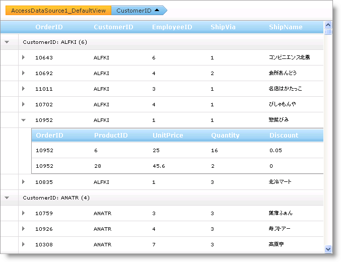

////

|metadata|
{
    "name": "webhierarchicaldatagrid-about-outlook-groupby",
    "controlName": ["WebHierarchicalDataGrid"],
    "tags": ["Grids","Grouping"],
    "guid": "{4112BCD0-8591-4134-AB22-6A02618452DB}",  
    "buildFlags": [],
    "createdOn": "0001-01-01T00:00:00Z"
}
|metadata|
////

= Outlook GroupBy について

== Outlook GroupBy

WebHierarchicalDataGrid™ の Outlook GroupBy 機能によってエンドユーザーはより多くの読みやすくまたナビゲート可能な表示にデータをグループ化できます。この機能は、データをグループ化するためにエンドユーザーが列をドラッグできるセクションをコントロールの上または下に表示します。

列がグループ化されたら、コントロールは link:{ApiPlatform}web{ApiVersion}~infragistics.web.ui.gridcontrols.containergrid.html[ContainerGrid] オブジェクトを使用してグループ化されたデータを描画します。WebHierarchicalDataGrid は、通常の link:{ApiPlatform}web{ApiVersion}~infragistics.web.ui.gridcontrols.gridrecord.html[GridRecord] オブジェクトの代わりに link:{ApiPlatform}web{ApiVersion}~infragistics.web.ui.gridcontrols.groupedrecord.html[GroupedRecord] オブジェクトを表示して、Groupby 領域に列ヘッダーを表示します。GroupedRecord オブジェクトは、デフォルトでグループ内の項目の値および数を表示し、展開してその中にネストされた GridRecord オブジェクトを表示することができます。

== 階層的な Outlook GroupBy

link:{ApiPlatform}web{ApiVersion}~infragistics.web.ui.gridcontrols.iband.html[IBand] インターフェイスを実装する WebHierarchicalDataGrid 内の各オブジェクトには、Groupby 機能固有のプロパティを設定するために使用できるタイプ link:{ApiPlatform}web{ApiVersion}~infragistics.web.ui.gridcontrols.groupingsettings.html[GroupingSettings] の link:{ApiPlatform}web{ApiVersion}~infragistics.web.ui.gridcontrols.iband~groupingsettings.html[GroupingSettings] プロパティが含まれています。GroupingSettings オブジェクトにはデータの各バンドのグループ化メカニズムの方法を制御するために設定できる link:{ApiPlatform}web{ApiVersion}~infragistics.web.ui.gridcontrols.groupingsettings~enablecolumngrouping.html[EnableColumnGrouping] プロパティが含まれます。

EnableColumnGrouping は以下の link:{ApiPlatform}web{ApiVersion}~infragistics.web.ui.defaultableboolean.html[DefaultableBoolean] 列挙値を取得します。

* True – GroupBy は IBand と任意の子 IBand オブジェクトに有効です。
* False – GroupBy は IBand と任意の子 IBand オブジェクトに無効です。
* NotSet – GroupBy は親オブジェクトの設定に基づいて有効または無効になります。

ルート バンド（WebHierarchicalDataGrid）の GroupingSettings オブジェクトの EnableColumnGrouping プロパティはデフォルトで False で、ルートとすべての子バンドに対してグループ化を無効にします。それぞれ個々のレベルを手動で制御したい場合、各バンドの EnableColumnGrouping を個々に設定します。

WebHierarchicalDataGrid は、GroupingSettings オブジェクトを通して link:{ApiPlatform}web{ApiVersion}~infragistics.web.ui.gridcontrols.hierarchicalgridgroupingsettings~groupareavisibility.html[GroupAreaVisibility] プロパティも公開します。このプロパティはコントロールの GroupBy 領域を表示または非表示にします。これはデフォルトで表示されます。

*注：* すべてのバンドが EnableColumnGrouping プロパティを False に設定されている場合、グループ化領域は非表示です。

== グループ化された列設定

GroupingSettings プロパティには、グループ化された列の個々のオプションを設定することを可能にする、ColumnGroupingSetting オブジェクトを追加するために使用できるタイプ link:{ApiPlatform}web{ApiVersion}~infragistics.web.ui.gridcontrols.columngroupingsettings.html[ColumnGroupingSettings] の link:{ApiPlatform}web{ApiVersion}~infragistics.web.ui.gridcontrols.groupingsettings~columnsettings.html[ColumnSettings] プロパティも含まれています。

たとえば、ColumnGroupingSetting オブジェクトを使用することによって、特定の列だけにグループ化を有効にして、並べ替えの方向を設定するだけでなく列の削除ボタンを表示できます。

== 列のグループ化の解除

WebHierarchicalDataGrid は link:{ApiPlatform}web{ApiVersion}~infragistics.web.ui.gridcontrols.groupedcolumns.html[GroupedColumns] コレクションにグループ化された列を保存します。列のグループ化を解除するには、グループ化領域から列ヘッダーをドラッグして、列ヘッダーで削除ボタンをクリックするか、GroupedColumns コレクションから列を削除します。

== Outlook GroupBy を有効にする

WebHierarchicalDataGrid で Outlook GroupBy 機能を有効にすると、エンドユーザーは列をグループ化してデータを整理して表示することができます。コントロールで link:{ApiPlatform}web{ApiVersion}~infragistics.web.ui.gridcontrols.iband.html[IBand] インターフェイスを実装する各オブジェクトは、 link:{ApiPlatform}web{ApiVersion}~infragistics.web.ui.gridcontrols.iband~groupingsettings.html[GroupingSettings] プロパティを公開します。このプロパティを使用して、 link:{ApiPlatform}web{ApiVersion}~infragistics.web.ui.gridcontrols.groupingsettings~enablecolumngrouping.html[EnableColumnGrouping] プロパティを True に設定することによって、Outlook GroupBy を有効にすることができます。 link:{ApiPlatform}web{ApiVersion}~infragistics.web.ui.gridcontrols.hierarchicalgridgroupingsettings~groupareavisibility.html[GroupAreaVisibility] プロパティを Visibility.Visible に設定することによって GroupBy 領域を表示できます。

link:{ApiPlatform}web{ApiVersion}~infragistics.web.ui.gridcontrols.hierarchicalgridgroupingsettings~groupbyarealocation.html[GroupByAreaLocation] プロパティを使用して、コントロールの上または下に GroupBy 領域を表示できます。これはデフォルトでコントロールの上側に、グループ化のためにエンドユーザーが列をドラッグするための場所を提供します。

以下のコードは、GroupBy を有効にして GroupBy 領域を表示する方法を示します。

*HTML の場合:*

----
<GroupingSettings EnableColumnGrouping="True" GroupAreaVisibility="Visible" GroupByAreaLocation="Top"/>
----

*Visual Basic の場合：*

----
Me.WebHierarchicalDataGrid1.GroupingSettings.EnableColumnGrouping = DefaultableBoolean.True
Me.WebHierarchicalDataGrid1.GroupingSettings.GroupAreaVisibility = Visibility.Visible
Me.WebHierarchicalDataGrid1.GroupingSettings.GroupByAreaLocation = GroupByAreaLocation.Top
----

*C# の場合：*

----
this.WebHierarchicalDataGrid1.GroupingSettings.EnableColumnGrouping = DefaultableBoolean.True;
this.WebHierarchicalDataGrid1.GroupingSettings.GroupAreaVisibility = Visibility.Visible;
this.WebHierarchicalDataGrid1.GroupingSettings.GroupByAreaLocation = GroupByAreaLocation.Top;
----

== 関連トピック

link:webhierarchicaldatagrid-custom-group-by-name.html[名前によるカスタム グループ]

link:webhierarchicaldatagrid-custom-text-in-group-row.html[グループ行のカスタム テキスト]

link:webhierarchicaldatagrid-group-columns-from-code-behind.html[コード ビハインドから列をグループ化]

link:webhierarchicaldatagrid-outlook-groupby-with-behaviors.html[動作による Outlook GroupBy]

link:webhierarchicaldatagrid-referencing-rows-when-using-outlook-groupby.html[Outlook GroupBy を使用する時に行を参照]