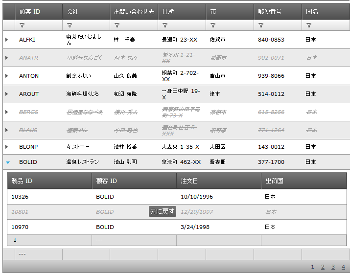

////

|metadata|
{
    "name": "webhierarchicaldatagrid-batch-updating-enabling",
    "controlName": ["WebHierarchicalDataGrid"],
    "tags": ["Editing","Getting Started","Grids","Performance"],
    "guid": "684d32ac-e165-4a1c-a674-149c5801c828",  
    "buildFlags": [],
    "createdOn": "2011-10-26T07:53:03.8643328Z"
}
|metadata|
////

= 一括更新を有効にする

このトピックでは、WebHierarchicalDataGrid™ の一括更新を有効にする方法と、一括更新中に行われた変更をユーザーが元に戻す方法を示しています。

== はじめに

一括更新が有効になっている場合、サーバーを呼び出さなくても、「通常の」編集操作の場合と同様、行を無制限に変更できます。一括更新では、行の追加、更新、削除などすべての変更はクライアントに保存され、最初にポストバックをトリガーしたときにサーバーに送信されます。以下の図は、一括更新機能が有効な状態の igHierarchicalGrid を示しています。

図 1: WebHierarchicalDataGrid での行の一括変更

== 一括更新を有効にする

一括更新を有効にするには、マークアップまたはコード ビハインドで BatchUpdate プロパティを true に設定するだけです。子バンドについては、Batch Update モードを個別に有効にする必要がある点に注意してください。これはすべての子機能に当てはまります。すべてのバンドについてバッチ オプションを個別に指定する必要があります。

*ASPX の場合:*

----
<ig:WebHierarchicalDataGrid ID="whdg1" runat="server">
    <Behaviors>
        <ig:Activation/>                 
        <ig:EditingCore BatchUpdating="true">
            <Behaviors>
                <ig:RowAdding/>
                <ig:RowDeleting/>
                <ig:CellEditing/>
            </Behaviors>
        </ig:EditingCore>
    </Behaviors>
    <Bands>
        <ig:Band>
            <Behaviors>
                <ig:EditingCore BatchUpdating="true">
                    <Behaviors>
                        <ig:RowAdding/>
                        <ig:RowDeleting/>
                        <ig:CellEditing/>
                    </Behaviors>
                </ig:EditingCore>
            </Behaviors>
        </ig:Band>
    </Bands>
</ig:WebHierarchicalDataGrid>
----

*C# の場合：*

----
this.whdg1.Behaviors.EditingCore.BatchUpdating = true;
this.whdg1.Bands[0].Behaviors.EditingCore.BatchUpdating = true;
----

または、特定のビヘイビアーの継承を有効にするだけでも同じ結果を得ることができます。したがって親レベルの継承を有効にする場合、子バンドについて再度継承を有効にする必要はありません。

*ASPX の場合:*

----
<ig:WebHierarchicalDataGrid ID="whdg1" runat="server">
    <Behaviors>
        <ig:Activation/>                 
        <ig:EditingCore EnableInheritance="true" BatchUpdating="true">
            <Behaviors>
                <ig:RowAdding/>
                <ig:RowDeleting/>
                <ig:CellEditing/>
            </Behaviors>
        </ig:EditingCore>
    </Behaviors>
    <Bands>
        <ig:Band>
        </ig:Band>
    </Bands>
</ig:WebHierarchicalDataGrid>
----

*C# の場合：*

----
this.whdg1.Behaviors.EditingCore.BatchUpdating = true;
this.whdg1.Behaviors.EditingCore.EnableInheritance = true;
----

結果を確認するには、Web ブラウザーでそのページを開きます。図 1 に示すように、行を一括変更できるはずです。

*注:*

親行を追加する場合、ポストバックを行い、その行をデータベースに保存する必要があります。保存した後でないと、子行を追加、削除、または更新することはできません。

== 元のデータの復元

一括更新機能の大きなメリットは、Batch Update モードにいる、つまり変更がまだサーバーにコミットされていない限り、変更されたあらゆる行データを元の状態に復元できることです。

復元は、復元する行にフォーカスすることで 1 行ずつ行われます。その後、次を行います。

* Ctrl+Z キーを押して、行に行われた編集内容を元に戻します
* Undo hover ボタンをクリックして、削除された行を復元します 

図 2: Undo 機能と削除された行

*注:*

マウスのクリックとは別に、Undo ボタンはキーボードの Enter キーまたは Space キーを押して起動できます。

== 関連トピック

link:webhierarchicaldatagrid-batch-updating-overview.html[WebHierarchicalDataGrid の一括更新の概要]

link:webhierarchicaldatagrid-batch-updating-events.html[WebHierarchicalDataGrid の一括更新イベント]

link:webhierarchicaldatagrid-batch-updating-summaries.html[WebHierarchicalDataGrid の一括更新のまとめ]

link:known-issues-known-issues-and-breaking-changes-revision-history.html[既知の問題と重大な変更]