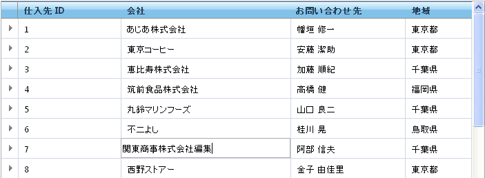

////

|metadata|
{
    "name": "webhierarchicaldatagrid-cell-editing",
    "controlName": ["WebHierarchicalDataGrid"],
    "tags": ["Editing","Grids"],
    "guid": "{43E96E6C-E8C1-40E4-A2BB-A56A19E1BDB4}",  
    "buildFlags": [],
    "createdOn": "0001-01-01T00:00:00Z"
}
|metadata|
////

= セルの編集

WebHierarchicalDataGrid™ でセル値を編集することはクライアント側のみに限られています。そのセルへの参照を取得し、その設定値メソッドを呼び出すことによってセルの値を編集できます。

サーバー側で、セル値は読み取り専用です。ただし、データ検証などの操作のための値を取得することができます。サーバー側とクライアント側の両方でセルの値を取得できます。

以下のコードは WebHierarchicalDataGrid のセル値を取得および編集する方法を示します。

*注：* プログラムでセルを編集するために  pick:[asp-net="link:{ApiPlatform}web{ApiVersion}~infragistics.web.ui.gridcontrols.editingcore.html[EditingCore]"]  動作を有効にし、その  pick:[asp-net="link:{ApiPlatform}web{ApiVersion}~infragistics.web.ui.gridcontrols.editingcore~enableinheritance.html[EnableInheritance]"]  プロパティを True に設定する必要があります。

*Visual Basic の場合：*

----
' RowIslandDataBound イベントを接続します 
AddHandler Me.WebHierarchicalDataGrid1.RowIslandDataBound, AddressOf WebHierarchicalDataGrid1_RowIslandDataBound
Protected Sub WebHierarchicalDataGrid1_RowIslandDataBound(ByVal sender As Object, ByVal e As RowIslandEventArgs) Handles WebHierarchicalDataGrid1.RowIslandDataBound
   If e.RowIsland.DataMember = "SqlDataSource1_DefaultView" Then
' 親セル値にアクセスします 
      Dim cellValue As String = e.RowIsland.Rows(0).Items(1).Value.ToString()
   End If
End Sub
----

*C# の場合：*

----
// RowIslandDataBound イベントを接続します
this.WebHierarchicalDataGrid1.RowIslandDataBound += new RowIslandEventHandler(WebHierarchicalDataGrid1_RowIslandDataBound);
protected void WebHierarchicalDataGrid1_RowIslandDataBound(object sender, RowIslandEventArgs e)
{
   if(e.RowIsland.DataMember == "SqlDataSource1_DefaultView")
   {
// 親セル値にアクセスします
      string cellValue = e.RowIsland.Rows[0].Items[1].Value.ToString();    
   }
}
----

*JavaScript の場合：*

----
var grid = $find("WebHierarchicalDataGrid1");
var parentGrid = grid.get_gridView();
// 親セル値を取得および設定します 
var oldvalue = parentGrid.get_rows().get_row(0).get_cell(1).get_value(); parentGrid.get_rows().get_row(0).get_cell(1).set_value("new string value");
// 子セル値を取得および設定します
var childGrid = grid.get_gridView().get_rows().get_row(0).get_rowIslands(0)[0];
var oldValue = childGrid.get_rows().get_row(0).get_cell(1).get_value();
childGrid.get_rows().get_row(0).get_cell(1).set_value("NewChildValue");
----

== セルの編集動作を有効にする

WebHierarchicalDataGrid でデータ編集を有効にするには、 pick:[asp-net="link:{ApiPlatform}web{ApiVersion}~infragistics.web.ui.gridcontrols.cellediting.html[CellEditing]"]  動作を  pick:[asp-net="link:{ApiPlatform}web{ApiVersion}~infragistics.web.ui.gridcontrols.behaviors.html[Behaviors]"]  コレクションに追加します。CellEditing 動作の  pick:[asp-net="link:{ApiPlatform}web{ApiVersion}~infragistics.web.ui.gridcontrols.editablebehaviorbase~editmodeactions.html[EditModeActions]"]  プロパティによって、どのアクションによってセルが編集モードになるのかを決定することができます。

pick:[asp-net="link:{ApiPlatform}web{ApiVersion}~infragistics.web.ui.gridcontrols.webhierarchicaldatagrid~rowupdating_ev.html[RowUpdating]"]  イベントを処理した場合には、編集された行でフォーカスを失うと変更が直ちにデータ ソースにコミットします。行がフォーカスを取得またはフォーカスを失うには、Activation 動作を有効にする必要があります。Activation 動作の詳細は、 link:webhierarchicaldatagrid-activation.html[「アクティブ化」]トピックを参照してください。

*注：* この種類の自動的な更新に対してサポートされるデータ ソースを発生させる必要があります。データ ソースが WebHierarchicalDataGrid によって自動的に更新できない場合、更新イベントを処理してデータを手動で更新する必要があります。

WebHierarchicalDataGrid で CellEditing 動作を有効にするために、次の手順を実行します。

[start=1]
. WebHierarchicalDataGrid を WebHierarchicalDataSource™ コンポーネントにバインドし、Categories および Products テーブルからデータを取得します。この詳細は、 link:webhierarchicaldatasource-using-webhierarchicaldatasource.html[階層的なデータ ソースにバインド]トピックを参照してください。
[start=2]
. Microsoft® Visual Studio [プロパティ] ウィンドウで、Behaviors プロパティを指定して、省略記号 (...) ボタンをクリックし、[動作エディター] ダイアログを起動します。
[start=3]
. 動作を有効にするために左側の動作のリストのセルの編集の隣のチェックボックスをチェックします。 pick:[asp-net="link:{ApiPlatform}web{ApiVersion}~infragistics.web.ui.gridcontrols.editingcore.html[EditingCore]"]  動作も追加されていることに注意してください。
[start=4]
. EditingCore およびセルの編集動作の  pick:[asp-net="link:{ApiPlatform}web{ApiVersion}~infragistics.web.ui.gridcontrols.editingcore~enableinheritance.html[EnableInheritance]"]  プロパティを True に設定します。これによって、すべての子レベルでセルの編集動作が自動的に継承されます。このプロパティのデフォルト値は False です。
[start=5]
. EditModeActions プロパティの下の Cell Editing プロパティ セクションで、 pick:[asp-net="link:{ApiPlatform}web{ApiVersion}~infragistics.web.ui.gridcontrols.editmodeactions~mouseclick.html[MouseClick]"]  プロパティを Single に設定します。これはシングル クリックでセルが編集モードになるように指定します。デフォルトはダブルクリックです。
[start=6]
. [適用]、そして [OK] をクリックします。
[start=7]
. WebHierarchicalDataGrid のプロパティ ウィンドウのイベント表示に移動して、RowUpdating イベントを処理します。コードをイベント ハンドラに追加する必要はありません。
[start=8]
. WebHierarchicalDataGrid のプロパティ ウィンドウで EnableAjax が True であることをチェックします。そうでない場合は、True に設定します。
[start=9]
. アプリケーションを実行します。セルをクリックすると、セルは編集モードになりデータを変更できます。編集したばかりのセルをクリックして放すと、AJAX を介してデータ ソースに変更がコミットされます。

== 関連トピック

link:webhierarchicaldatagrid-behaviors.html[動作]