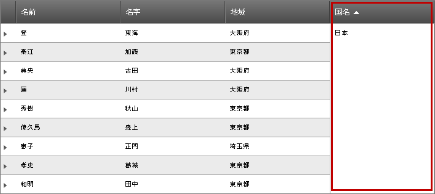
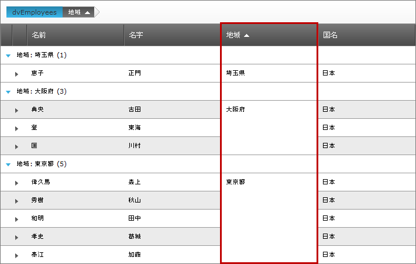

////

|metadata|
{
    "name": "webhierarchicaldatagrid-cell-merging-overview",
    "controlName": ["WebHierarchicalDataGrid"],
    "tags": [],
    "guid": "895c2a95-70ed-4dc4-a4b9-a1dbf5396d1e",  
    "buildFlags": [],
    "createdOn": "2012-04-16T16:48:39.7548288Z"
}
|metadata|
////

= セル結合の概要

=== 目的

_WebHierarchicalDataGrid_™ コントロール機能を使用したセル結合の紹介。

=== 必要な背景

このトピックを理解するための必須条件となる資料。

[options="header", cols="a,a"]
|====
|トピック|目的

|[[_Hlk319418933]] 

link:webhierarchicaldatagrid-sorting.html[並べ替え]
|コード例を使用して、 _WebHierarchicalDataGrid_ で並べ替えを有効にする方法を示します。

|[[_Hlk319416570]] 

link:webhierarchicaldatagrid-about-outlook-groupby.html[Outlook GroupBy について]
|コード例を使用して、 _WebHierarchicalDataGrid_ で Outlook GroupBy 機能を有効にする方法を示します。

|====

== セル結合の概要

=== 概要

セル結合によって、 _WebHierarchicalDataGrid_   内でのデータの並べ替えまたはグループ化が可能になり、また単一セルに結合された同じ値を含むセルを使ってデータを表示できます。セルは結合された状態で表示されます。グリッド構造はこの機能の使用によって影響を受けません。セル結合は、 link:webhierarchicaldatagrid-sorting.html[並べ替え]動作および  _WebHierarchicalDataGrid_  の link:webhierarchicaldatagrid-about-outlook-groupby.html[グループ化]設定と共に機能します。

以下の画面は、結合解除された表示 (図 1) および結合された表示 (図 2) を示しています。以下の結合された表示 (図 2) で分かるように、レコードを並べ替え、同じ領域を使ってこれらのレコードを収集し、セルのデータのひとつのインスタンスを使用して結合された単一セルとして領域を表示しています。

[cols="a,a"]
|====
|image::images/Overview_page_for_Cell_Merging_1_WHDG.png[]図 1 - セル結合が無効状態の並べ替え|image::images/Overview_page_for_Cell_Merging_2__WHDG.png[]図 2 - セル結合が有効状態の並べ替え

|====

デフォルトでは、セル結合は無効になっています。この機能の有効化に関する情報は、 link:webhierarchicaldatagrid-enabling-cell-merging.html[セル結合の有効化]トピックを参照してください。

=== サポートされるセル結合動作

セルの結合は、並べ替え動作またはグループ化設定に対して独立して有効化または無効化できます。以下は、セル結合がこれらのそれぞれにいかに影響を及ぼすかに関する詳細な説明です。

=== 並べ替えにおけるセル結合

以下のスクリーンショットは、セル結合が有効な場合に、並べ替えられた  _WebHierarchicalDataGrid_   のデータがどのように表示されるかを示しています。

<<_Ref320880084,図 3 - セル結合が有効な場合の並べ替え例>> をよく調べると、セル結合が有効な状態での、 _WebHierarchicalDataGrid_   の並べ替え動作の使用の効果が分かります。並べ替えの例では、並べ替え条件が Country = ‘USA’ であるレコードになっており、この条件を満たすレコードが、グリッド上部にまとまって表示されているのが分かります。

[[_Ref320880084]]
図 3 - セル結合が有効な場合の並べ替え

==== 関連トピック:

* link:webhierarchicaldatagrid-enabling-cell-merging.html[セル結合を有効にする]
* link:webhierarchicaldatagrid-sorting.html[並べ替え]

=== グループ化におけるセル結合

以下のスクリーンショットは、セル結合が有効な場合の、 _WebHierarchicalDataGrid_   のグループ設定の効果を示しています。

列にはさまざまな国を表す値が含まれていることが分かります。この場合、 __UK__  および  __USA__  です。表示されると、レコードは、セル内の値が同じ値を持つ国によってグループ化されます。この例では  __UK__  または  __USA__  に属するレコードが、同じ国に属する他のレコードと視覚的に結合されます。また、行は、グループ化された項目を識別するグループ化されたレコード、その値、およびレコード数の前に表示されることに留意してください。この場合は、Country、それぞれ 4 レコードと 5 レコードを含む UK および USA になります。

==== 関連トピック:

* link:webhierarchicaldatagrid-enabling-cell-merging.html[セル結合を有効にする]
* link:webhierarchicaldatagrid-about-outlook-groupby.html[OutlookGroupBy]

*関連内容*

=== トピック

以下のトピックでは、このトピックに関連する情報を提供しています。

[options="header", cols="a,a"]
|====
|トピック|目的

| link:webhierarchicaldatagrid-enabling-cell-merging.html[セル結合の有効化 (WebDataHierarchicalGrid)]
|

| link:webhierarchicaldatagrid-about-outlook-groupby.html[OutlookGroupBy]
|

| link:webhierarchicaldatagrid-sorting.html[並べ替え]
|

|====

=== サンプル

以下のサンプルでは、このトピックに関連する情報を提供しています。

[options="header", cols="a,a"]
|====
|サンプル|目的

| link:{SamplesURL}/samples/webhierarchicaldatagrid/organization/sortingcellmerging/default.aspx?cn=hierarchical-data-grid&sid=bec77c3a-c432-4f5f-a526-a6e7bb4cc9c2[セルの結合と並べ替え]
|セル結合が有効な場合の、 _WebHierarchicalDataGrid_ _の、その並べ替え動作を使用した_ 機能を示します。.

| link:{SamplesURL}/samples/webhierarchicaldatagrid/organization/groupbycellmerging/default.aspx?cn=hierarchical-data-grid&sid=79b0908a-792b-419f-ae00-c6d3947b2866[グループ化されたセルの結合]
|セル結合が有効な場合の、 _WebHierarchicalDataGrid_ _の、そのグループ化設定を使用した_ 機能を示します。

|====