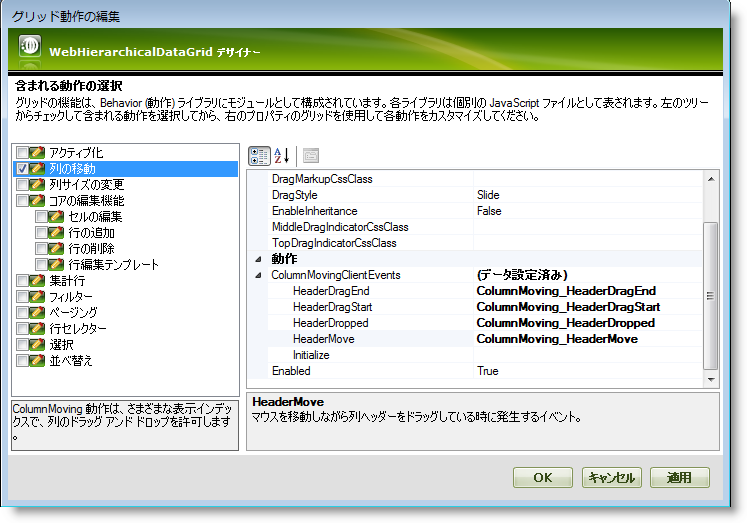

////

|metadata|
{
    "name": "webhierarchicaldatagrid-column-moving",
    "controlName": ["WebHierarchicalDataGrid"],
    "tags": [],
    "guid": "bfbd48f4-c12d-4e24-bd9b-d0e1483122ab",  
    "buildFlags": [],
    "createdOn": "2011-06-02T12:21:09.3527642Z"
}
|metadata|
////

= 列の移動

== はじめに

バージョン 2011.1 の時点では、WebHierarchicalDataGrid™ コントロールは、WebDataGrid™ コントロールにある同じ機能に似たグリッド間での列の移動をサポートします。ColumnMoving でビヘイビアーが有効にされた場合、ユーザーは列をドラッグ アンド ドロップして自分の好みに合わせて整理できます。ビヘイビアーが有効に設定されたバンドの列は、そこから派生する子バンドごとにサイズ移動されます。

== 階層データで列の移動

階層データ内で列を移動する場合は、以下の点に注意してください:

* 2 つの子行アイランドが同じバンドから展開され、そのバンドのひとつで列が移動されると、ポストバックが発生して、WebHierarchicalDataGrid コントロールがバンド列の表示可能なインデックスを変更することを可能にします。*注:* 両方の行アイランドは、変更された表示可能なインデックスで返します。
* ロードオンデマンドが有効で、列が子行アイランドで移動されると、同じ親に属する隣接するバンドの列も移動されます。
* 列がバンドで自動生成される場合、列が移動された行アイランドのみで表示可能なインデックスが変更されます。
* 列のグループが列の移動とともに有効である場合、列がグループ化または移動されるかどうかは、ドロップ操作がグループ領域で行われたかどうかによって決定されます。また、グループ化がオンで、列が既にグループ化されているか、列がテンプレート列である場合、ドラッグ操作は列が移動可能である限り開始されます。この反対も正しくなります。列に移動できない列設定がある場合、ドラッグ操作はグループ化が可能である場合は開始されます。
* 列のグループ化が有効である場合、グリッドによって、グループ領域およびヘッダーの別の場所の両方に列をドラッグできます。 pick:[asp-net="link:{ApiPlatform}web{ApiVersion}~infragistics.web.ui.gridcontrols.columnmoving~dragstyle.html[DragStyle]"]  移動ビヘイビアーは、グループ化を許可するためにこのケースでは「follow」に設定されます。

== 列の移動を有効にする

リスト 1 およびリスト 2 で示すように、マークアップでデザイン タイムに、またはランタイムに、ビヘイビアー ダイアログから列移動のビヘイビアーを設定できます。

*リスト 1: デザイン タイムに列の移動を有効*

*HTML の場合:*

----
<Behaviors>
   <ig:ColumnMoving EnableInheritance="True">
   </ig:ColumnMoving>
</Behaviors>
----

*リスト 2: ランタイムに列の移動を有効*

*Visual Basic の場合:*

----
WebHierarchicalDataGrid1.Behaviors.CreateBehavior(Of Infragistics.Web.UI.GridControls.ColumnMoving)()
WebHierarchicalDataGrid1.Behaviors.ColumnMoving.EnableInheritance = True
----

*C# の場合:*

----
WebHierarchicalDataGrid1.Behaviors.CreateBehavior<Infragistics.Web.UI.GridControls.ColumnMoving>();
WebHierarchicalDataGrid1.Behaviors.ColumnMoving.EnableInheritance = true;
----

それぞれの例で、 pick:[asp-net="link:{ApiPlatform}web{ApiVersion}~infragistics.web.ui.gridcontrols.columnmoving~enableinheritance.html[EnableInheritance]"]  プロパティは、機能が子バンドに転送されるかどうかを決定します。

== 列移動イベント

WebHierarchicalDataGrid のこの新しいビヘイビアーは、カスタム コードを実行するために使用できるクライアント側イベントに付属します。これらは列の移動時にエンドユーザーが実行する最も重要なアクションをカバーします。すなわち、 pick:[asp-net="link:{ApiPlatform}web{ApiVersion}~infragistics.web.ui.gridcontrols.columnmovingclientevents~headerdragstart.html[HeaderDragStart]"] 、 pick:[asp-net="link:{ApiPlatform}web{ApiVersion}~infragistics.web.ui.gridcontrols.columnmovingclientevents~headerdragend.html[HeaderDragEnd]"] 、 pick:[asp-net="link:{ApiPlatform}web{ApiVersion}~infragistics.web.ui.gridcontrols.columnmovingclientevents~headermove.html[HeaderMove]"]  および  pick:[asp-net="link:{ApiPlatform}web{ApiVersion}~infragistics.web.ui.gridcontrols.columnmovingclientevents~headerdropped.html[HeaderDropped]"]  です。 pick:[asp-net="link:{ApiPlatform}web{ApiVersion}~infragistics.web.ui.framework.clienteventsbase~initialize.html[Initialize]"]  イベントも使用可能です。

== デザイナーでサブスクライブする

デザイナーを使用して前述したすべてのイベントをサブスクライブできます。これを行うためには、 link:webhierarchicaldatagrid-webhierarchicaldatagrid-smart-tag.html[WebHierarchicalDataGrid スマートタグ]のビヘイビアー リンクをクリックします。[列の移動] を選択し、 pick:[asp-net="link:{ApiPlatform}web{ApiVersion}~infragistics.web.ui.gridcontrols.columnmoving~columnmovingclientevents.html[ColumnMovingClientEvents]"]  プロパティを展開します。以下は、ほとんどのクライアント イベントがサブスクライブしたサンプルの WebHierarchicalDataGrid ビヘイビアー デザイナーのスクリーンショットです。

== コードでサブスクライブする

コードでクライアント イベントにサブスクライブするには、以下のサンプルを参照してください:

*HTML の場合:*

----
<Behaviors>
   <ig:ColumnMoving>
      <ColumnMovingClientEvents HeaderDragEnd="ColumnMoving_HeaderDragEnd" 
         HeaderDragStart="ColumnMoving_HeaderDragStart" 
         HeaderDropped="ColumnMoving_HeaderDropped" 
         HeaderMove="ColumnMoving_HeaderMove" />
   </ig:ColumnMoving>
</Behaviors>
----

*JavaScript の場合*

----
function ColumnMoving_HeaderMove(sender, eventArgs)
{
}
----

== サーバー イベント

列の移動操作がバンドで行われる場合、 pick:[asp-net="link:{ApiPlatform}web{ApiVersion}~infragistics.web.ui.gridcontrols.webhierarchicaldatagrid~columnmoved_ev.html[ColumnMoved]"]  サーバー イベントが WebHierarchicalDataGrid ではなく移動が行われた  pick:[asp-net="link:{ApiPlatform}web{ApiVersion}~infragistics.web.ui.gridcontrols.iband.html[IBand]"]  であるセンダーで発生します。

== 関連トピック

link:webhierarchicaldatagrid-column-resizing.html[列のサイズ変更]