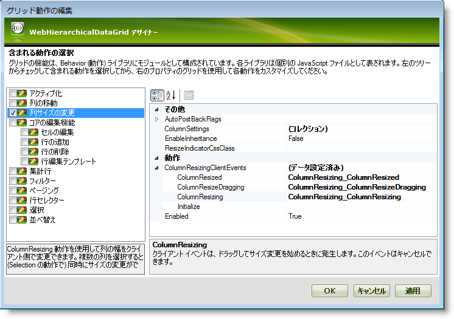

////

|metadata|
{
    "name": "webhierarchicaldatagrid-column-resizing",
    "controlName": ["WebHierarchicalDataGrid"],
    "tags": [],
    "guid": "f81dbdb3-c6bf-4152-a094-3efee1cf73db",  
    "buildFlags": [],
    "createdOn": "2011-06-02T12:22:28.178646Z"
}
|metadata|
////

= 列のサイズ変更

== はじめに

バージョン 11.1 の時点では、WebHierarchicalDataGrid™ コントロールは、WebDataGrid™ コントロールにある同じ機能に似たサイズ変更をサポートします。ColumnResizing ビヘイビアーが有効にされた場合、ユーザーは列の端をドラッグ アンドドロップしてサイズを変更できます。ビヘイビアーが有効に設定されたバンドの列は、そこから派生する子バンドごとにサイズ変更されます。

== 階層データで列のサイズ変更

階層データ内で列のサイズを変更する場合は、以下の点に注意してください:

* ロードオンデマンドが有効で、列が子行アイランドでサイズ変更されると、同じ親に属する隣接するバンドの列もサイズ変更されます。
* サイズ変更操作が行われる時にポストバックが WebHierarchicalDataGrid で発生するかどうかは、ColumnResized AutoPostbackFlag によって決定されます。True の場合、ポストバックが発生します。False の場合、サイズ変更はクライアントで行われます。
* 列がバンドで自動生成される場合、列がサイズ変更された行アイランドのみで幅が変更されます。ただし、そのバンドの他の行アイランドもクライアントに存在する場合、それらの列はクライアントでもサイズ変更されます。

== 列のリサイズを有効化

*リスト 1* および*リスト 2* で示すように、マークアップでデザイン タイムに、またはランタイムに、ビヘイビアー ダイアログからビヘイビアーを設定できます。

*リスト 1: デザイン タイムに列のサイズ変更を有効*

*HTML の場合:*

----
<Behaviors>
   <ig:ColumnResizing EnableInheritance="True">
   </ig:ColumnResizing>
</Behaviors>
----

*リスト 2: ランタイムに列のサイズ変更を有効*

*Visual Basic の場合:*

----
WebHierarchicalDataGrid1.GridView.Behaviors.CreateBehavior(Of Infragistics.Web.UI.GridControls.ColumnResizing)()
WebHierarchicalDataGrid1.GridView.Behaviors.ColumnResizing.EnableInheritance = True
----

*C# の場合:*

----
WebHierarchicalDataGrid1.GridView.Behaviors.CreateBehavior<Infragistics.Web.UI.GridControls.ColumnResizing>();
WebHierarchicalDataGrid1.GridView.Behaviors.ColumnResizing.EnableInheritance = true;
----

それぞれの例で、 pick:[asp-net="link:{ApiPlatform}web{ApiVersion}~infragistics.web.ui.gridcontrols.columnresizing~enableinheritance.html[EnableInheritance]"]  プロパティは、機能が子バンドに転送されるかどうかを決定します。

== 列リサイズ イベント

新しい機能は、リサイズが発生中および発生後にカスタム コードを実行する権限をユーザーに提供するいくつかのクライアント側イベントに付属しています。WebHierarchicalDataGrid の列のサイズ変更機能でサポートされるクライアント側イベントは、 pick:[asp-net="link:{ApiPlatform}web{ApiVersion}~infragistics.web.ui.gridcontrols.columnresizingclientevents~columnresizing.html[ColumnResizing]"] 、 pick:[asp-net="link:{ApiPlatform}web{ApiVersion}~infragistics.web.ui.gridcontrols.columnresizingclientevents~columnresizedragging.html[ColumnResizeDragging]"]  および  pick:[asp-net="link:{ApiPlatform}web{ApiVersion}~infragistics.web.ui.gridcontrols.columnresizingclientevents~columnresized.html[ColumnResized]"]  です。

== デザイナーでサブスクライブする

デザイナーを使用して前述したすべてのイベントをサブスクライブできます。これを行うためには、 link:webhierarchicaldatagrid-webhierarchicaldatagrid-smart-tag.html[WebHierarchicalDataGrid スマート タグ]のビヘイビアー リンクをクリックします。[列のサイズ変更] を選択し、 pick:[asp-net="link:{ApiPlatform}web{ApiVersion}~infragistics.web.ui.gridcontrols.columnresizing~columnresizingclientevents.html[ColumnResizingClientEvents]"]  プロパティを展開します。以下は、ほとんどのクライアント イベントがサブスクライブしたサンプルの WebHierarchicalDataGrid ビヘイビアー デザイナーのスクリーンショットです。

== コードでサブスクライブする

コードでクライアント イベントにサブスクライブするには、以下のサンプルを参照してください:

*HTML の場合:*

----
<Behaviors>
   <ig:ColumnResizing>
      <ColumnResizingClientEvents ColumnResized="ColumnResizing_ColumnResized" 
         ColumnResizeDragging="ColumnResizing_ColumnResizeDragging" 
         ColumnResizing="ColumnResizing_ColumnResizing" />
      </ig:ColumnResizing>
</Behaviors>
----

*JavaScript の場合*

----
function ColumnResizing_ColumnResizing(sender, eventArgs)
{
}
----

== サーバー イベント

列のサイズ変更操作がバンドで行われる場合、 pick:[asp-net="link:{ApiPlatform}web{ApiVersion}~infragistics.web.ui.gridcontrols.webhierarchicaldatagrid~columnresized_ev.html[ColumnResized]"]  サーバー イベントが WebHierarchicalDataGrid ではなくサイズ変更が行われた  pick:[asp-net="link:{ApiPlatform}web{ApiVersion}~infragistics.web.ui.gridcontrols.iband.html[IBand]"]  であるセンダーで発生します。

== 関連トピック

link:webhierarchicaldatagrid-column-moving.html[列の移動]