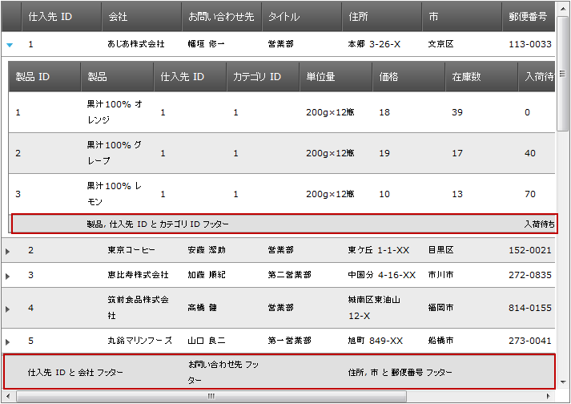
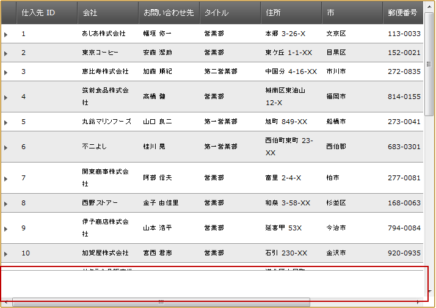
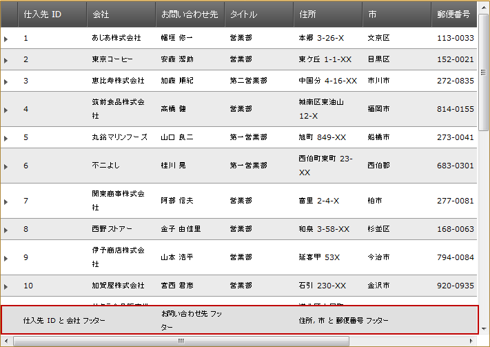

////

|metadata|
{
    "name": "webhierarchicaldatagrid-configuring-multi-column-footers",
    "controlName": ["WebHierarchicalDataGrid"],
    "tags": ["Grids","Grouping"],
    "guid": "5acf4b66-149c-449c-9053-05af0c79a133",  
    "buildFlags": [],
    "createdOn": "2012-04-16T02:34:04.9436489Z"
}
|metadata|
////

= 複数列フッターの構成

== トピックの概要

=== 目的

このトピックでは、 _WebHierarchicalDataGrid_   _™_   における複数列フッターのセットアップ方法を示します。

=== 前提条件

以下の表に、このトピックを理解するための前提条件として求められるトピックをリストします。

[options="header", cols="a,a"]
|====
|トピック|目的

| link:webhierarchicaldatagrid-about-webhierarchicaldatagrid.html[詳細情報]
|このトピックでは、 _WebHierarchicalDataGrid_ の機能について説明します。

| link:webhierarchicaldatagrid-getting-started-with-webhierarchicaldatagrid.html[WebHierarchicalDataGrid を使用した作業の開始]
|このトピックでは、 _WebHierarchicalDataGrid_ を Northwind データベースにバインドする方法について説明します。

|====

=== 本トピックの内容

このトピックには次のセクションがあります。

* <<_Ref321763361, 複数列フッターの構成 - 概念的概要 >>
** <<_Ref321836641,複数列フッターの構成の概要>>
** <<_Ref321836646,要件>>
** <<_Ref321836649,プロパティ設定>>

* <<_Ref321763367, 複数列フッターの構成 - コード例 >>
** <<_Ref321763378,概要>>
** <<_Ref321763381,プレビュー>>
** <<_Ref321763385,要件>>
** <<_Ref321763388,概要>>
** <<_Ref321763391,手順>>

* <<_Ref321763372, 関連内容 >>
** <<_Ref321836628,トピック>>
** <<_Ref321836631,サンプル>>

[[_Control_Configuration_Summary]]
[[_Ref321763361]]
== 複数列フッターの構成 - 概念的概要

[[_Ref321836641]]

=== 複数列フッターの構成の概要

複数列フッター機能によって、複数列フッターを結合できます。つまり、ひとつの列のフッター テキストが複数列に及ぶことになります。

複数列フッターの構成には、 link:{ApiPlatform}web{ApiVersion}~infragistics.web.ui.gridcontrols.gridfield_members.html[GridField] またはその子孫インスタンスの作成、および link:{ApiPlatform}web{ApiVersion}~infragistics.web.ui.gridcontrols.gridfield~footer.html[Footer] プロパティ オブジェクトの設定が伴います。 link:{ApiPlatform}web{ApiVersion}~infragistics.web.ui.gridcontrols.gridfield~footer.html[Footer] プロパティ オブジェクトは link:{ApiPlatform}web{ApiVersion}~infragistics.web.ui.gridcontrols.gridfieldfootercaption_members.html[GridFieldFooterCaption] クラスであり、 link:{ApiPlatform}web{ApiVersion}~infragistics.web.ui.gridcontrols.gridfieldfootercaption~colspan.html[ColSpan] プロパティを持っています。このプロパティは、複数列フッターの構成を行います。このプロパティの設定後に必要なことは、 link:{ApiPlatform}web{ApiVersion}~infragistics.web.ui.gridcontrols.gridfield~footer.html[Footer] の Text プロパティでのフッター設定のみです。

複数列ヘッダー機能とは異なり、グループ内にフッターのネスティングはありません。複数列フッターを構成する場合、以下に留意してください。

*  *結合は左から右へ行います。*

結合された列の重複がある場合、左列のルールが右列のルールに優先し、その結果、右のルールは破棄されます。

*  *列のスパンは固定領域を超えることはできません。*

列の固定と共に複数列フッターを使用する場合は、列のスパンは固定領域を超えることはできません。たとえば、2 列が固定されており、3 列のフッター スパンを定義した場合、2 列のみがスパンすることになります

*  *列のスパンは、表示された列にのみ影響を与えます。*

つまり、列は、コレクション内の順序ではなく、表示された順序で処理されます。たとえば、列スパン 2 を持つ表示された列、非表示の列、別の表示された列の順序の場合、2 番目の表示された列が列スパンに含まれます。

* 列のスパンは、グリッドの終わりを超えることはできません。

たとえば、グリッドの右側に 2 列あり、3 列スパンを定義した場合、結果は 2 列スパンになります。

*注:* _GridField_   インスタンスまたはその子孫でフッターをスパンできます。

[[_Ref321836646]]

=== 要件

true に設定された link:{ApiPlatform}web{ApiVersion}~infragistics.web.ui.gridcontrols.webhierarchicaldatagrid~showfooter.html[ShowFooter] プロパティを使用してデータにバインドされた、 _Web_   _Hierarchical_   _DataGrid_  。

[[_Ref321836649]]

=== プロパティ設定

以下の表に、複数列フッターの設定可能な項目と、それを管理するための該当するプロパティへのマッピングを示します。

[options="header", cols="a,a"]
|====
|構成可能な項目|プロパティ

|列の数
|
* link:{ApiPlatform}web{ApiVersion}~infragistics.web.ui.gridcontrols.gridfieldfootercaption~colspan.html[ColSpan] 

|====

[[_Configuring_Multi-Column_Footers]]
[[_Ref321763367]]
== 複数列フッターの構成 - コード例

[[_Ref321763378]]

=== 概要

この例では、 _Web_   _Hierarchical_   _DataGrid_   は、 _Northwind_   サンプル データベース内の  _Suppliers_   および  _Products_   テーブルにバインドされます。複数列フッターを表示するには、列フッターをグリッドに対して有効にし、列スパンを、 _Suppliers_   テーブルの 2 列および  _Products_   テーブルの 2 列に対して定義します。これらは、 _Suppliers_   テーブルの  _SupplierID_   と  _Address_   列、および  _Products_   テーブルの  _ProductName_   と  _UnitPrice_   です。

[[_Ref321763381]]

=== プレビュー

以下のスクリーンショットは最終結果のプレビューです。

[[_Ref321763385]]

=== 要件

* 手順を完了するには、以下が必要です:
**  _Northwind_   データベースの  _Suppliers_   および  _Products_   テーブルにバインドされた  _WebHierarchicalDataGrid_  。

[[_Ref321763388]]

=== 概要

このトピックでは、 _WebHierarchicalDataGrid_   の複数列フッターの構成について、ステップごとに説明します。以下はプロセスの概念的概要です。

*1.<<Configure_footer_visibility,フッターの表示状態を構成します>>*

*2.<<Define_fields,グリッドのフィールドを定義します>>*

*3.<<Configure_Multi_column_footer,コンテナー グリッドの複数列フッターを構成します>>*

*4.<<Configure_Multi_column_footer_for_band,バンドの複数列フッターを構成します (オプション)>>*

[[_Ref321763391]]

=== 手順

以下のステップは、 _WebHierarchicalDataGrid_   における複数列フッターの構成方法を示します。

=== 1.フッターの表示状態を構成します

フッター セットを表示するには、Show Footer プロパティを true に設定します。値はバンド内で継承されます。

*ASPX の場合:*

[source,html]
----
<ig:WebHierarchicalDataGrid ID="WebHierarchicalDataGridView" runat="server" ShowFooter="True" >
</ig:WebHierarchicalDataGrid>
----

*C# の場合:*

[source,csharp]
----
WebHierarchicalDataGridView.ShowFooter = true;
----

=== 2.グリッドのフィールドを定義します

*1.コンテナー グリッドのフィールドを定義します。*

*ASPX の場合:*

[source,html]
----
<Columns>
    <ig:BoundDataField DataFieldName="SupplierID" Key="SupplierID">
        <Header Text="SupplierID" />
    </ig:BoundDataField>
    <ig:BoundDataField DataFieldName="CompanyName" Key="CompanyName">
        <Header Text="Company" />
    </ig:BoundDataField>
    <ig:BoundDataField DataFieldName="Address" Key="Address">
        <Header Text="Address" />
    </ig:BoundDataField>
    <ig:BoundDataField DataFieldName="City" Key="City">
        <Header Text="City" />
    </ig:BoundDataField>
    <ig:BoundDataField DataFieldName="PostalCode" Key="PostalCode">
        <Header Text="Postal Code" />
    </ig:BoundDataField>
</Columns>
----

*C# の場合:*

[source,csharp]
----
BoundDataField supplierId = new BoundDataField();
supplierId.DataFieldName = "SupplierID";
supplierId.Key = "SupplierID";
supplierId.Header.Text = "SupplierID";
WebHierarchicalDataGridView.Columns.Add(supplierId);
BoundDataField companyName = new BoundDataField();
companyName.DataFieldName = "CompanyName";
companyName.Key = "CompanyName";
companyName.Header.Text = "Company";
WebHierarchicalDataGridView.Columns.Add(companyName);
BoundDataField address = new BoundDataField();
address.DataFieldName = "Address";
address.Key = "Address";
address.Header.Text = "Address";
WebHierarchicalDataGridView.Columns.Add(address);
BoundDataField city = new BoundDataField();
city.DataFieldName = "City";
city.Key = "City";
city.Header.Text = "City";
WebHierarchicalDataGridView.Columns.Add(city);
BoundDataField postalCode = new BoundDataField();
postalCode.DataFieldName = "PostalCode";
postalCode.Key = "PostalCode";
postalCode.Header.Text = "Postal Code";
WebHierarchicalDataGridView.Columns.Add(postalCode);
----

*2.グリッド バンドのフィールドを定義します。*

*ASPX の場合:*

[source,html]
----
<ig:Band Key="Products" DataMember="AccessDataSource2_Products" DataKeyFields="SupplierID" AutoGenerateColumns=" DefaultColumnWidth="100px">
    <Columns>
        <ig:BoundDataField DataFieldName="ProductName" Key="ProductName">
            <Header Text="Product Name" />
        </ig:BoundDataField>
        <ig:BoundDataField DataFieldName="SupplierID" Key="SupplierID">
            <Header Text="SupplierID" />
        </ig:BoundDataField>
        <ig:BoundDataField DataFieldName="UnitPrice" Key="UnitPrice">
            <Header Text="UnitPrice" />
        </ig:BoundDataField>
        <ig:BoundDataField DataFieldName="UnitsInStock" Key="UnitsInStock">
            <Header Text="UnitsInStock" />
        </ig:BoundDataField>
        <ig:BoundDataField DataFieldName="UnitsOnOrder" Key="UnitsOnOrder">
            <Header Text="UnitsOnOrder" />
        </ig:BoundDataField>
    </Columns>
</ig:Band>
----

*C# の場合:*

[source,csharp]
----
if (!IsPostBack)
{
    Band band = WebHierarchicalDataGridView.Bands["Products"];
    BoundDataField supplierID = new BoundDataField();
    supplierID.DataFieldName = "SupplierID";
    supplierID.Key = "SupplierID";
    supplierID.Header.Text = "SupplierID";
    band.Columns.Add(supplierID);
    BoundDataField productName = new BoundDataField();
    productName.DataFieldName = "ProductName";
    productName.Key = "ProductName";
    productName.Header.Text = "Product Name";
    band.Columns.Add(productName);
    BoundDataField unitPrice = new BoundDataField();
    unitPrice.DataFieldName = "UnitPrice";
    unitPrice.Key = "UnitPrice";
    unitPrice.Header.Text = "UnitPrice";
    band.Columns.Add(unitPrice);
    BoundDataField unitsInStock = new BoundDataField();
    unitsInStock.DataFieldName = "UnitsInStock";
    unitsInStock.Key = "UnitsInStock";
    unitsInStock.Header.Text = "UnitsInStock";
    band.Columns.Add(unitsInStock);
    BoundDataField unitsInOrder = new BoundDataField();
    unitsInOrder.DataFieldName = "UnitsOnOrder";
    unitsInOrder.Key = "UnitsOnOrder";
    unitsInOrder.Header.Text = "UnitsOnOrder";
    band.Columns.Add(unitsInOrder);
    WebHierarchicalDataGridView.Bands.Add(band);
}
----

=== 3.コンテナー グリッドの複数列フッターを構成します

フッターを  _SupplierID_   および  _Address_   列に追加します

 *1.フッターを*   _SupplierID_    *列に追加し、*   _ColSpan_    *を 2 に設定します。* 

*ASPX の場合:*

[source,html]
----
<ig:BoundDataField DataFieldName="SupplierID" Key="SupplierID">
    <Header Text="SupplierID" />
    <Footer Text="SupplierID and Company Name footer" ColSpan="2" />
</ig:BoundDataField>
----

*C# の場合:*

[source,csharp]
----
BoundDataField supplierId = new BoundDataField();
supplierId.DataFieldName = "SupplierID";
supplierId.Key = "SupplierID";
supplierId.Header.Text = "SupplierID";
supplierId.Footer.Text = "SupplierID and Company Name footer";
supplierId.Footer.ColSpan = 2;
WebHierarchicalDataGridView.Columns.Add(supplierId);
----

*2.フッターを*   _Address_    *列に追加し、*  _ColSpan_    *を 3 に設定します。*

*ASPX の場合:*

[source,html]
----
<ig:BoundDataField DataFieldName="Address" Key="Address">
    <Header Text="Address" />
    <Footer Text="Address and City and Postal Code footer" ColSpan="3" />
</ig:BoundDataField>
----

*C# の場合:*

[source,csharp]
----
BoundDataField address = new BoundDataField();
address.DataFieldName = "Address";
address.Key = "Address";
address.Header.Text = "Address";
address.Footer.Text = "Address and City and Postal Code footer";
address.Footer.ColSpan = 3;
WebHierarchicalDataGridView.Columns.Add(address);
----

=== 4.バンドの複数列フッターを構成します (オプション)

フッターを  _ProductName_   および  _UnitPrice_   列に追加します *1.フッターを*   _ProductName_    *列に追加し、*  _ColSpan_    *を 2 に設定します。* 

*ASPX の場合:*

[source,html]
----
<ig:BoundDataField DataFieldName="ProductName" Key="ProductName">
    <Header Text="Product Name" />
    <Footer Text="This is Product Name and SupplierID footer" ColSpan="2" />
</ig:BoundDataField>
----

*C# の場合:*

[source,csharp]
----
BoundDataField productName = new BoundDataField();
productName.DataFieldName = "ProductName";
productName.Key = "ProductName";
productName.Header.Text = "Product Name";
productName.Footer.Text = "This is Product Name and SupplierID footer";
productName.Footer.ColSpan = 2;
band.Columns.Add(productName);
----

*2*  *.*  *フッターを*   _UnitPrice_    *列に追加し、*  _ColSpan_    *を 3*   *に設定します。*

*ASPX の場合:*

[source,html]
----
<ig:BoundDataField DataFieldName="UnitPrice" Key="UnitPrice">
    <Header Text="UnitPrice" />
    <Footer Text="This is UnitPrice and UnitsInStock and UnitsOnOrder footer" ColSpan="3" />
</ig:BoundDataField>
----

*C# の場合:*

[source,csharp]
----
BoundDataField unitPrice = new BoundDataField();
unitPrice.DataFieldName = "UnitPrice";
unitPrice.Key = "UnitPrice";
unitPrice.Header.Text = "UnitPrice";
unitPrice.Footer.Text = "This is UnitPrice and UnitsInStock and UnitsOnOrder footer";
unitPrice.Footer.ColSpan = 3;
band.Columns.Add(unitPrice);
----

[[_Related_Content]]
[[_Ref321763372]]
== 関連内容

[[_Ref321836628]]

=== トピック

以下のトピックでは、このトピックに関連する情報を提供しています。

[options="header", cols="a,a"]
|====
|トピック|目的

| link:webhierarchicaldatagrid-configuring-multi-column-headers.html[複数列ヘッダーの構成]
|このトピックでは、 _Web_ _Hierarchical_ _DataGrid_ における複数列ヘッダーの構成方法を示します。

|====

[[_Ref321836631]]

=== サンプル

以下のサンプルでは、このトピックに関連する情報を提供しています。

[options="header", cols="a,a"]
|====
|サンプル|目的

| link:{SamplesURL}/samples/webhierarchicaldatagrid/display/multicolumnfooters/default.aspx?cn=hierarchical-data-grid&sid=87d97c70-f8d3-4311-91ee-33e6a1b4cf86[複数列のフッター]
|このサンプルは、複数列フッターを使用した _WebHierarchicalDataGrid_ の構成を示しています。

|====