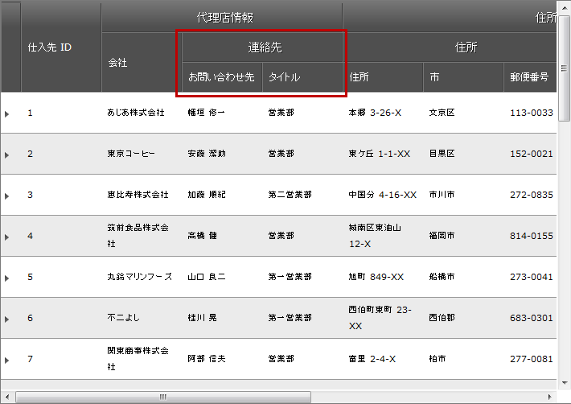

////

|metadata|
{
    "name": "webhierarchicaldatagrid-configuring-multi-column-headers",
    "controlName": ["WebHierarchicalDataGrid"],
    "tags": ["Grids","Grouping","Layouts"],
    "guid": "3204d475-9ef0-4885-b68f-7e7b8dea2a92",  
    "buildFlags": [],
    "createdOn": "2012-04-12T20:07:27.2964535Z"
}
|metadata|
////

= 複数列ヘッダーの構成

== トピックの概要

=== 目的

このトピックでは、 _WebHierarchicalDataGrid_   _™_   における複数列ヘッダーのセットアップ方法を示します。

=== 前提条件

以下の表に、このトピックを理解するための前提条件として求められるトピックをリストします。

[options="header", cols="a,a"]
|====
|トピック|目的

| link:webhierarchicaldatagrid-getting-started-with-webhierarchicaldatagrid.html[WebHierarchicalDataGrid を使用した作業の開始]
|このトピックでは、 _WebHierarchicalDataGrid_ を Northwind データベースにバインドする方法について説明します。

|====

=== 本トピックの内容

このトピックには次のセクションがあります。

* <<_Ref321761870, 複数列ヘッダーの構成 - 概念的概要 >>
* <<_Ref321764907, 複数列ヘッダーの構成 - コード例 >>
** <<_Ref321764911,概要>>
** <<_Ref321764914,プレビュー>>
** <<_Ref321764917,要件>>
** <<_Ref321764920,概要>>
** <<_Ref321764924,手順>>

* <<_Ref320889580, 関連内容 >>
** <<_Ref321819237,トピック>>
** <<_Ref321819243,サンプル>>

[[_Ref321761870]]
== 複数列ヘッダーの構成 - 概念的概要

=== 複数列ヘッダーの構成の概要

複数レベルのヘッダーを作成する必要のある場合や、ヘッダーを複数のカテゴリにグループ分けする必要のある場合には、複数列ヘッダーを有効にすると、こうしたことが可能になります。 link:{ApiPlatform}web{ApiVersion}~infragistics.web.ui.gridcontrols.groupfield_members.html[GroupField] オブジェクトは、その列コレクションに他の列を入れることのできるフィールドです。列コレクションの列の上に link:{ApiPlatform}web{ApiVersion}~infragistics.web.ui.gridcontrols.groupfield_members.html[GroupField] のヘッダーが表示されます。グリッドのサイズ変更/並べ替え/選択/フィルター処理/移動の各動作は、この新しいレイアウトのニーズに合わせてデザインしなおされています。

=== 要件

データにバインドされた  _Web_   _Hierarchical_   _DataGrid_

=== プロパティ設定

以下の表に、複数列ヘッダーの設定可能な項目と、それを管理するための該当するプロパティへのマッピングを示します。

[options="header", cols="a,a"]
|====
|構成可能な項目|プロパティ

|複数列ヘッダー
|
* link:{ApiPlatform}web{ApiVersion}~infragistics.web.ui.gridcontrols.groupfield_members.html[GroupField] 

* link:{ApiPlatform}web{ApiVersion}~infragistics.web.ui.gridcontrols.webhierarchicaldatagrid~columns.html[Columns] 

|====

[[_Control_Configuration_Summary]]
[[_Configuring_multi-column_headers]]
[[_Ref320889575]]
[[_Ref321764907]]
== 複数列ヘッダーの構成 - コード例

[[_Ref321764911]]

=== 概要

この例では、連絡先情報フィールドをグループ化する link:{ApiPlatform}web{ApiVersion}~infragistics.web.ui.gridcontrols.groupfield_members.html[GroupField] オブジェクトを定義します。その後、2 つの BoundDataField オブジェクトをフィールドの link:{ApiPlatform}web{ApiVersion}~infragistics.web.ui.gridcontrols.webhierarchicaldatagrid~columns.html[Columns] コレクションに追加します。これらのフィールドには、列データ  _ContactName_   および  _ContactTitle_   が保持されます。

[[_Ref321764914]]

=== プレビュー

以下のスクリーンショットは最終結果のプレビューです。

[[_Ref321764917]]

=== 要件

手順を完了するためには、 _Northwind_   サンプル データベースのサプライヤー テーブルにバインドされた  _WebHierarchicalDataGrid_   が必要です。

[[_Ref321764920]]

=== 概要

このトピックでは、 _WebHierarchicalDataGrid_   の複数列ヘッダーの構成について順を追って説明します。以下はプロセスの概念的概要です。

* link:webhierarchicaldatagrid-configuring-multi-column-headers.html#_1_defining_a_groupfield[1.GroupField の定義]<<Define_GroupField,>>*

* link:webhierarchicaldatagrid-configuring-multi-column-headers.html#_2_configuring_the_header_text[2.ヘッダー テキストの構成]<<Configure_the_header_text,>>*

* link:webhierarchicaldatagrid-configuring-multi-column-headers.html#_3_adding_columns_to_the_groupfield_s_columns_collection[3.GroupField の列コレクションへの列の追加]*

[[_Ref321764924]]

=== 手順

以下の手順は、複数列ヘッダーの構成方法を示します。

=== 1.GroupField の定義

GroupField は、他の列と同様に定義されます。データにはバインドされませんが、他の列と同じようにキーが必要です。

*ASPX の場合:*

[source,html]
----
<ig:GroupField Key="ContactInfo">
</ig:GroupField>
----

*C# の場合:*

[source,csharp]
----
GroupField groupField = new GroupField();
groupField.Key = "ContactInfo";
this.WebHierarchicalDataGridView.Columns.Add(groupField);
----

=== 2.ヘッダー テキストの構成

ヘッダー テキストは、その列に表示されるテキストです。これは、GridField の `Header` オブジェクトの `Text` プロパティで構成します。

*ASPX の場合:*

[source,html]
----
<Header Text="Contact Information" />
----

*C# の場合:*

[source,csharp]
----
groupField.Header.Text = "Contact Information";
----

=== 3.GroupField の列コレクションへの列の追加

子列を表示するには、子列を GroupField の Columns コレクションに追加します。

*ASPX の場合:*

[source,html]
----
<Columns>
    <ig:BoundDataField DataFieldName="ContactName" Key="ContactName">
        <Header Text="Contact" />
    </ig:BoundDataField>
    <ig:BoundDataField DataFieldName="ContactTitle" Key="ContactTitle">
        <Header Text="Title" />
    </ig:BoundDataField>
</Columns>
----

*C# の場合:*

[source,csharp]
----
/* Creating a  BoundDataField * /
BoundDataField field = new BoundDataField();
field.DataFieldName = "ContactName";
field.Key = "ContactName";
field.Header.Text = "Contact";
/* Adding the BoundDataField to be under the GroupedField 
* which was created above
*/
groupField.Columns.Add(field);
/* Creating a  BoundDataField * /
field = new BoundDataField();
field.DataFieldName = "ContactTitle";
field.Key = "ContactTitle";
field.Header.Text = "Title";
/* Adding the BoundDataField to be under the GroupedField 
* which was created above
*/
groupField.Columns.Add(field);
----

[[_Related_Content]]
[[_Ref320889580]]
== 関連内容

[[_Ref321819237]]

=== トピック

以下のトピックでは、このトピックに関連する情報を提供しています。

[options="header", cols="a,a"]
|====
|トピック|目的

| link:webhierarchicaldatagrid-getting-started-with-webhierarchicaldatagrid.html[WebHierarchicalDataGrid を使用した作業の開始]
|このトピックでは、 _WebHierarchicalDataGrid_ を Northwind データベースにバインドする方法について説明します。

| link:webhierarchicaldatagrid-behaviors.html[動作]
|このトピックでは、 _WebHierarchicalDataGrid_ で構成可能な動作の一覧を示します。

|====

[[_Ref321819243]]

=== サンプル

以下のサンプルでは、このトピックに関連する情報を提供しています。

[options="header", cols="a,a"]
|====
|サンプル|目的

| link:{SamplesURL}/samples/webhierarchicaldatagrid/display/multicolumnheaders/default.aspx?cn=hierarchical-data-grid&sid=d893d141-97f2-4848-a4ed-3622544a7612[複数列のヘッダー]
|このサンプルでは、 _WebHierarchicalDataGrid_ で複数列ヘッダーを構成する方法を示します。

|====