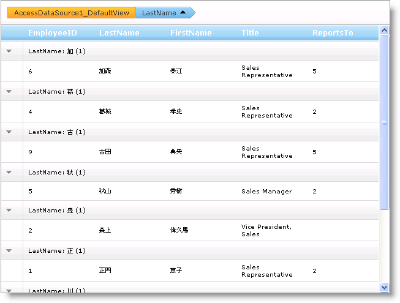

////

|metadata|
{
    "name": "webhierarchicaldatagrid-custom-group-by-name",
    "controlName": ["WebHierarchicalDataGrid"],
    "tags": ["Grids","Grouping"],
    "guid": "{B8696B18-B3B9-4D52-BA11-2C830ADCABF1}",  
    "buildFlags": [],
    "createdOn": "0001-01-01T00:00:00Z"
}
|metadata|
////

= 名前によるカスタム グループ

WebHierarchicalDataGrid™ で列をグループ化すると、その列のセル値に基づいて列がグループ化されます。カスタムの比較に応じて、このデフォルトの動作を変更して列をグループ化できます。カスタムのグループ化機能を実行するには、一般的な link:{ApiPlatform}web{ApiVersion}~infragistics.web.ui.gridcontrols.groupequalitycomparer`1.html[GroupEqualityComparer] 抽象クラスを実装する必要があります。これを実行した後で、カスタムの比較子クラスのインスタンスを link:{ApiPlatform}web{ApiVersion}~infragistics.web.ui.gridcontrols.columngroupingsetting.html[ColumnGroupingSetting] オブジェクトの link:{ApiPlatform}web{ApiVersion}~infragistics.web.ui.gridcontrols.columngroupingsetting~groupcomparer.html[GroupComparer] プロパティに指定します。

GroupEqualityComparer クラスは、 link:{ApiPlatform}web{ApiVersion}~infragistics.web.ui.gridcontrols.groupequalitycomparer`1~equals.html[Equals] と link:{ApiPlatform}web{ApiVersion}~infragistics.web.ui.gridcontrols.groupequalitycomparer`1~groupname.html[GroupName] の 2 つのメソッドを実装する必要があります。Equals メソッドは比較のカスタム ロジックを提供しますが、GroupName メソッドはグループ行の文字列を返します。

以下のコードは、Employee の姓の最初の文字だけでグループ化する方法を示します。

*Visual Basic の場合：*

----
Protected Sub Page_Init(ByVal sender As Object, ByVal e As EventArgs)
    Me.WebHierarchicalDataGrid1.GroupingSettings.GroupedColumns.Add("LastName")
    Dim setting As New ColumnGroupingSetting()
    setting.ColumnKey = "LastName"
    setting.GroupComparer = New AlphabetGroupComparer()
    Me.WebHierarchicalDataGrid1.GroupingSettings.ColumnSettings.Add(setting)
End Sub
Public Class AlphabetGroupComparer
    Inherits GroupEqualityComparer(Of String)
    Public Overloads Overrides Function Equals(ByVal x As String, ByVal y As String) As Boolean
        If x.Substring(0, 1).ToLower() = y.Substring(0, 1).ToLower() Then
            Return True
        End If
        Return False
    End Function
    Public Overloads Overrides Function GroupName(ByVal value As String) As String
        If value.Length = 0 Then
            Return String.Empty
        End If
        Return value.Substring(0, 1).ToUpper()
    End Function
End Class
----

*C# の場合：*

----
protected void Page_Init(object sender, EventArgs e)
{
    this.WebHierarchicalDataGrid1.GroupingSettings.GroupedColumns.Add("LastName");
    ColumnGroupingSetting setting = new ColumnGroupingSetting();
    setting.ColumnKey = "LastName";
    setting.GroupComparer = new AlphabetGroupComparer();
    this.WebHierarchicalDataGrid1.GroupingSettings.ColumnSettings.Add(setting);
}
public class AlphabetGroupComparer : GroupEqualityComparer<string>
{
    public override bool Equals(string x, string y)
    {
        if (x.Substring(0, 1).ToLower() == y.Substring(0, 1).ToLower())
            return true;
        return false;
    }
    public override string GroupName(string value)
    {
        if (value.Length == 0)
            return string.Empty;
        return value.Substring(0, 1).ToUpper();
    }
}
----

== 関連トピック

link:webhierarchicaldatagrid-about-outlook-groupby.html[Outlook GroupBy について]

link:webhierarchicaldatagrid-custom-text-in-group-row.html[グループ行のカスタム テキスト]

link:webhierarchicaldatagrid-group-columns-from-code-behind.html[コード ビハインドから列をグループ化]

link:webhierarchicaldatagrid-outlook-groupby-with-behaviors.html[動作による Outlook GroupBy]

link:webhierarchicaldatagrid-referencing-rows-when-using-outlook-groupby.html[Outlook GroupBy を使用する時に行を参照]