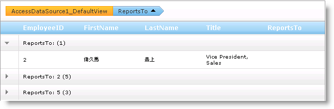
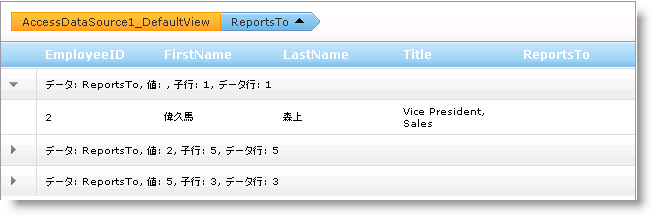
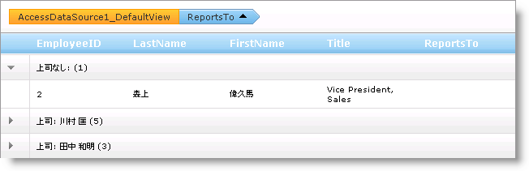

////

|metadata|
{
    "name": "webhierarchicaldatagrid-custom-text-in-group-row",
    "controlName": ["WebHierarchicalDataGrid"],
    "tags": ["Editing","Grids","Styling"],
    "guid": "{05137124-CA41-4E4A-810D-62874C14903D}",  
    "buildFlags": [],
    "createdOn": "0001-01-01T00:00:00Z"
}
|metadata|
////

= グループ行のカスタム テキスト

WebHierarchicalDataGrid™ がグループ化された行を表示する時、各行に以下のフォーマットの説明テキストが付きます[列名]:[値] ([子行の数])。

link:{ApiPlatform}web{ApiVersion}~infragistics.web.ui.gridcontrols.groupedrecord.html[GroupedRecord] オブジェクトの link:{ApiPlatform}web{ApiVersion}~infragistics.web.ui.gridcontrols.groupedrecord~text.html[Text] プロパティを使用してテキストにアクセスできます。列の値は link:{ApiPlatform}web{ApiVersion}~infragistics.web.ui.gridcontrols.groupedrecord~value.html[Value] プロパティを使用してアクセスされます。

GroupedRecord オブジェクトのカスタムの説明を表示したい場合には、手動で構築する、またはマスクを使用するのいずれかでカスタムの文字列を提供することによって実行できます。

== カスタムのグループ化マスク

link:{ApiPlatform}web{ApiVersion}~infragistics.web.ui.gridcontrols.iband.html[IBand] インターフェイスを実装するオブジェクトは、 link:{ApiPlatform}web{ApiVersion}~infragistics.web.ui.gridcontrols.groupingsettings~groupedrowtextmask.html[GroupedRowTeskMask] プロパティを設定することによってテキスト マスクを設定することができる link:{ApiPlatform}web{ApiVersion}~infragistics.web.ui.gridcontrols.groupingsettings.html[GroupingSettings] オブジェクトを公開します。このマスクに使用できるトークンは以下の通りです。

* {0} – 列名。
* {1} – 列の値。
* {2} – グループ行に属するすぐ下の子行。
* {3} – グループ行に属する合計データ行。

以下のコードは、グループ行のテキスト マスクを設定する方法を示します。

*HTML の場合:*

----
<GroupingSettings GroupedRowTextMask="データ: {0}, 値: {1}, 子行: {2}, データ行:{3}" />
----

*Visual Basic の場合：*

----
Me.WebHierarchicalDataGrid1.GroupingSettings.GroupedRowTextMask = "データ: {0}, 値: {1}, 子行: {2}, データ行:{3}"
----

*C# の場合：*

----
this.WebHierarchicalDataGrid1.GroupingSettings.GroupedRowTextMask = "データ: {0}, 値: {1}, 子行: {2}, データ行:{3}";
----

== 手動でテキストをカスタマイズ

グループ行のテキストに表示される値を完全に制御したい場合には、WebHierarchicalDataGrid の link:{ApiPlatform}web{ApiVersion}~infragistics.web.ui.gridcontrols.webhierarchicaldatagrid~groupedrowinitialized_ev.html[GroupedRowInitialized] イベントで行のテキストを手動で操作できます。以下のコードは、グループ行のテキストに異なるセル値を表示する方法を示します。

*Visual Basic の場合：*

----
Private Sub WebHierarchicalDataGrid1_GroupedRowInitialized(ByVal sender As Object, ByVal e As Infragistics.Web.UI.GridControls.GroupedRowEventArgs)
    ' ReportsTo 列のカスタム テキストを設定します。
    If e.GroupedRow.ColumnGroupedBy.Key = "ReportsTo" Then
        ' 値が存在しない場合、その社員は誰の監督下にもありません。
        If e.GroupedRow.Value = DBNull.Value Then
            ' デフォルトのテキストから項目数を取得します。
            Dim numItems As String = e.GroupedRow.Text.Substring(e.GroupedRow.Text.Length - 3, 3)
            e.GroupedRow.Text = "上司なし: " & numItems
        Else
            Dim numItems As String = e.GroupedRow.Text.Substring(e.GroupedRow.Text.Length - 3, 3)
            ' グループ化されている値を取得します。
            Dim value As Integer = CInt(e.GroupedRow.Value)
            ' ReportsTo 列からグループ化されている値に等しい EmployeeID を持つ行を取得します。
            ' これはグループ化されている行がその監督下にある社員の行を返します。
            Dim record As GridRecord = Me.WebHierarchicalDataGrid1.Rows.FromKey(New Object() {value})
            If record IsNot Nothing Then
                ' 監督下にある人の名前を取得します。
                Dim name As String = (record.Items(1).Value.ToString() & " ") + record.Items(2).Value.ToString()
                e.GroupedRow.Text = ("上司: " & name & " ") + numItems
            End If
        End If
    End If
End Sub
----

*C# の場合：*

----
void WebHierarchicalDataGrid1_GroupedRowInitialized(object sender, Infragistics.Web.UI.GridControls.GroupedRowEventArgs e)
{
// ReportsTo 列のカスタム テキストを設定します。
    if (e.GroupedRow.ColumnGroupedBy.Key == "ReportsTo")
    {
// 値が存在しない場合、その社員は誰の監督下にもありません。
        if (e.GroupedRow.Value == DBNull.Value)
        {
// デフォルトのテキストから項目数を取得します。
            string numItems = e.GroupedRow.Text.Substring(e.GroupedRow.Text.Length - 3, 3);
            e.GroupedRow.Text = "上司なし: " + numItems;
        }
        else
        {
            string numItems = e.GroupedRow.Text.Substring(e.GroupedRow.Text.Length - 3, 3);
// グループ化されている値を取得します。
            int value = (int)e.GroupedRow.Value;
// ReportsTo 列からグループ化されている値に等しい EmployeeID を持つ行を取得します。
// これはグループ化されている行がその監督下にある社員の行を返します。
            GridRecord record = this.WebHierarchicalDataGrid1.Rows.FromKey(new object[] { value });
            if (record != null)
            {
// 監督下にある人の名前を取得します。
                string name = record.Items[1].Value.ToString() + " " + record.Items[2].Value.ToString();
                e.GroupedRow.Text = "上司: " + name + " " + numItems;
            }
        }
    }
}
----

== 関連トピック

link:webhierarchicaldatagrid-about-outlook-groupby.html[Outlook GroupBy について]

link:webhierarchicaldatagrid-custom-group-by-name.html[名前によるカスタム グループ]

link:webhierarchicaldatagrid-group-columns-from-code-behind.html[コード ビハインドから列をグループ化]

link:webhierarchicaldatagrid-outlook-groupby-with-behaviors.html[動作による Outlook GroupBy]

link:webhierarchicaldatagrid-referencing-rows-when-using-outlook-groupby.html[Outlook GroupBy を使用する時に行を参照]