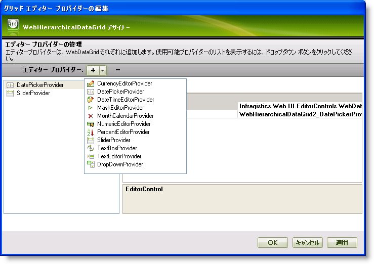
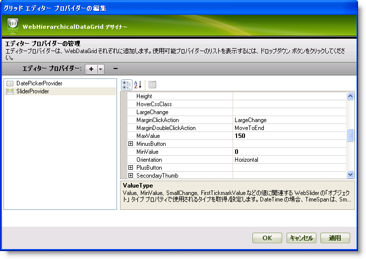
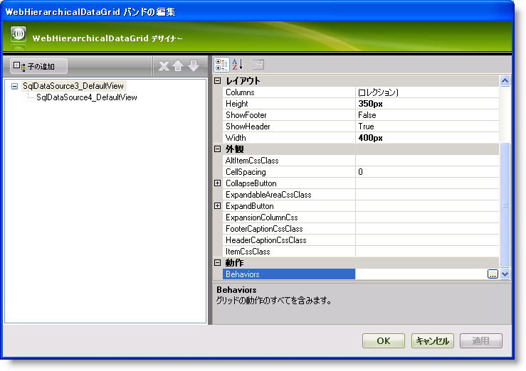
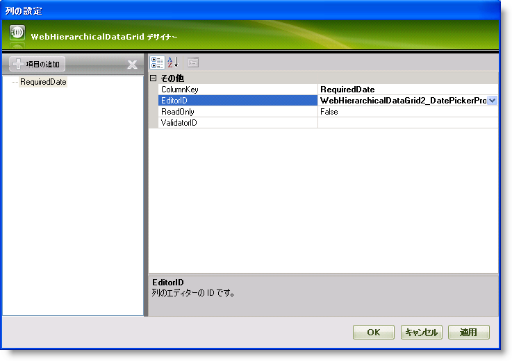
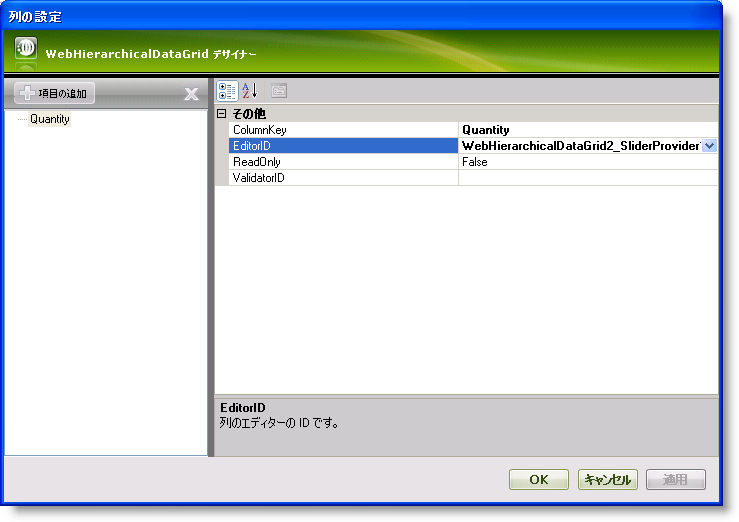
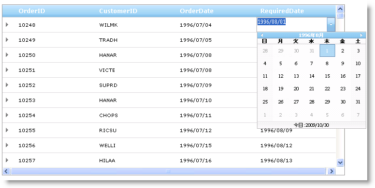

////

|metadata|
{
    "name": "webhierarchicaldatagrid-editor-providers",
    "controlName": ["WebHierarchicalDataGrid"],
    "tags": ["Editing","Grids"],
    "guid": "{0AE764B7-D861-466B-9AEC-9E8B795D5A33}",  
    "buildFlags": [],
    "createdOn": "2009-02-10T15:02:20Z"
}
|metadata|
////

= エディター プロバイダー

WebHierarchicalDataGrid™ でフィールドに異なるエディターを使用したい場合があります。エディター プロバイダーの使用によって実行できます。

編集対応の WebHierarchicalDataGrid™ コントロールで、列のデータ型に基づいて最も適切なエディター プロバイダーが各列で使用されます。たとえば、数値および DateTime データ型列は自動的に NumericEditorProvider および DateTimeEditorProvider をそれぞれ使用します。ただし、このデフォルトの機能をオーバーライドしたい場合には、固有のエディタープロバイダーを常に指定できます。これによって、各列により適切と見なされる異なるエディターを提供することができます。使用できるエディタープロバイダーは以下のとおりです。

* link:{ApiPlatform}web{ApiVersion}~infragistics.web.ui.gridcontrols.currencyeditorprovider.html[CurrencyEditorProvider]
* link:{ApiPlatform}web{ApiVersion}~infragistics.web.ui.gridcontrols.datepickerprovider.html[DatePickerProvider]
* link:{ApiPlatform}web{ApiVersion}~infragistics.web.ui.gridcontrols.datetimeeditorprovider.html[DateTimeEditorProvider]
* link:{ApiPlatform}web{ApiVersion}~infragistics.web.ui.gridcontrols.dropdownprovider.html[DropDownProvider]
* link:{ApiPlatform}web{ApiVersion}~infragistics.web.ui.gridcontrols.maskeditorprovider.html[MaskEditorProvider]
* link:{ApiPlatform}web{ApiVersion}~infragistics.web.ui.gridcontrols.monthcalendarprovider.html[MonthCalendarProvider]
* link:{ApiPlatform}web{ApiVersion}~infragistics.web.ui.gridcontrols.numericeditorprovider.html[NumericEditorProvider]
* link:{ApiPlatform}web{ApiVersion}~infragistics.web.ui.gridcontrols.percenteditorprovider.html[PercentEditorProvider]
* link:{ApiPlatform}web{ApiVersion}~infragistics.web.ui.gridcontrols.sliderprovider.html[SliderProvider]
* link:{ApiPlatform}web{ApiVersion}~infragistics.web.ui.gridcontrols.textboxprovider.html[TextBoxProvider]
* link:{ApiPlatform}web{ApiVersion}~infragistics.web.ui.gridcontrols.texteditorprovider.html[TextEditorProvider]

WebHierarchicalDataGrid の列のデータ型に基づいてデフォルトで使用されるエディター プロバイダーの一部は以下のとおりです。以下のテーブルはデータ型と関連するエディターをリストします。

[options="header", cols="a,a"]
|====
|タイプ|エディター

|Byte
|WebNumericEditorProvider

|Char
|WebNumericEditorProvider

|DateTime
|DateTimeEditorProvider

|Double
|NumericEditorProvider

|Int16
|NumericEditorProvider

|Int32
|NumericEditorProvider

|Int64
|NumericEditorProvider

|Single
|NumericEditorProvider

|String
|TextBoxProvider

|====

エディター プロバイダーを使用するには、エディター プロバイダーを EditorProviders コレクションに追加します。追加されたら、ID を使用してエディター プロバイダーにアクセスし特定の列に割り当てることができます。

WebHierarchicalDataGrid コントロールで EditorProviders を使用するために、次の手順を実行します。

== 次の手順を実行します

[start=1]
. WebHierarchicalDataGrid を WebHierarchicalDataSource™ コンポーネントにバインドし、Orders および Order Details テーブルからデータを取得します。実行についての詳細は、 link:webhierarchicaldatasource-using-webhierarchicaldatasource.html[階層的なデータ ソースにバインド]トピックを参照してください。
[start=2]
. Microsoft® Visual Studio™ プロパティ ウィンドウで、EditorProviders プロパティを指定して、省略記号 (...) ボタンをクリックし、エディター プロバイダー デザイナーを起動します。
[start=3]
. プラス （+） ボタンをクリックして、可能なエディターのリストをドロップダウンします。列を設定する時に、後で使用できるようにするために、親バンドにひとつ、そして子バンドにひとつの 2 つのエディターを選択します。この目的のために、DatePickerProvider および SliderProvider を選択します。

[start=4]
. 右のプロパティ グリッドでエディターの ID を WebHierarchicalDataGrid1_DatePickerProvider1 および WebHierarchicalDataGrid1_SliderProvider1 のままにしておきます。この ID は列のエディターを設定するときに後で必要になります。
[start=5]
. EditorControl プロパティを拡張することによって、エディター コントロールの追加プロパティを設定できます。このトピックについては、SliderProvider の EditorControl プロパティを拡張してください。以下のプロパティの値を設定します。

** MaxValue – 150
** MinValue – 0
** ValueType – Int

[start=6]
. [適用] そして [OK] ボタンをクリックしてデザイナーを閉じます。
[start=7]
. link:{ApiPlatform}web{ApiVersion}~infragistics.web.ui.gridcontrols.webhierarchicaldatagrid~bands.html[Bands] プロパティを指定して、省略記号 (...) ボタンをクリックし、[WebHierarchicalDataGrid バンドの編集] ダイアログを起動します。
[start=8]
. このウィンドウで、親および子バンドのプロパティを設定できます。親バンドの右にあるプロパティ グリッドから link:{ApiPlatform}web{ApiVersion}~infragistics.web.ui.gridcontrols.webhierarchicaldatagrid~behaviors.html[Behaviors] プロパティを指定します。省略（...）ボタンをクリックして [グリッド動作の編集] ダイアログを起動します。

[start=9]
. 編集を有効にするには左のリストで link:{ApiPlatform}web{ApiVersion}~infragistics.web.ui.gridcontrols.cellediting.html[CellEditing] 動作をチェックします。
[start=10]
. 右のプロパティ グリッドで link:webhierarchicaldatagrid~infragistics.web.ui.grideditbase~columnsettings.html[ColumnSettings] プロパティを指定して、省略記号 (...) ボタンをクリックして、[列設定エディター] ダイアログを起動します。
[start=11]
. RequiredDate 列の編集で DatePickerProvider を使用するために、WebHierarchicalDataGrid の親バンドを構成します。

.. [項目の追加] をクリックして列設定を追加します。
.. ColumnKey を RequiredDate として設定します。
.. EditorID プロパティで、ドロップダウン リストをクリックして選択します。

WebHierarchicalDataGrid 1_DatePickerProvider1。EditorProviders コレクションに追加したエディターのみがここで使用できます。
.. ReadOnly を False のままにしておきます。
.. [列設定] および [グリッド動作の編集] ダイアログ ウィンドウで [OK] をクリックします。

*注：* ドロップダウン リストで [列の追加/修正] オプションを選択して、[グリッド列の編集] ダイアログに移動することもできます。

[start=12]
. 手順 8 ～ 10 に従いますが、今回は子バンドを構成します。
[start=13]
. Quantity 列の編集で SliderProvider を使用するために、WebHierarchicalDataGrid の子バンドを構成します。

.. [項目の追加] をクリックして列設定を追加します。
.. ColumnKey を Quantity として設定します。
.. EditorID プロパティで、ドロップダウン リストをクリックして WebHierarchicalDataGrid1_SliderProviderProvider1 を選択します。EditorProviders コレクションに追加したエディターのみがここで使用できます。
.. ReadOnly プロパティを False のままにしておきます。
.. [列設定] および [グリッド動作の編集] ダイアログ ウィンドウで [OK] をクリックします。

[start=14]
. [OK] をクリックして [WebHierarchicalDataGrid バンドの編集] ダイアログを閉じます。
[start=15]
. アプリケーションを実行します。RequiredDate 列のセルで編集モードになると、DatePickerProvider が表示します。同様に、子バンド内の Quantity 列のセルで編集モードに入ると、SliderProvider が表示します。

===== WebHierarchicalDataGrid - RequiredDate 列で DatePickerProvider を示す親バンド

===== WebHierarchicalDataGrid - Quantity 列で SliderProvider を示す子バンド

image::images/WebHierarchicalDataGrid_Using_Editor_Providers_07.png[]