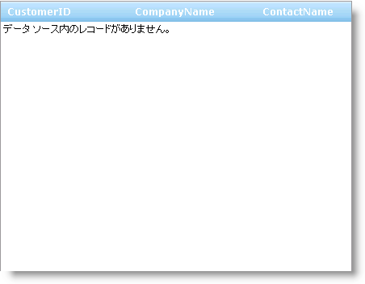

////

|metadata|
{
    "name": "webhierarchicaldatagrid-enable-empty-rows-template",
    "controlName": ["WebHierarchicalDataGrid"],
    "tags": ["Grids","Templating"],
    "guid": "{88D47868-FDBE-4552-9341-480DBB1158E1}",  
    "buildFlags": [],
    "createdOn": "0001-01-01T00:00:00Z"
}
|metadata|
////

= 空の行テンプレートを有効にする

WebHierarchicalDataGrid™ には、データ ソースに行がない場合に表示されるカスタム表示をエンドユーザーに提供するために使用できる空の行テンプレートがあります。すべてのテンプレートと同様、カスタム メッセージをエンドユーザーに提供するために空のテンプレート内にコントロールを配置できます。

コントロールのスマート タグをクリックしてテンプレートの編集を選択することで、デザイン タイムに空の行テンプレートを設定できます。表示ドロップダウン リストから空の行テンプレートを選択します。これでコントロールを空の行テンプレート表面にドラッグできます。

以下のコードは、WebHierarchicalDataGrid がバインドされているが行がない場合にエンドユーザーにメッセージを表示するカスタム テンプレートの作成方法を示します。テンプレートの作成と同様、ITemplate インターフェイスを実装するクラスが必要です。

*Visual Basic の場合：*

----
Protected Overloads Overrides Sub OnInit(ByVal e As EventArgs) 
    MyBase.OnInit(e) 
    'テンプレートはポストバックごとにインスタンス化される必要があります 
    Me.WebHierarchicalDataGrid1.EmptyRowsTemplate = New CustomEmptyRowsTemplate() 
End Sub 
Private Class CustomEmptyRowsTemplate 
    Implements ITemplate 
    #Region "ITemplate Members" 
    Public Sub InstantiateIn(ByVal container As Control) Implements ITemplate.InstantiateIn
        Dim label1 As New System.Web.UI.WebControls.Label() 
        label1.Text = "データ ソース内のレコードがありません。" 
        label1.ID = "Label1" 
        container.Controls.Add(label1) 
    End Sub 
    #End Region
End Class
----

*C# の場合：*

----
protected override void OnInit(EventArgs e)
{
   base.OnInit(e);
   //テンプレートはポストバックごとにインスタンス化される必要があります
   this.WebHierarchicalDataGrid1.EmptyRowsTemplate = new CustomEmptyRowsTemplate();
}
private class CustomEmptyRowsTemplate : ITemplate
{
   #region ITemplate Members
   public void InstantiateIn(Control container)
   {
      System.Web.UI.WebControls.Label label1 = new System.Web.UI.WebControls.Label();
      label1.Text = "データ ソース内のレコードがありません。";
      label1.ID = "Label1";
      container.Controls.Add(label1);
    }
    #endregion
}
----

== 関連トピック

link:webhierarchicladatagrid-column-templates.html[列のテンプレート]

link:webhierarchicaldatagrid-paging-template.html[ページング テンプレート]

link:webhierarchicaldatagrid-enable-error-template.html[エラー テンプレートを有効にする]