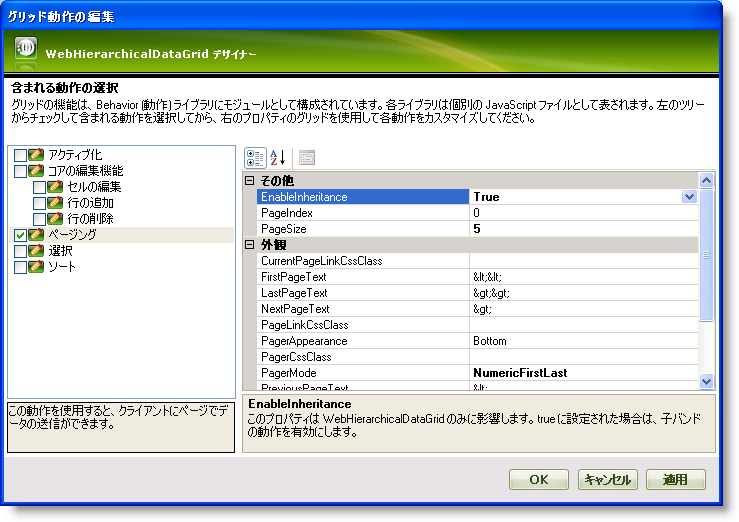

////

|metadata|
{
    "name": "webhierarchicaldatagrid-enabling-paging",
    "controlName": ["WebHierarchicalDataGrid"],
    "tags": ["Grids","Paging"],
    "guid": "{3AEBBF60-C2D5-4181-9924-47CEEF36A66D}",  
    "buildFlags": [],
    "createdOn": "0001-01-01T00:00:00Z"
}
|metadata|
////

= ページングを有効にする

== 始める前に

WebHierarchicalDataGrid™ はページとして表示されるより小さいサブセットでデータを提供するためのページング機能を提供します。ページングを有効にするには、 pick:[asp-net="link:{ApiPlatform}web{ApiVersion}~infragistics.web.ui.gridcontrols.paging.html[Paging]"]  動作を  pick:[asp-net="link:{ApiPlatform}web{ApiVersion}~infragistics.web.ui.gridcontrols.gridbehaviorcollection.html[Behaviors]"]  コレクションに追加します。

== 達成すること

WebHierarchicalDataGrid で基本的なページングを有効にしてページングのためのいくつかのオプションを設定する方法を学習します。

== 次の手順を実行します

[start=1]
. WebHierarchicalDataGrid を WebHierarchicalDataSource™ コンポーネントにバインドし、Categories および Products テーブルからデータを取得します。実行についての詳細は、 link:webhierarchicaldatasource-using-webhierarchicaldatasource.html[階層的なデータ ソースにバインド]トピックを参照してください。
[start=2]
. Microsoft® Visual Studio™ プロパティ ウィンドウで、Behaviors プロパティを指定して、省略記号 (...) ボタンをクリックし、[動作エディター] ダイアログを起動します。
[start=3]
. この動作を追加して有効にするには、左のリストからページャの隣りのチェックボックスをチェックします。
[start=4]
. プロパティで、 pick:[asp-net="link:{ApiPlatform}web{ApiVersion}~infragistics.web.ui.gridcontrols.paging~pagesize.html[PageSize]"]  を 5 に設定し、ページあたりのレコード数を 5 に増やします。
[start=5]
. 最初と最後のページへのリンクが付いた番号にページャー リンクを変更する NumericFirstLast に  pick:[asp-net="link:{ApiPlatform}web{ApiVersion}~infragistics.web.ui.gridcontrols.paging~pagermode.html[PagerMode]"]  を設定します。
[start=6]
. すべての子レベルで Paging を有効にするには、 pick:[asp-net="link:{ApiPlatform}web{ApiVersion}~infragistics.web.ui.gridcontrols.paging~enableinheritance.html[EnableInheritance]"]  プロパティを True に設定します。デフォルト値は False です。

[適用]、そして [OK] をクリックします。デザイン タイムに一部の Pager 設定で親および子レベルにページングを有効にします。

*注：* Sorting と組み合わせて Paging を使用するには、DataKeyFields を HierarchicalDataGrid の各バンドで設定する必要があります。

image::images/WebHierarchicalDataGrid_Enabling_Paging_02.png[]

コードでもページング動作を有効にします。

*In HTML:*

----
<ig:WebHierarchicalDataGrid ID="WebHierarchicalDataGrid1" runat="server" 
        Height="350px" Width="400px">
        <Behaviors>
            <ig:Paging EnableInheritance="True" PagerMode="NumericFirstLast" PageSize="5">
            </ig:Paging>
        </Behaviors>
    </ig:WebHierarchicalDataGrid>
----

*In Visual Basic:*

----
Me.WebHierarchicalDataGrid1.Behaviors.Paging.PagerMode = _
    Infragistics.Web.UI.GridControls.PagerMode.NumericFirstLast
Me.WebHierarchicalDataGrid1.Behaviors.Paging.PageSize = 5
Me.WebHierarchicalDataGrid1.Behaviors.Paging.EnableInheritance = True
----

*In C#:*

----
this.WebHierarchicalDataGrid1.Behaviors.Paging.PagerMode =
    Infragistics.Web.UI.GridControls.PagerMode.NumericFirstLast;
this.WebHierarchicalDataGrid1.Behaviors.Paging.PageSize = 5;
this.WebHierarchicalDataGrid1.Behaviors.Paging.EnableInheritance = true;
----

== 関連トピック

link:webhierarchicaldatagrid-activation.html[アクティブ化]

link:webhierarchicaldatagrid-cell-editing.html[セルの編集]

link:webhierarchicaldatagrid-enabling-row-adding.html[行の追加を有効にする]

link:webhierarchicaldatagrid-enabling-row-deleting.html[行の削除を有効にする]

link:webhierachicaldatagrid-selection.html[選択]

link:webhierarchicaldatagrid-sorting.html[並べ替え]