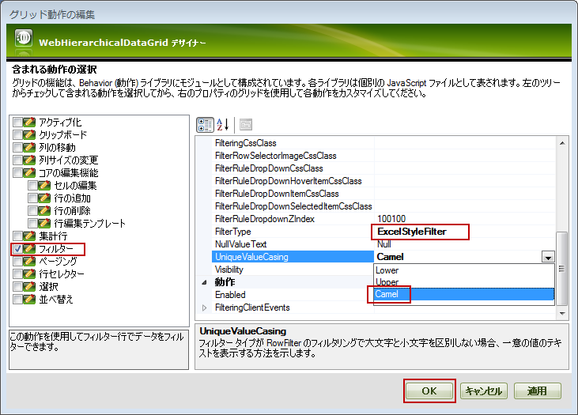
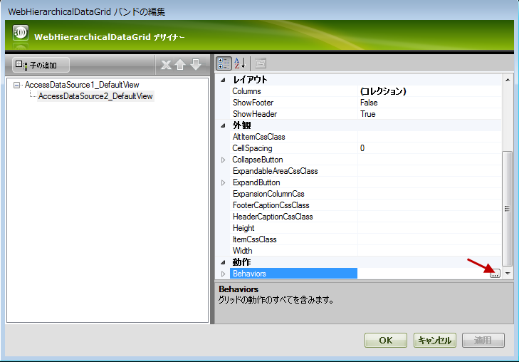
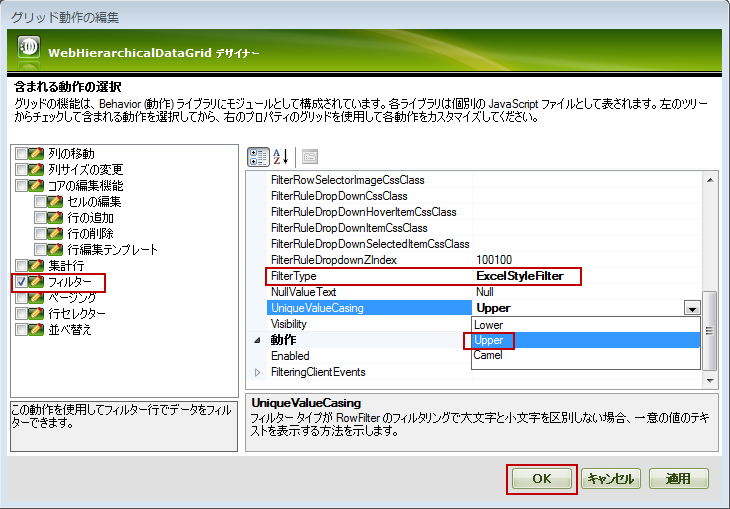
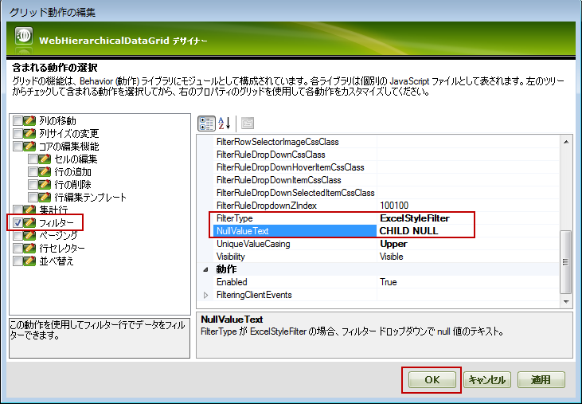

////

|metadata|
{
    "name": "webhierarchicaldatagrid-excelstylefiltering-configuring",
    "controlName": ["WebHierarchicalDataGrid"],
    "tags": ["Filtering","Grids"],
    "guid": "1b29e2f3-22aa-4118-b3d8-a69fac4e1fff",  
    "buildFlags": [],
    "createdOn": "2012-07-16T12:20:10.9190495Z"
}
|metadata|
////

= Excel フィルタリングの設定

Excel フィルタリングの設定 ( _WebHierarchicalDataGrid_ )

[[_Ref336005674]]
== トピックの概要

[[_Ref336006129]]

=== 目的

このトピックでは、 _WebHierarchicalDataGrid_™ コントロールの Excel フィルタリング オプションを構成する方法を説明します。

=== 前提条件

このトピックの本題に入る前に、以下のトピックをお読みください。

[options="header", cols="a,a"]
|====
|トピック|目的

| link:webhierarchicaldatagrid-getting-started-with-webhierarchicaldatagrid.html[WebHierarchicalGrid を使用した作業の開始]
|このトピックでは、Northwind データベースの _Categories_ および _Products_ テーブルを使用して _WebHierarchicalDataGrid_ を _WebHierarchicalDataSource_™ コンポーネントにバインドする方法を学習します。

| link:webhierarchicaldatagrid-excelstylefiltering-overview.html[Excel フィルタリングの概要 ( _WebHierarchicalDataGrid_ )]
|このトピックでは、 _WebHierarchicalDataGrid_ コントロールの Excel フィルタリング機能について紹介します。

| link:webhierarchicaldatagrid-excelstylefiltering-enabling.html[Excel フィルタリングの有効化 _(WebHierarchicalDataGrid)_ ]
|このトピックは、 _WebHierarchicalDataGrid_ コントロールの Excel フィルタリング機能のプロパティについての情報を提供します。

|====

=== このトピックの内容

このトピックは以下のセクションからなります。

* <<_Ref329857460,Excel フィルタリングの設定概要>>
* <<_Ref336284691,フィルタリング ドロップダウンで一意の値を大文字化する設定>>
* <<_Ref336006342,概要>>
* <<_Ref336006348,プロパティ設定>>
* <<_Ref329857547,前提条件>>
* <<_Ref336019721,デザイナーで一意の値の大文字化を構成>>
* <<_Ref336022251,ASPX マークアップで一意の値の大文字化を構成>>

* <<_Ref329857565,コード ビハインドで一意の値の大文字化を構成>>

* <<_Ref336284708,フィルタリング ドロップダウンで Null 値のテキストを構成>>

* <<_Ref336284789,概要>>
* <<_Ref336006661,プレビュー>>
* <<_Ref329857590,プロパティ設定>>
* <<_Ref329857593,前提条件>>
* <<_Ref329857597,デザイナーで Null 値のテキストを構成>>
* <<_Ref336022322,ASPX マークアップで Null 値のテキストを構成>>
* <<_Ref329857603,コード ビハインドで Null 値のテキストを構成>>

* <<_Ref336284750,関連コンテンツ>>

* <<_Ref336006743,トピック>>
* <<_Ref336006749,サンプル>>

[[_Ref329857460]]
[[_Ref336019679]]
== Excel フィルタリングの設定概要

[[_Ref336006324]]

=== Excel フィルタリングの設定概要表

以下の表は WebHierarchicalDataGrid™ コントロールの link:webhierarchicaldatagrid-excelstylefiltering-landingpage.html[*Excel フィルタリング* ] 機能の設定可能な要素を表示します。

[options="header", cols="a,a,a"]
|====
|設定可能な要素|詳細|プロパティ

|<<_Ref336284691,フィルタリング ドロップダウンで一意の値の大文字化を構成>>
|フィルタリング ドロップダウンの値の大文字化を指定できます。利用可能なオプションは: 小文字、大文字、および camelcase です。
|
* link:{ApiPlatform}web{ApiVersion}~infragistics.web.ui.gridcontrols.columnfilteringsetting~uniquevaluecasing.html[UniqueValueCasing] 

|<<_Ref336284708,フィルタリング ドロップダウンで Null 値のテキストを構成>>
|フィルタリング ドロップダウンで Null 値のカスタム テキストを指定できます。
|
* link:{ApiPlatform}web{ApiVersion}~infragistics.web.ui.gridcontrols.columnfilteringsetting~nullvaluetext.html[NullValueText] 

|====

[[_Ref329857481]]

[[_Ref336006336]]

[[_Ref336284691]]
== フィルタリング ドロップダウンで一意の値の大文字化を構成

[[_Ref336006342]]

=== 概要

一意の値の大文字化オプションは:

*  *Lowercase*  (デフォルト) – 項目は小文字で表示されます
*  *Uppercase*  – 項目は大文字で表示されます
*  *Camelcase*  – 項目は英語の文字の大文字化で表示されます。項目の最初の文字のみは大文字で表示されます。

大文字化は link:{ApiPlatform}web{ApiVersion}~infragistics.web.ui.gridcontrols.columnfilteringsetting~uniquevaluecasing.html[UniqueValueCasing] プロパティによって処理されます。

一意の値の大文字化は複数のレベルで設定できます。

* 列ごと
* バンドごと (親/子)
* グリッド全体

列ごとの設定は優先があります。

[[_Ref336006348]]

=== プロパティ設定

[options="header", cols="a,a,a"]
|====
|以下の表は、プロパティ設定の大文字化の構成を示しています。目的:|使用するプロパティ:|設定の選択肢:

|フィルタリング ドロップダウンの項目を小文字に設定します。
| link:{ApiPlatform}web{ApiVersion}~infragistics.web.ui.gridcontrols.columnfilteringsetting~uniquevaluecasing.html[UniqueValueCasing]
| _Lower_ 

|フィルタリング ドロップダウンの項目を大文字に設定します。
| link:{ApiPlatform}web{ApiVersion}~infragistics.web.ui.gridcontrols.columnfilteringsetting~uniquevaluecasing.html[UniqueValueCasing]
| _Upper_ 

|フィルタリング ドロップダウンの項目の最初の文字を大文字に設定します。
| link:{ApiPlatform}web{ApiVersion}~infragistics.web.ui.gridcontrols.columnfilteringsetting~uniquevaluecasing.html[UniqueValueCasing]
| _Camel_ 

|====

[[_Ref329857547]]

=== 前提条件

この手順を実行するには、以下のリソースが必要です。

* Web ページで初期化された WebHierarchicalDataGrid を含む ASP.NET Web プロジェクト
* Northwind データベースの Customers テーブルの CustomerID、CompanyName、ContactName、および ContactTitle フィールドを取得する SqlDataSource コンポーネントにバインドされる WebHierarchicalDataGrid。詳細は、* link:webhierarchicaldatagrid-getting-started-with-webhierarchicaldatagrid.html[WebHierarchicalDataGrid を使用した作業の開始]* トピックを参照してください.  

[[_Ref336019721]]

=== デザイナーで一意の値の大文字化の設定

*グリッド レベルの大文字化の設定*

デザイナーでグリッド レベルの * link:{ApiPlatform}web{ApiVersion}~infragistics.web.ui.gridcontrols.columnfilteringsetting~uniquevaluecasing.html[UniqueValueCasing]* プロパティを  _Camel_  に設定するために:

*1**.* _WebDataGrid_  のスマート タグから *WebDataGrid デザイナー*  *を開きます* 。

*2**.*左側のペインで、 *フィルタリング動作を選択します* 。

*3**.*右側のペインで、* link:{ApiPlatform}web{ApiVersion}~infragistics.web.ui.gridcontrols.columnfilteringsetting~uniquevaluecasing.html[UniqueValueCasing]*  *プロパティを*   _Camel_   *に設定します* 。

*4**.*[*OK*]  *ボタンを*  *クリックします* 。

*バンド レベルの大文字化の設定*

以下の例では、最初の子バンドのフィルタリング ドロップダウンで一意の値の大文字化を設定する方法を紹介します。この例では、項目が大文字に設定されます。 link:{ApiPlatform}web{ApiVersion}~infragistics.web.ui.gridcontrols.columnfilteringsetting~uniquevaluecasing.html[UniqueValueCasing] プロパティは  _Upper_   に設定されます。

*1**.*子バンドを追加します*  * 。*

*2**.*そのバンドのフィルタリング動作を設定します。*

[[_Ref329857558]]

=== ASPX マークアップで一意の値の大文字化の設定

以下のコードは、ASPX マークアップで、親レベルの link:{ApiPlatform}web{ApiVersion}~infragistics.web.ui.gridcontrols.columnfilteringsetting~uniquevaluecasing.html[UniqueValueCasing] を  _Camel_   に設定し、子レベルの link:{ApiPlatform}web{ApiVersion}~infragistics.web.ui.gridcontrols.columnfilteringsetting~uniquevaluecasing.html[UniqueValueCasing] プロパティを  _Upper_   に設定します。

*ASPX の場合:*

[source,html]
----
<Behaviors>
    <ig:Filtering FilterType="ExcelStyleFilter" 
    UniqueValueCasing="Camel">
    </ig:Filtering>
</Behaviors>
<Bands>
    <ig:Band Key="Products" DataMember="SQLDataSource_Products" 
        DataKeyFields="CategoryID">
        <Behaviors>
            <ig:Filtering FilterType="ExcelStyleFilter" 
            UniqueValueCasing="Upper">
            </ig:Filtering>
        </Behaviors>
    </ig:Band>
</Bands>
----

[[_Ref329857565]]

=== コード ビハインドで一意の値の大文字化の設定

以下のコードは、コード ビハインドで、親レベルの link:{ApiPlatform}web{ApiVersion}~infragistics.web.ui.gridcontrols.columnfilteringsetting~uniquevaluecasing.html[UniqueValueCasing] を  _Camel_   に設定し、子レベルの link:{ApiPlatform}web{ApiVersion}~infragistics.web.ui.gridcontrols.columnfilteringsetting~uniquevaluecasing.html[UniqueValueCasing] プロパティを  _Upper_   に設定します。

*C# の場合:*

[source,csharp]
----
 protected void Page_Load(object sender, EventArgs e)
        {
            this.WebHierarchicalDataGrid1.InitializeBand += new InitializeBandEventHandler(WebHierarchicalDataGrid1_InitializeBand);
            this.WebHierarchicalDataGrid1.Behaviors.CreateBehavior<Filtering>();
            this.WebHierarchicalDataGrid1.Behaviors.Filtering.FilterType = FilteringType.ExcelStyleFilter;
            this.WebHierarchicalDataGrid1.Behaviors.Filtering.EnableInheritance = true;
            this.WebHierarchicalDataGrid1.Behaviors.Filtering.UniqueValueCasing = UniqueValueCasing.Camel;
            this.WebHierarchicalDataGrid1.RefreshBehaviors();
        }
        void WebHierarchicalDataGrid1_InitializeBand(object sender, BandEventArgs e)
        {
            e.Band.Behaviors.CreateBehavior<Filtering>();
            e.Band.Behaviors.Filtering.Enabled = true;
            e.Band.Behaviors.Filtering.FilterType = FilteringType.ExcelStyleFilter;
            e.Band.Behaviors.Filtering.EnableInheritance = true;
            e.Band.Behaviors.Filtering.UniqueValueCasing = UniqueValueCasing.Upper;
        }
----

[[_Ref336006648]]

[[_Ref336284708]]
== フィルタリング ドロップダウンで Null 値のテキストを設定

[[_Ref336284789]]

=== 概要

null 値テキストを設定すると、フィルター ドロップダウンの項目のテキストを変更できます。このテキストは、データソース / データベースで Null 値を持つ項目のために表示されます。

* link:{ApiPlatform}web{ApiVersion}~infragistics.web.ui.gridcontrols.columnfilteringsetting~nullvaluetext.html[NullValueText]* プロパティは String 型で、デフォルトの値は  _Null_  です。このプロパティは親レベルと子レベルの両方に設定できます。この例では、 link:{ApiPlatform}web{ApiVersion}~infragistics.web.ui.gridcontrols.columnfilteringsetting~nullvaluetext.html[NullValueText] プロパティは子バンドで  _CHILD NULL_   に設定されます。

[[_Ref336006661]]

=== プレビュー

以下の画像は、 link:{ApiPlatform}web{ApiVersion}~infragistics.web.ui.gridcontrols.columnfilteringsetting~nullvaluetext.html[NullValueText] プロパティを  _CHILD NULL_   文字列に設定したために  _CHILD NULL_   値を表示する項目を紹介します。

image::images/WHDG_ExcelStyleFiltering_Configuring_4.png[]

[[_Ref329857590]]

=== プロパティ設定

以下の表では、設定をプロパティ設定にマップします。

[options="header", cols="a,a,a"]
|====
|目的:|使用するプロパティ:|設定の選択肢:

|子バンドのフィルタリング ドロップダウンの null 値の項目のテキストを _CHILD NUL_ に設定します。
| link:{ApiPlatform}web{ApiVersion}~infragistics.web.ui.gridcontrols.columnfilteringsetting~nullvaluetext.html[NullValueText]
| _CHILD NULL_ 

|====

[[_Ref329857593]]

=== 前提条件

この手順を実行するには、以下のリソースが必要です。

* Web ページで初期化された WebHierarchicalDataGrid を含む ASP.NET Web プロジェクト
* Northwind データベースの Customers テーブルの CustomerID、CompanyName、ContactName、および ContactTitle フィールドを取得する SqlDataSource コンポーネントにバインドされる WebHierarchicalDataGrid。詳細は、* link:webhierarchicaldatagrid-getting-started-with-webhierarchicaldatagrid.html[WebHierarchicalDataGrid を使用した作業の開始]* トピックを参照してください.  

[[_Ref329857597]]

=== デザイナーで Null 値のテキストの設定

以下の画像は、デザイナーで WebHierarchicalDataGrid™ の子バンドの link:{ApiPlatform}web{ApiVersion}~infragistics.web.ui.gridcontrols.columnfilteringsetting~nullvaluetext.html[NullValueText] を  _CHILD NULL_   に設定する方法を表示します。最初に WebHierarchicalDataGrid™ のスマート タグで「バンドの編集」をクリックします。最初に子バンドを追加して、 link:{ApiPlatform}web{ApiVersion}~infragistics.web.ui.gridcontrols.columnfilteringsetting~nullvaluetext.html[NullValueText] を  _CHILD NULL_   に設定したフィルタリング動作を追加します。

デザイナーで  _WebHierarchicalDataGrid_   の子バンドの link:{ApiPlatform}web{ApiVersion}~infragistics.web.ui.gridcontrols.columnfilteringsetting~nullvaluetext.html[NullValueText] を  _My Null_   に設定するには:

*1.*  _WebHierarchicalDataGrid_  のスマート タグから WebHierarchicalDataGrid バンドの編集  *を開きます* 。

*2.* 左側のペインで、フィルター *をチェックします* 。

*2.* 右側のペインで、FilterType  *プロパティを*   _ExcelStyleFilter_    *に設定します* 。

*3.* 右側のペインで、 link:{ApiPlatform}web{ApiVersion}~infragistics.web.ui.gridcontrols.columnfilteringsetting~nullvaluetext.html[NullValueText]  *プロパティを*   _My Null_    *に設定します* 。

*4.* [*OK*]  *ボタンを*  *クリックします* 。

[[_Ref329857600]]

=== ASPX マークアップで Null 値のテキストの設定

以下のコードは、ASPX マークアップで子バンドの link:{ApiPlatform}web{ApiVersion}~infragistics.web.ui.gridcontrols.columnfilteringsetting~nullvaluetext.html[NullValueText] プロパティを  _CHILD NULL_   に設定する方法を紹介します。

*ASPX の場合:*

[source,html]
----
<Bands>
    <ig:Band DataKeyFields="CustomerID" DataMember="SQLDataSource_Products" 
        Key="Products">
        <Behaviors>
            <ig:Filtering FilterType="ExcelStyleFilter"
 NullValueText="CHILD NULL">
            </ig:Filtering>
        </Behaviors>
    </ig:Band>
</Bands>
----

[[_Ref329857603]]

=== コード ビハインドで Null 値のテキストの設定

以下のコードは、コード ビハインドで子バンドの link:{ApiPlatform}web{ApiVersion}~infragistics.web.ui.gridcontrols.columnfilteringsetting~nullvaluetext.html[NullValueText] プロパティを  _CHILD NULL_   に設定する方法を紹介します。

*C# の場合:*

[source,csharp]
----
 protected void Page_Load(object sender, EventArgs e)
        {
            this.WebHierarchicalDataGrid1.InitializeBand += new InitializeBandEventHandler(WebHierarchicalDataGrid1_InitializeBand);
            this.WebHierarchicalDataGrid1.Behaviors.CreateBehavior<Filtering>();
            this.WebHierarchicalDataGrid1.Behaviors.Filtering.FilterType = FilteringType.ExcelStyleFilter;
            this.WebHierarchicalDataGrid1.Behaviors.Filtering.EnableInheritance = true;
            this.WebHierarchicalDataGrid1.RefreshBehaviors();
        }
        void WebHierarchicalDataGrid1_InitializeBand(object sender, BandEventArgs e)
        {
            e.Band.Behaviors.CreateBehavior<Filtering>();
            e.Band.Behaviors.Filtering.Enabled = true;
            e.Band.Behaviors.Filtering.FilterType = FilteringType.ExcelStyleFilter;
            e.Band.Behaviors.Filtering.EnableInheritance = true;
            e.Band.Behaviors.Filtering.NullValueText = "CHILD NULL";
        }
----

[[_Ref336006691]]

[[_Ref336284750]]
== 関連コンテンツ

[[_Ref336006743]]

=== トピック

このトピックについては、以下のトピックも参照してください。

[options="header", cols="a,a"]
|====
|トピック|目的

| link:webhierarchicaldatagrid-excelstylefiltering-propertyreference.html[Excel フィルタリングのプロパティ リファレンス ( _WebHierarchicalDataGrid_ )]
|このトピックは、 _WebHierarchicalDataGrid_ コントロールの Excel フィルタリング機能のプロパティについての情報を提供します。

|====

[[_Ref336006749]]

=== サンプル

このトピックについては、以下のサンプルも参照してください。

[options="header", cols="a,a"]
|====
|サンプル|目的

| link:{SamplesURL}/samples/webhierarchicaldatagrid/organization/excelstylefilteringboundunboundfields/default.aspx?cn=hierarchical-data-grid&sid=73902ae9-b135-4a4b-bc4d-016907516bdd[Excel フィルタリング - バインド/非バインド フィールド]
|このサンプルでは、バインドおよび非バインド フィールドで Excel フィルタリングおよびチェックボックスを使用する方法を紹介します。

| link:{SamplesURL}/samples/webhierarchicaldatagrid/organization/excelstylefilteringcrud/default.aspx?cn=hierarchical-data-grid&sid=3e518c05-cf4d-415f-97e2-a88e8e6bbcda[CRUD 機能が有効な Excel フィルタリング]
|このサンプルでは、編集と Excel フィルタリングを紹介します。

|====