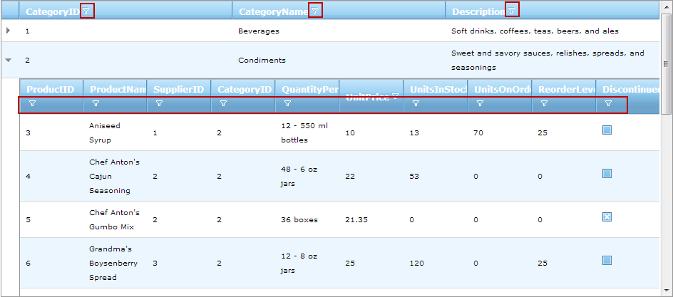
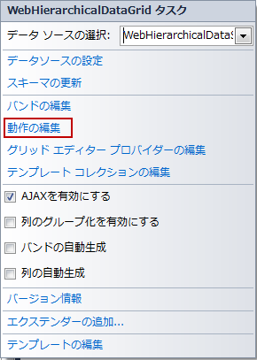
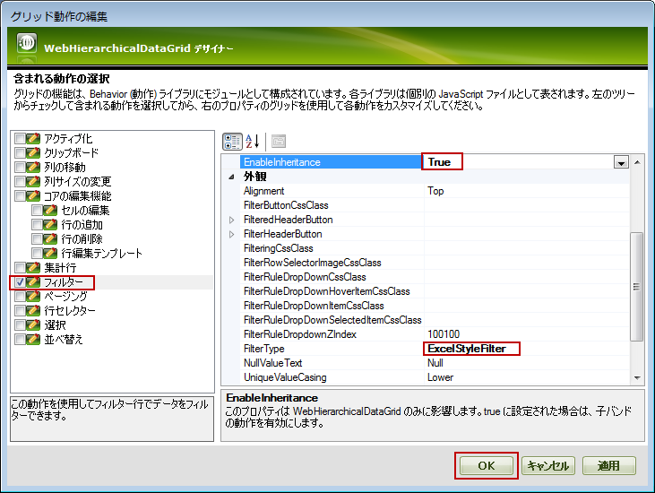

////

|metadata|
{
    "name": "webhierarchicaldatagrid-excelstylefiltering-enabling",
    "controlName": ["WebHierarchicalDataGrid"],
    "tags": ["Filtering","Grids"],
    "guid": "b1a99bd5-5ad9-457c-a9bc-5fb7dd4d84f0",  
    "buildFlags": [],
    "createdOn": "2012-07-16T12:17:57.6127202Z"
}
|metadata|
////

= Excel フィルタリングの有効化

== トピックの概要

=== 目的

このトピックでは、 _WebHierarchicalDataGrid_™ コントロールの link:webhierarchicaldatagrid-excelstylefiltering-landingpage.html[Excel フィルタリング]機能を有効にする方法を説明します。

=== 前提条件

このトピックの本題に入る前に、以下のトピックをお読みください。

[options="header", cols="a,a"]
|====
|トピック|目的

| link:webhierarchicaldatagrid-getting-started-with-webhierarchicaldatagrid.html[WebHierarchicalDataGrid を使用した作業の開始]
|このトピックでは、Northwind データベースの _Categories_ および _Products_ テーブルを使用して _WebHierarchicalDataGrid_ を _WebHierarchicalDataSource_™ コンポーネントにバインドする方法を学習します。

| link:webhierarchicaldatagrid-excelstylefiltering-overview.html[Excel フィルタリングの概要 ( _WebHierarchicalDataGrid_ )]
|このトピックでは、 _WebHierarchicalDataGrid_ コントロールの Excel フィルタリング機能について紹介します。

|====

=== このトピックの内容

このトピックは以下のセクションからなります。

* <<_Ref335674225,はじめに>>
* <<_Ref336016015,Excel フィルタリングの有効化の概要>>

* <<_Ref336016195,Excel フィルタリングの有効化のプロパティ設定>>

* <<_Ref335674238,デザイナーで Excel フィルタリングの有効化>>

* <<_Ref336279462,はじめに>>
* <<OLE_LINK77,プレビュー>>
* <<OLE_LINK41,前提条件>>
* <<OLE_LINK63,概要>>
* <<_Ref336279480,手順>>

* <<_Ref336279314,ASPX マークアップで Excel フィルタリングの有効化>>

* <<_Ref336279498,概要>>
* <<_Ref336279509,プレビュー>>
* <<_Ref336279547,コード>>

* <<_Ref336279321,コード ビハインドで Excel フィルタリングの有効化>>

* <<_Ref336279563,概要>>
* <<_Ref336279567,プレビュー>>
* <<_Ref336279570,コード>>

* <<_Ref335674243,関連コンテンツ>>

* <<_Ref336279588,トピック>>
* <<_Ref336279591,サンプル>>

[[_Ref335674225]]
== はじめに

[[_Ref336016015]]

=== Excel フィルタリングの有効化の概要

デフォルトでは、 _WebHierarchicalDataGrid_   の規格の (Excel ではない) フィルタリングが有効になります。Excel フィルタリング機能を有効にするには、 _WebHierarchicalDataGrid_   の link:{ApiPlatform}web{ApiVersion}~infragistics.web.ui.gridcontrols.filtering~filtertype.html[FilterType] プロパティを  _ExcelStyleFilter_   に設定します。Excel フィルタリングをすべての列で有効にしますが、列ごとで無効にするには、 link:{ApiPlatform}web{ApiVersion}~infragistics.web.ui.gridcontrols.columnfilteringsetting.html[ColumnFilteringSetting] プロパティを設定できます。

以下のセクションは、すべての列で Excel スタイル フィルタリングを有効にする方法を紹介します。

* <<_Ref335674238,デザイナーで Excel フィルタリングの有効化>>

以下のセクションは、親バンドの 1 つの列および子バンドの 1 つの列以外のすべての列で Excel フィルタリングを有効にする方法を紹介します。その 2 つの列でフィルタリングが無効にされます。

* <<_Ref336279314,ASPX マークアップで Excel フィルタリングの有効化>>
* <<_Ref336279321,コード ビハインドで Excel フィルタリングの有効化>>

[[_Ref336016020]]

=== Excel フィルタリングの有効化のプロパティ設定

以下の表では、フィルタリング動作をプロパティ設定にマップします。

[options="header", cols="a,a,a"]
|====
|目的:|使用するプロパティ:|設定の選択肢:

|Excel フィルタリングを有効にする
| link:{ApiPlatform}web{ApiVersion}~infragistics.web.ui.gridcontrols.filtering~filtertype.html[FilterType]
|_ExcelStyleFilter_

|列のフィルタリングを無効にする
| link:{ApiPlatform}web{ApiVersion}~infragistics.web.ui.gridcontrols.columnfilteringsetting.html[(ColumnSetting の) Enable]
| _False_ 

|====

[[_Ref335674229]]

[[_Ref335674238]]
== デザイナーで Excel フィルタリングの有効化

[[_Ref336279462]]

=== はじめに

この例では、デザイナーで  _WebHierarchicalDataGrid_   の親バンドと子バンドに Excel フィルタリングを有効にする方法を紹介します。

=== プレビュー

以下のスクリーンショットは最終結果のプレビューです。

=== 前提条件

この手順を実行するには、以下のリソースが必要です。

* Web ページで初期化された WebHierarchicalDataGrid を含む ASP.NET Web プロジェクト
* Northwind  _Categories_   および  _Products_   テーブルを取得する WebHierarchicalDataSource コンポーネントにバインドされる WebHierarchicalDataGrid。詳細は、* link:webhierarchicaldatagrid-getting-started-with-webhierarchicaldatagrid.html[WebHierarchicalDataGrid を使用した作業の開始]* トピックを参照してください.  

=== 概要

以下はプロセスの概念的概要です。 *1.Excel フィルタリングを有効にする* 

*2.* (オプション) * 結果を確認します*

[[_Ref336279480]]

=== 手順

以下の手順は、デザイナーで Excel フィルタリングを有効にする方法を紹介します。

=== 1.Excel フィルタリングを有効にします。

*1.* グリッド動作の編集 ダイアログを*起動します* 。

_WebHierarchicalDataGrid_   のスマート タグをクリックして、*動作の編集オプションを選択します* 。

WebDataGrid デザイナー ダイアログが開かれます。 *2.親レベルと子レベルで Excel フィルタリングを有効にします。* 

A. グリッド動作の編集 ダイアログの左側のパネルで、*フィルターをチェックします。*

B. 右側のパネルで、* link:{ApiPlatform}web{ApiVersion}~infragistics.web.ui.gridcontrols.filtering~filtertype.html[FilterType]* *プロパティを*  _ExcelStyleFilter_   * に設定します。*

C. 右側のパネルで、*EnableInheritance* *プロパティを*  _True_   * に設定します。*

この設定は親バンドと子バンドでフィルタリングを有効にします。

D. [OK]  *ボタンを*  *クリックします* 。

=== 3.(オプション) 結果を確認します。

結果を確認するには、プロパティを保存して実行し、 _WebHierarchicalDataGrid_   のフィルタリング動作を確認します。

[[_Ref336279314]]
== ASPX マークアップで Excel フィルタリングの有効化

[[_Ref336279498]]

=== 概要

この例では、ASPX マークアップで、親バンドと子バンドのすべての列で Excel フィルタリングを有効にする方法を紹介します。親バンドの CategoryName および子バンドの ProductName 列でフィルタリングが無効にされます。

[[_Ref336279509]]

=== プレビュー

以下の画像は、この例の結果を表示します。

image::images/WHDG_ExcelStyleFiltering_Enabling_4.png[]

[[_Ref336279547]]

=== コード

*ASPX の場合:*

[source,html]
----
<Behaviors>
    <ig:Filtering FilterType="ExcelStyleFilter">
        <ColumnSettings>
            <ig:ColumnFilteringSetting ColumnKey="CategoryName" Enabled=" />
        </ColumnSettings>
    </ig:Filtering>
</Behaviors>
<Bands>
    <ig:Band Key="Products" DataMember="SQLDataSource_Products" DataKeyFields="CategoryID">
        <Behaviors>
            <ig:Filtering FilterType="ExcelStyleFilter">
                <ColumnSettings>
                    <ig:ColumnFilteringSetting ColumnKey="ProductName" Enabled=" />
                </ColumnSettings>
            </ig:Filtering>
        </Behaviors>
    </ig:Band>
</Bands>
----

[[_Ref335674233]]

[[_Ref336279321]]
== コード ビハインドで Excel フィルタリングの有効化

[[_Ref336279563]]

=== 概要

この例では、コード ビハインドで、親バンドと子バンドのすべての列で Excel フィルタリングを有効にする方法を紹介します。親バンドの CategoryName および子バンドの ProductName 列でフィルタリングが無効にされます。

[[_Ref336279567]]

=== プレビュー

以下の画像は、この例の結果を表示します。

image::images/WHDG_ExcelStyleFiltering_Enabling_4.png[]

[[_Ref336279570]]

=== コード

*C# の場合:*

[source,csharp]
----
 protected void Page_Load(object sender, EventArgs e)
        {
            this.WebHierarchicalDataGrid1.InitializeBand += new InitializeBandEventHandler(WebHierarchicalDataGrid1_InitializeBand);
            this.WebHierarchicalDataGrid1.Behaviors.CreateBehavior<Filtering>();
            this.WebHierarchicalDataGrid1.Behaviors.Filtering.FilterType = FilteringType.ExcelStyleFilter;
            this.WebHierarchicalDataGrid1.Behaviors.Filtering.EnableInheritance = true;
            //Create a ColumnFilteringSetting 
            ColumnFilteringSetting settingColumn = new ColumnFilteringSetting();
            //Set the ColumnKey
            settingColumn.ColumnKey = "CategoryName";
            //Set the Enabled property to false
            settingColumn.Enabled = false;
            this.WebHierarchicalDataGrid1.Behaviors.Filtering.ColumnSettings.Add(settingColumn);
            this.WebHierarchicalDataGrid1.RefreshBehaviors();
        }
        void WebHierarchicalDataGrid1_InitializeBand(object sender, BandEventArgs e)
        {
            e.Band.Behaviors.CreateBehavior<Filtering>();
            e.Band.Behaviors.Filtering.Enabled = true;
            e.Band.Behaviors.Filtering.FilterType = FilteringType.ExcelStyleFilter;
            e.Band.Behaviors.Filtering.EnableInheritance = true;
            ColumnFilteringSetting settingColumn = new ColumnFilteringSetting();
            settingColumn.ColumnKey = "ProductName";
            settingColumn.Enabled = false;
            e.Band.Behaviors.Filtering.ColumnSettings.Add(settingColumn);
        }
----

[[_Ref335674243]]
== 関連コンテンツ

[[_Ref336279588]]

=== トピック

このトピックについては、以下のトピックも参照してください。

[options="header", cols="a,a"]
|====
|トピック|目的

| link:webhierarchicaldatagrid-excelstylefiltering-configuring.html[Excel フィルタリングの構成 ( _WebHierarchicalDataGrid_ )]
|このトピックでは、 _WebHierarchicalDataGrid_ コントロールの Excel フィルタリング オプションを構成する方法を説明します。

| link:webhierarchicaldatagrid-excelstylefiltering-propertyreference.html[Excel フィルタリングのプロパティ リファレンス ( _WebHierarchicalDataGrid_ )]
|このトピックは、 _WebHierarchicalDataGrid_ コントロールの Excel フィルタリング機能のプロパティについての情報を提供します。

|====

[[_Ref336279591]]

=== サンプル

このトピックについては、以下のサンプルも参照してください。

[options="header", cols="a,a"]
|====
|サンプル|目的

| link:{SamplesURL}/samples/webhierarchicaldatagrid/organization/excelstylefilteringboundunboundfields/default.aspx?cn=hierarchical-data-grid&sid=73902ae9-b135-4a4b-bc4d-016907516bdd[Excel フィルタリング - バインド/非バインド フィールド]
|このサンプルでは、バインドおよび非バインド フィールドで Excel フィルタリングおよびチェックボックスを使用する方法を紹介します。

| link:{SamplesURL}/samples/webhierarchicaldatagrid/organization/excelstylefilteringcrud/default.aspx?cn=hierarchical-data-grid&sid=3e518c05-cf4d-415f-97e2-a88e8e6bbcda[CRUD 機能が有効な Excel フィルタリング]
|このサンプルでは、編集と Excel フィルタリングを紹介します。

|====