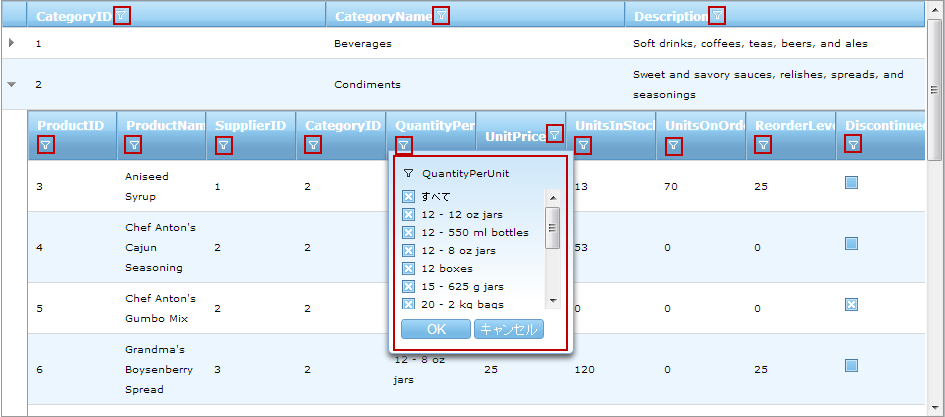
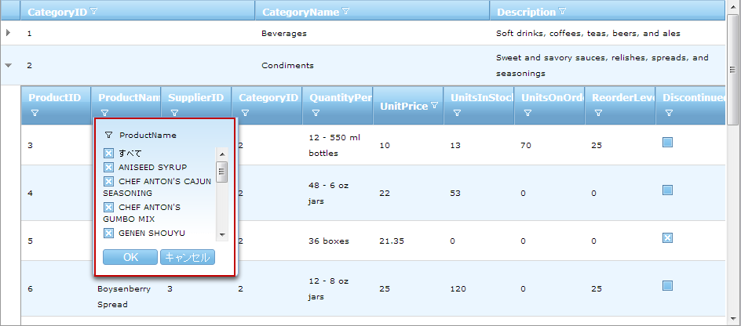

////

|metadata|
{
    "name": "webhierarchicaldatagrid-excelstylefiltering-overview",
    "controlName": ["WebHierarchicalDataGrid"],
    "tags": ["Filtering","Grids"],
    "guid": "f4439162-9ee7-4b05-bb0a-de586efe3882",  
    "buildFlags": [],
    "createdOn": "2012-07-16T12:08:03.0752724Z"
}
|metadata|
////

= Excel フィルタリングの概要

== トピックの概要

=== 目的

このトピックでは、 _WebHierarchicalDataGrid_™ コントロールの link:webhierarchicaldatagrid-excelstylefiltering-landingpage.html[Excel フィルタリング]機能について紹介します。

=== 前提条件

このトピックの本題に入る前に、以下のトピックをお読みください。

[options="header", cols="a,a"]
|====
|トピック|目的

| link:webhierarchicaldatagrid-getting-started-with-webhierarchicaldatagrid.html[ _WebHierarchicalDataGrid_ を使用した作業の開始]
|このトピックでは、 _WebHierarchicalDataGrid_ をページに追加し、Northwind データベースの Customers テーブルを取得する方法を紹介します。

|====

=== このトピックの内容

このトピックは以下のセクションからなります。

* <<_Ref329871543,はじめに>>
* <<_Ref329871549,Excel フィルタリング オプション>>
* <<_Ref335941644,Excel フィルタリング オプションの概要表>><<_Ref329871610,>>
* <<_Ref336267105,一意の値の大文字化>>

* <<_Ref336267112,Null 値のカスタム テキスト>><<_Ref329871617,>>

* <<_Ref329871622,関連コンテンツ>>

* <<_Ref329871632,トピック>>
* <<_Ref329871637,サンプル>>

[[_Ref329871543]]
== はじめに

=== Excel フィルタリングの概要

_WebHierarchicalDataGrid_   の Excel フィルタリング機能は、Microsoft® Excel® ワークシートで使用されるフィルター設定を使用してグリッドのデータをフィルターします。この機能によってフィルタリング基準に一致するより小さいサブセットにデータを分割し、一致を表示します。

ユーザーはフィルタリング ドロップダウンでフィルター条件を選択します。ドロップダウンの値は、フィルターされる列の値です。OK ボタンをクリックして選択を保存した後、サーバーに要求を送信し、データのフィルターしたサブセットを取得して描画します。

有効な場合、Excel フィルタリングはグリッドのすべての列で有効になります。フィルタリングは列ごとに無効に設定できます。

グリッドの階層構造について、Excel フィルタリングは子レベルのみ、親レベルのみ、または両方で有効にできます。特定の列のフィルタリングの無効化は階層の任意のレベルに設定できます。親子レイアウトおよび特定の列を選択して機能を有効または無効にできます。

[[_Ref329871549]]
[[_Ref335941591]]
== Excel フィルタリング オプション

[[_Ref335941644]]

=== Excel フィルタリング オプションの概要表

以下の表は、 _WebHierarchicalDataGrid_™ コントロールの Excel フィルタリングの構成可能なオプションを説明します。

[options="header", cols="a,a"]
|====
|オプション|解説

|<<_Ref336267105,フィルタリング ドロップダウンで一意の値の大文字化>>
|フィルタリング ドロップダウンの値の大文字化を指定できます。利用可能なオプションは: 小文字、大文字、および camelcase です。

|<<_Ref336267112,フィルタリング ドロップダウンで Null 値のテキストを設定>>
|フィルタリング ドロップダウンで Null 値のカスタム テキストを指定できます。

|====

[[_Ref335941665]]

=== 一意の値の大文字化

このオプションを列またはグリッド全体に設定できます。列ごとの設定は優先があります。大文字化オプションは以下のとおりです。

* *Lowercase* (デフォルト) – 項目は小文字で表示されます
* *Uppercase* – 項目は大文字で表示されます
* *Camelcase*  - 項目は英語の文字の大文字化で表示されます。項目の最初の文字のみは大文字で表示されます。

以下の画像で、フィルタリング ドロップダウンの項目は大文字に設定されます。

*関連トピック:*

* link:webhierarchicaldatagrid-excelstylefiltering-configuring.html[Excel フィルタリングの構成]

[[_Ref336267112]]

=== Null 値のカスタム テキスト

フィルタリング ドロップダウンで、Null 値のセルの表示するカスタム テキストを構成できます。このカスタム値はドロップダウンの項目のテキストのみに表示され、データ ソースに保存されません。以下の画像では、Null 値は  _Custom Null Text_   に設定されます。

image::images/WHDG_ExcelStyleFiltering_Overview_3.png[]

== 関連トピック
:

* link:webhierarchicaldatagrid-excelstylefiltering-configuring.html[Excel フィルタリングの設定]

[[_Ref329871622]]
== 関連コンテンツ

[[_Ref329871632]]

=== トピック

このトピックについては、以下のトピックも参照してください。

[options="header", cols="a,a"]
|====
|トピック|目的

| link:webhierarchicaldatagrid-excelstylefiltering-enabling.html[Excel フィルタリングの有効化 _(WebHierarchicalDataGrid)_ ]
|このトピックは、 _WebHierarchicalDataGrid_ コントロールの Excel フィルタリング機能のプロパティについての情報を提供します。

| link:webhierarchicaldatagrid-excelstylefiltering-configuring.html[Excel フィルタリングの設定 ( _WebHierarchicalDataGrid_ )]
|このトピックでは、 _WebHierarchicalDataGrid_ コントロールの Excel フィルタリング オプションを構成する方法を説明します。

| link:webhierarchicaldatagrid-excelstylefiltering-propertyreference.html[Excel フィルタリングのプロパティ リファレンス ( _WebHierarchicalDataGrid_ )]
|このトピックは、 _WebHierarchicalDataGrid_ コントロールの Excel フィルタリング機能のプロパティについての情報を提供します。

|====

[[_Ref329871637]]

=== サンプル

このトピックについては、以下のサンプルも参照してください。

[options="header", cols="a,a"]
|====
|サンプル|目的

| link:{SamplesURL}/samples/webdatagrid/organization/excelstylefilteringboundunboudfields/default.aspx?cn=data-grid&sid=d9ad02bb-87ef-4440-9b4e-0fe51cdb7a38[Excel フィルタリング - バインド/非バインド フィールド]
|このサンプルでは、バインドおよび非バインド フィールドで Excel フィルタリングおよびチェックボックスを使用する方法を紹介します。

| link:{SamplesURL}/samples/webdatagrid/organization/excelstylefilteringnullvaluetext/default.aspx?cn=data-grid&sid=a1a23f0a-8f1f-4846-b780-0c7d28cc464d[Excel フィルタリングのドロップダウンの Null 値テキスト]
|このサンプルでは、Excel フィルタリングの ` link:{ApiPlatform}web{ApiVersion}~infragistics.web.ui.gridcontrols.columnfilteringsetting~nullvaluetext.html[NullValueText]` プロパティを _Null_ に設定する方法を紹介します。

| link:{SamplesURL}/samples/webdatagrid/organization/excelstylefilteringcrud/default.aspx?cn=data-grid&sid=a182b7c6-738e-4db9-b531-705dc05be0b7[CRUD 機能が有効な Excel フィルタリング]
|このサンプルでは、編集と Excel フィルタリングを紹介します。

|====