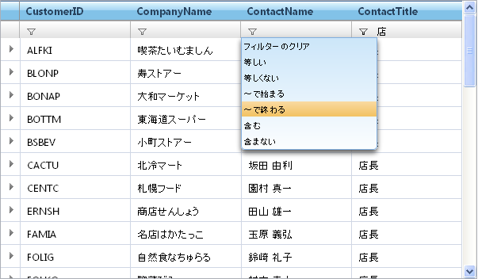

////

|metadata|
{
    "name": "webhierarchicaldatagrid-filtering",
    "controlName": ["WebHierarchicalDataGrid"],
    "tags": ["Filtering","Grids"],
    "guid": "8c53fb26-5c31-49c1-9130-65682c7c4505",  
    "buildFlags": [],
    "createdOn": "2010-06-08T03:45:40.2308078Z"
}
|metadata|
////

= フィルタリング

WebDataGrid™ のフィルタリング機能は WebHierarchicalDataGrid™ で使用できます。フィルタリングによってフィルタリング基準に一致するより小さいサブセットにデータが分割されて表示されます。これによってデータはエンドユーザーにより見やすくまた管理しやすくなります。AJAX が有効の場合、フィルタリングは非同期です。WebDataGrid に提供された API またはフィルター行 UI によってフィルタリングできます。

中核的なフィルタリング機能は、WebDataGrid のフィルタリング機能と同じままです。このトピックは、WebHierarchicalDataGrid 固有のフィルタリング設定に焦点を当てます。フィルタリングの基本情報は、WebDataGrid の link:webdatagrid-filtering.html[フィルタリング]を参照してください。

== 階層データのフィルタリング

WebHierarchicalDataGrid 内の各バンドはフィルタリング動作を指定できます。子バンドが設定を継承できるようにバンドの  pick:[asp-net="link:{ApiPlatform}web{ApiVersion}~infragistics.web.ui.gridcontrols.editablebehaviorbase~enableinheritance.html[EnableInheritance]"]  プロパティを設定できます。これにより、データの各バンドでフィルタリング動作をカスタマイズできます。たとえば、WebHierarchicalDataGrid のすべてのバンドに対してフィルタリングが必要な場合には、ルート レベルでフィルタリング動作を有効にして、EnableInheritance を True に設定するだけです。特定の子バンドに対して動作を無効にしたい場合には、その特定のバンドの動作を無効にします。

== 子バンドのフィルタリング

子バンドのフィルタリングを有効にすると、子コンテナーグリッドはフィルターアイコンを表示するので、エンドユーザーはクリックして子データをフィルタリングできます。データはその特定のコンテナーグリッドに限ってフィルタリングされます。つまり子データはバンドではなく、そのデータが属するデータアイランドによってフィルタリングされます。

行のすべての子行をフィルタリングする場合、行を展開および縮小することはこれまで同様に可能です。ただし、コンテナー グリッドは空白になります。

UI に依存せずにコード ビハインドからデータをフィルタリングすることも可能です。これは WebHierarchicalDataGrid コントロールのロード時にフィルタリングしたいデータがある時に役立ちます。行に子データがある場合に限ってコントロールは展開インジケーターを表示するため、展開できない親行となる可能性があることに留意してください。これは子行全体がフィルタリングされるためです。

フィルタリング機能を有効にするために、以下の手順を実行します。

== 以下の手順を実行します

[start=1]
. WebHierarchicalDataGrid を WebHierarchicalDataSource コンポーネントにバインドし、Northwind の Customers および Orders テーブルからデータを取得します。実行についての詳細は、「WebHierarchicalDataGrid を WebHierarchicalDataSource にバインド」を参照してください。
[start=2]
. Microsoft® Visual Studio™ プロパティ ウィンドウで、 pick:[asp-net="link:{ApiPlatform}web{ApiVersion}~infragistics.web.ui.gridcontrols.webhierarchicaldatagrid~behaviors.html[Behaviors]"]  プロパティを指定して、省略記号 (...) ボタンをクリックし、[動作エディタ] ダイアログを起動します。
[start=3]
. 有効にするには左側のリストの Activation 動作のチェックボックスをチェックします。
[start=4]
. Filtering 動作をチェックし、Enable および EnableInheritance を True に設定します。
[start=5]
. WebHierarchicalDataGrid が Sales Representatives のデータに限ってフィルタリングを実行するように、Customer バンドの最初のフィルタリング条件を設定します。

..  pick:[asp-net="link:{ApiPlatform}web{ApiVersion}~infragistics.web.ui.gridcontrols.columnfilters.html[ColumnFilters]"]  プロパティを指定して、省略記号 (...) ボタンをクリックし、[列フィルタリング エディタ] ダイアログを起動します。
.. [項目の追加] ボタンをクリックすることで列フィルタを追加します。
.. フィルタの  pick:[asp-net="link:{ApiPlatform}web{ApiVersion}~infragistics.web.ui.gridcontrols.columnfilter~columnkey.html[ColumnKey]"]  プロパティを ContactTitle に設定します。
.. Condition プロパティのドロップダウンで RuleTextNode を選択します。
.. 列の  pick:[asp-net="link:{ApiPlatform}web{ApiVersion}~infragistics.web.ui.gridcontrols.columnfilter~condition.html[Condition]"]  プロパティの展開インジケーターをクリックします。Rule および Value プロパティが表示します。
.. Rule を Equals に、Value を Sales Representative に設定します。
.. [適用] 、次に [OK] をクリックして、[列フィルタリング エディタ] ダイアログを閉じます。
.. [適用] 、次に [OK] をクリックして、[動作エディタ] ダイアログを閉じます。

[start=6]
. WebHierarchicalDataGrid が 12/31/1996 以降の日付のデータに限ってフィルタリングを実行するように、子 Order バンドの最初のフィルタリング条件を設定します。

..  pick:[asp-net="link:{ApiPlatform}web{ApiVersion}~infragistics.web.ui.gridcontrols.webhierarchicaldatagrid~bands.html[Bands]"]  プロパティを指定し、省略記号ボタン (...) をクリックします。[バンドの編集] ダイアログが表示します。
.. [子を追加] ボタンをクリックして子バンドをルート バンドに追加します。
..  pick:[asp-net="link:{ApiPlatform}web{ApiVersion}~infragistics.web.ui.gridcontrols.band~key.html[Key]"]  を Orders に変更します。
..  pick:[asp-net="link:{ApiPlatform}web{ApiVersion}~infragistics.web.ui.gridcontrols.band~datamember.html[DataMember]"]  を AccessDataSource2_Orders に設定します。
..  pick:[asp-net="link:{ApiPlatform}web{ApiVersion}~infragistics.web.ui.gridcontrols.band~datakeyfields.html[DataKeyFields]"]  を OrderID に設定します。
.. Behaviors プロパティの省略記号ボタン (...) をクリックします。
.. Filtering 動作のチェックボックスをチェックします。
.. ColumnFilters プロパティの省略記号ボタン (...) をクリックします。
.. 手順 5 で行ったように Column Filter を追加し、今回は ColumnKey を OrderDate に、そして Condition を RuleDateNode に追加します。
[start=10]
.. Rule を After に、Value を 12/31/1996 に設定します。
[start=11]
.. [OK] をクリックして [動作を編集] ダイアログを閉じます。
[start=12]
.. [OK] をクリックして [バンドを編集] ダイアログを閉じます。

以下のコードを使用して上記の手順を実行することも可能です。

*注：* 特定のケースで、フィルタを適用するために ApplyFilter メソッドを呼び出す必要があります。呼び出さないと、次のポストバックまで WebHierarchicalDataGrid はフィルタリングを実行しません。クライアント側で、複数のフィルタを追加する時、add_columnFilterRange メソッドを使用してフィルタの配列として追加する必要があります。以下のコード ビハインドは、マークアップでバンドを定義し、InitializeBand サーバー側イベントを処理していることを前提とします。

*HTML の場合:*

[source]
----
<ig:webhierarchicaldatagrid ID="WebHierarchicalDataGrid1" DataSourceID="WebHierarchicalDataSource1" runat="server" Height="350px" Width="600px" DataKeyFields="CustomerID" Key="Customers">
----

[source]
----
            <Behaviors>
                <ig:Activation Enabled="true">
                </ig:Activation>
                <ig:Filtering>
                    <ColumnFilters>
                        <ig:ColumnFilter ColumnKey="ContactTitle">
                            <ConditionWrapper>
                                <ig:RuleTextNode Rule="Equals" Value="Sales Representative" />
                            </ConditionWrapper>
                        </ig:ColumnFilter>
                    </ColumnFilters>
                </ig:Filtering>
            </Behaviors>
            <Bands>
                <ig:Band Key="Orders">
                    <Behaviors>
                        <ig:Filtering>
                            <ColumnFilters>
                                <ig:ColumnFilter ColumnKey="OrderDate">
                                    <ConditionWrapper>
                                        <ig:RuleDateNode Value="" />
                                    </ConditionWrapper>
                                </ig:ColumnFilter>
                            </ColumnFilters>
                            <ColumnSettings>
                                <ig:ColumnFilteringSetting />
                            </ColumnSettings>
                        </ig:Filtering>
                    </Behaviors>
                </ig:Band>
    </Bands>
----

[source]
----
</ig:webhierarchicaldatagrid> 
----

*C# の場合:*

----
protected void WebHierarchicalDataGrid1_InitializeBand(object sender, BandEventArgs e)
    {
    if (e.Band.Key == "Customers")
        {
            e.Band.Behaviors.CreateBehavior();
            e.Band.Behaviors.Filtering.Enabled = true;
            e.Band.Behaviors.Filtering.EnableInheritance = true;
            RuleTextNode textCondition = new RuleTextNode(TextFilterRules.Equals, "Sales Representative");
            ColumnFilter columnFilter1 = new ColumnFilter();
            columnFilter1.ColumnKey = "ContactTitle";
            columnFilter1.Condition = textCondition;
            e.Band.Behaviors.Filtering.ColumnFilters.Add(columnFilter1);
            this.WebHierarchicalDataGrid1.RefreshBehaviors();
        }
        else if (e.Band.Key == "Orders")
        {
            e.Band.Behaviors.CreateBehavior();
            e.Band.Behaviors.Filtering.Enabled = true;
            RuleDateNode dateCondition = new RuleDateNode(DateTimeFilterRules.After, DateTime.Parse("12/31/1996"));
            ColumnFilter columnFilter1 = new ColumnFilter();
            columnFilter1.ColumnKey = "OrderDate";
            columnFilter1.Condition = dateCondition;
            e.Band.Behaviors.Filtering.ColumnFilters.Add(columnFilter1);
            this.WebHierarchicalDataGrid1.RefreshBehaviors();
        }
    }
----

[start=7]
. アプリケーションを実行します。WebDataGrid は 1996 年の発注日以降顧客 ALFKI のレコードを表示します。列のひとつのドロップダウン リストをクリックし、条件を選択して値を入力することにより、さらにデータをフィルタリングできます。WebDataGrid は既存のデータをフィルタリングします。