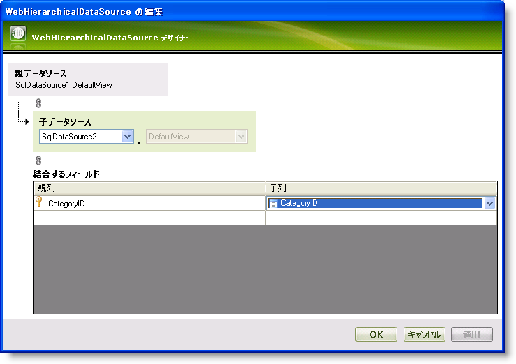

////

|metadata|
{
    "name": "webhierarchicaldatagrid-getting-started-with-webhierarchicaldatagrid",
    "controlName": ["WebHierarchicalDataGrid"],
    "tags": ["Data Binding","Data Presentation","Design Environment","Getting Started","Grids"],
    "guid": "{1A4F9337-B361-4831-A5C2-D1790ECDCE2E}",  
    "buildFlags": [],
    "createdOn": "0001-01-01T00:00:00Z"
}
|metadata|
////

= WebHierarchicalDataGrid を使用した作業の開始

== 始める前に

WebHierarchicalDataGrid™ によって、多くの機能を有効にし、複雑な動作や動的操作を実行できます。ただし最も一般的に使用するのはデータを表示するためです。WebHierarchicalDataGrid を使用したデータバインドと表示は簡単なプロセスです。これは多くの形態の階層データソースにバインドできます。階層データを取得する便利な方法の 1 つは、WebHierarchicalDataSource™ を使用することです。WebHierarchicalDataSource コンポーネントを使用してデータにバインドする方法の詳細は、 link:webhierarchicaldatasource-getting-started-with-webhierarchicaldatasource.html[WebHierarchicalDataSource を使用した作業の開始]を参照してください。

== 達成すること

Northwind Categories および Products テーブルを使用して WebHierarchicalDataGrid を WebHierarchicalDataSource コンポーネントにバインドする方法を学習します。

== 次の手順を実行します

[start=1]
. ASP.NET Web ページを作成します。
[start=2]
. ツールボックスからページに ScriptManager コンポーネントをドラッグします。
[start=3]
. ツールボックスからページに WebHierarchicalDataGrid コントロールをドラッグします。
[start=4]
. ツールボックスからページに WebHierarchicalDataSource コンポーネントをドラッグします。

*注:* WebHierarchicalDataSource の設定方法を既に理解している場合、このコンポーネントを設定して親子関係を持つ Categories および Products データを取得し、手順 26 に進んでください。

[start=5]
. WebHierarchicalDataSource のスマート タグをクリックして、[リレーションシップの編集] を選択します。クイック デザインが表示します。

image::images/WebHierarchicalDataSource_Getting_Started_with_WebHierarchicalDatasource_01.png[]

[start=6]
. [ビューの追加] オプションをクリックします。
[start=7]
. 表示するドロップダウン リストから [新しいデータ ソース] を選択します。

*注:* この時点でページにおいてデータ ソースがすぐに使用可能になっている場合には、これらのデータ ソースはドロップダウン リストに表示されます。データ ソースに複数のビューがある場合には、DataView ドロップダウン リストで選択可能です。

[データ ソース構成] ウィザードが表示します。

image::images/WebHierarchicalDataSource_Getting_Started_with_WebHierarchicalDatasource_02.png[]

[start=8]
. [データベース] を選択します。
[start=9]
. [OK] をクリックします。
[start=10]
. WebHierarchicalDataSource は SqlDataSource コンポーネントをフォームに追加すると、[データソースの構成] ウィザードが SqlDataSource コンポーネントのために表示します。

image::images/WebGrid_Binding_WebGrid_To_SQL_Data_Source_01.png[]

[start=11]
. [新しい接続] をクリックして接続文字列を構成します。[接続を追加] ダイアログが表示します。

image::images/WebGrid_Binding_WebGrid_To_SQL_Data_Source_02.png[]

[start=12]
. この場合、使用しているサーバー、SQLEXPRESS にサーバー名を指定します。データベースを Northwind に設定します。
[start=13]
. [OK] をクリックします。[接続の構成] 画面に戻ります。
[start=14]
. [次へ] をクリックします。
[start=15]
. [テーブル] または [ビュー] から [列の指定] を選択し以下を実行します:

.. ドロップダウン リストから Categories テーブルを選択します。
.. [列] セクションで、CategoryID、CategoryName、および Description を選択してこれらの列を表示します。
.. この時点で、SqlDataSource コンポーネントが取得されたデータの Insert、Update および Delete ステートメントを生成することを指定するために [詳細] ボタンをクリックするオプションがあります。

[start=16]
. [次へ] をクリックします。
[start=17]
. SqlDataSource がデータを取得することを保証するためにクエリをテストします。
[start=18]
. [完了] をクリックして構成ウィザードを閉じます。SqlDataSource は Northwind データベースから Categories データを取得するように設定されます。
[start=19]
. [OK] をクリックして、クイック デザインに戻ります。追加したばかりの SqlDataSource を確認します。

image::images/WebHierarchicalDataSource_Getting_Started_with_WebHierarchicalDatasource_03.png[]

[start=20]
. SqlDataSource1 ノードの真下にある Add Child ノードをクリックします。子の構成画面が表示します。

*注:* 追加されたデータ ソースと同じレベルにある Add View リンクをクリックすることによって、この時点で既存のデータ ソースの兄弟ノードを追加することも可能です。

[start=21]
. [子データ ソース] ドロップダウン リストで [新しいデータ ソース] を選択します。

*注:* この時点で、最初のデータ ソースを選択して自己関係的なビューを作成することもできます。詳細は、 link:webhierarchicaldatasource-creating-a-self-related-data-relation.html[自己関係的なデータ関係の作成]を参照してください。

[start=22]
. 二番目の SqlDataSource で手順 8-12 を繰り返しますが、今回はすべての列を選択して Products テーブルを選択します。
[start=23]
. 関係のための列を選択することによって、2 つのデータ ソースの間の関係を追加します。

.. [親列] ドロップダウン リストで [CategoryID] を選択します。
.. [子列] ドロップダウン リストで [CategoryID] を選択します。

*注:* 複合キーに基づいて追加の列を選択することによって、テーブルを関連付けることができます。詳細は、 link:webhierarchicaldatasource-add-a-composite-key-relationship.html[複合キーの関係を追加]を参照してください。

[start=24]
. [OK] をクリックして、クイック デザイン ビューに戻ります。
[start=25]
. この時点で、WebHierarchicalDataSource は 2 つの SQL データ ソースを使用して階層データを表示する準備ができました。[適用]、そして [OK] をクリックします。
[start=26]
. WebHierarchicalDataGrid の DataSourceID プロパティを [プロパティ] ウィンドウで WebHierarchicalDataSource1 に設定します。WebHierarchicalDataGrid のバンド、列、およびキーを更新しますか?とプロンプトされます。
[start=27]
. [はい] をクリックします。これで DataMember および Key プロパティが、WebHierarchicalDataSource でユーザーが設定する最初のデータ表示の名前である SqlDataSource1_DefaultView に自動的に設定されます。

image::images/WebHierarchicalDataGrid_Binding_to_Data_02.png[]

[start=28]
. アプリケーションを実行します。WebHierarchicalDataGrid は、Categories および Products テーブルの階層表示を表示します。

image::images/WebHierarchicalDataGrid_Binding_to_Data_03.png[]

== 関連トピック

link:webhierarchicaldatagrid-about-webhierarchicaldatagrid.html[WebHierarchicalDataGrid について]